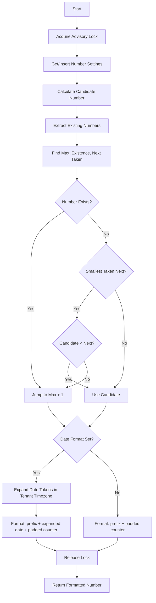

# Invoice Number Generation Flowchart

## Key Steps Explanation

1. **Advisory Lock**: Ensures thread safety for number generation
2. **Number Settings**: Gets or creates the numbering configuration
3. **Candidate Calculation**: Determines next number from sequence
4. **Number Analysis**: Extracts and analyzes existing numbers
5. **Conflict Check**: Determines if candidate is safe to use
6. **Gap Detection**: Finds available gaps in number sequence
7. **Date Token Expansion** *(optional)*: If a `prefix_date_format` is configured on the document type, the tokens `{YYYY}`, `{YY}`, `{MM}`, and `{DD}` are expanded to the issuance date in the tenant's configured timezone (UTC fallback). The expanded string is inserted between the static prefix and the padded counter, producing numbers of the form `<prefix><date><counter>` — for example, prefix `INV-` with date format `{YYYY}-{MM}-` and counter `1` (padding 6) yields `INV-2026-09-000001`. The sequential counter never resets on a date boundary.
8. **Formatting**: Assembles the final number string from the static prefix, the optional expanded date string, and the zero-padded counter.
9. **Cleanup**: Releases lock and returns result
