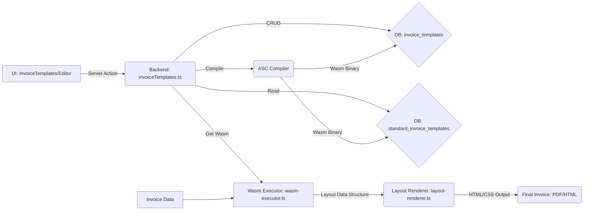

# Invoice Template System Documentation

**Related Documentation:**
- [billing.md](./billing.md) - Overall billing system architecture
- [billing_cycles.md](./billing_cycles.md) - Billing cycle management
- [invoice_finalization.md](./invoice_finalization.md) - Invoice finalization process

## 1. Overview

The Invoice Template System allows users to customize the appearance and layout of generated invoices. It supports two types of templates:

*   **Standard Templates:** Pre-defined templates provided by the system (e.g., "Standard", "Detailed"). These serve as defaults and starting points.
*   **Custom Templates:** User-created or modified templates, tailored to specific business needs. Users can clone standard templates or create new ones from scratch.

Templates are written in **AssemblyScript**, a subset of TypeScript that compiles to **WebAssembly (Wasm)**. This approach allows for safe, sandboxed execution of custom template logic on the server while providing a familiar TypeScript-like syntax for developers or advanced users creating templates.

**Key Files:**
- [invoiceTemplates.ts](../server/src/lib/actions/invoiceTemplates.ts) - Server actions
- [InvoiceTemplates.tsx](../server/src/components/billing-dashboard/InvoiceTemplates.tsx) - Template list UI
- [InvoiceTemplateEditor.tsx](../server/src/components/billing-dashboard/InvoiceTemplateEditor.tsx) - Template editor UI
- [wasm-executor.ts](../server/src/lib/invoice-renderer/wasm-executor.ts) - Wasm execution
- [layout-renderer.ts](../server/src/lib/invoice-renderer/layout-renderer.ts) - Layout to HTML/CSS conversion

## 2. Architecture

The system follows a typical web application flow involving the UI, backend server actions, database interactions, and a specialized compilation/execution pipeline for the AssemblyScript templates:

1.  **UI (React Components):** Users interact with components within the Billing Dashboard (`BillingDashboard.tsx`) to manage templates (`InvoiceTemplates.tsx`) and edit them (`InvoiceTemplateEditor.tsx`).
2.  **Server Actions (`invoiceTemplates.ts`):** UI interactions trigger Next.js Server Actions to handle requests like fetching, saving, deleting, compiling, and rendering templates.
3.  **Database (PostgreSQL):**
    *   `invoice_templates`: Stores custom templates specific to each tenant.
    *   `standard_invoice_templates`: Stores the system's standard templates.
    *   `invoice_template_assignments`: Persists default selections per tenant and per client. `scope_type` is either `tenant` or `company` (legacy label for client-level overrides); each row points to a `standard_invoice_template_code` *or* an `invoice_template_id`.
4.  **Compilation (AssemblyScript Compiler `asc`):** When a custom template is saved or a standard template needs updating, the `compileAndSaveTemplate` or `compileStandardTemplate` action uses the `asc` compiler to transform the AssemblyScript source code into Wasm bytecode.
5.  **Execution (Wasm Executor):** The `getCompiledWasm` action retrieves the Wasm binary. The `renderTemplateOnServer` action (or similar logic during invoice generation) uses a Wasm executor (`wasm-executor.ts`, leveraging `@assemblyscript/loader`) to run the compiled Wasm template code with specific invoice data.
6.  **Rendering (`layout-renderer.ts`):** The executed Wasm code interacts with a provided rendering context (likely defined in `layout-renderer.ts` or similar) to generate the final invoice layout (e.g., HTML or data structure for PDF generation).

## 3. UI Components

Located under `server/src/components/billing-dashboard/`.

### 3.1. `InvoiceTemplates.tsx`

*   **Purpose:** Displays a list of available standard and custom invoice templates for the current tenant.
*   **Key Features:**
    *   Uses `DataTable` component (`server/src/components/ui/DataTable.tsx`) to display templates.
    *   Distinguishes between standard (read-only view) and custom templates.
    *   **Actions (via `DropdownMenu` in 'Actions' column, adhering to AI Coding Standards):**
        *   **View Standard:** (Implied, no direct action, cannot edit/delete)
        *   **Edit Custom:** Navigates to the `InvoiceTemplateEditor` for the selected custom template (triggered by "Edit" menu item or row click). ID: `edit-invoice-template-menu-item`.
        *   **Clone:** Creates a copy of a standard or custom template, opening it in the `InvoiceTemplateEditor` as a new custom template. ID: `clone-invoice-template-menu-item`.
        *   **Set as Default:** Marks a custom template as the default for the selected client (scope type `company`). Disabled if already default. ID: `set-default-invoice-template-menu-item`.
        *   **Delete:** Removes an unused custom template after confirmation via a `Dialog`. Disabled for standard templates or templates in use. ID: `delete-invoice-template-menu-item`.
    *   Navigation handled via `useRouter` and URL parameters managed by `BillingDashboard.tsx`.
*   **Relevant Props/State:** Fetches data using `getInvoiceTemplates` server action, manages loading/error states, handles user interactions for actions.

### 3.2. `InvoiceTemplateEditor.tsx`

*   **Purpose:** Allows users to create new custom templates or edit existing ones.
*   **Key Features:**
    *   **Name Input:** Standard `Input` component (`server/src/components/ui/Input.tsx`) for template name (required field, includes validation). ID: `invoice-template-name-input`.
    *   **AssemblyScript Editor:** Uses `@monaco-editor/react` to provide a code editor for the AssemblyScript source. Features dynamic height calculation to fill available screen space.
    *   **Save/Cancel Buttons:**
        *   `Save`: Triggers the `compileAndSaveTemplate` server action. ID: `save-invoice-template-button`.
        *   `Cancel`: Navigates back to the template list view without saving. ID: `cancel-edit-invoice-template-button`.
    *   **Timestamp Display:** Shows "Created At" and "Last Updated At" timestamps in the `CardFooter`.
*   **Relevant Props/State:** Receives `templateId` (if editing), fetches template data using `getInvoiceTemplate`, manages template state (`name`, `assemblyScriptSource`), handles save/cancel logic, manages editor height.

### 3.3. `BillingDashboard.tsx`

*   **Purpose:** Acts as the main container for billing-related sections, including Invoice Templates.
*   **Key Features:**
    *   Uses `CustomTabs` to switch between different billing sections.
    *   Manages routing for the 'invoice-templates' tab.
    *   Uses URL search parameters (`editTemplate`, `cloneTemplate`) to determine whether to display the `InvoiceTemplates` list view or the `InvoiceTemplateEditor` view.
    *   Passes necessary props (like `templateId` for editing/cloning) down to the child components.

## 4. Backend Actions (`server/src/lib/actions/invoiceTemplates.ts`)

These Next.js Server Actions handle the core logic for managing invoice templates. They interact with the database and the compilation/execution pipeline. All actions enforce tenant isolation.

*   **`getInvoiceTemplates(tenantId)`:** Fetches all standard templates and custom templates belonging to the specified tenant. Returns a combined list, marking standard templates appropriately.
*   **`getInvoiceTemplate(templateId, tenantId)`:** Fetches a single custom invoice template by its ID and tenant ID. Used by the editor view. Includes `created_at` and `updated_at` fields.
*   **`saveInvoiceTemplate(templateData, tenantId)`:** Creates or updates a custom invoice template in the `invoice_templates` table for the specified tenant. Does *not* handle compilation itself but saves the source code. Called internally by `compileAndSaveTemplate`.
*   **`setDefaultTemplate({ templateSource, templateId?, standardTemplateCode? })`:** Persists the tenant-scoped default selection in `invoice_template_assignments`. When `templateSource = 'custom'`, the action also synchronizes the legacy `invoice_templates.is_default` column for backward compatibility.
*   **`deleteInvoiceTemplate(templateId, tenantId)`:** Deletes a custom invoice template from the `invoice_templates` table after checking it's not a standard template, not currently set as the default in `invoice_template_assignments`, and not referenced in any conditional display rules (logic for this check needs confirmation).
*   **`compileAndSaveTemplate(templateData, tenantId)`:**
    1.  Validates input data (e.g., template name).
    2.  Calls the AssemblyScript compiler (`asc`) to compile `templateData.assemblyScriptSource` into Wasm bytecode.
    3.  Calculates the SHA hash of the source code.
    4.  Calls `saveInvoiceTemplate` to save the source code, compiled Wasm binary, and SHA hash to the `invoice_templates` table.
    5.  Returns the saved template data or throws an error if compilation/saving fails.
*   **`getCompiledWasm(templateId, tenantId)`:** Retrieves the compiled `wasmBinary` for a given custom template ID and tenant ID from `invoice_templates`. If the `templateId` corresponds to a standard template code, it retrieves the binary from `standard_invoice_templates`.
*   **`renderTemplateOnServer(templateId, invoiceData, tenantId)`:** (Or similar logic used during invoice generation)
    1.  Calls `getCompiledWasm` to get the appropriate Wasm binary (custom or standard).
    2.  Calls `executeWasmTemplate` from `wasm-executor.ts`, passing the Wasm binary and `invoiceData`.
    3.  `executeWasmTemplate` instantiates the Wasm module, calls its `generateLayout` function (passing serialized `invoiceData`), receives the resulting layout data structure (as JSON, then deserialized).
    4.  The returned `LayoutElement` data structure is then passed to the `renderLayout` function from `layout-renderer.ts`.
    5.  `renderLayout` converts the data structure into HTML and CSS.
    6.  Returns the final rendered output (e.g., HTML/CSS for PDF generation).
*   **`compileStandardTemplate(templateCode)`:** Compiles a specific standard template identified by its `standard_invoice_template_code`. Reads the source from disk (`server/src/invoice-templates/assemblyscript/standard/`), compiles it, calculates the SHA, and updates the corresponding record in the `standard_invoice_templates` table with the new `wasmBinary`, `sha`, and `updated_at` timestamp. Used during startup sync.

### Additional Actions (Not Yet Fully Implemented)

The following server actions exist but are **placeholder implementations**:

*   **`getCustomFields()`** - Line 274: Logs warning "getCustomFields implementation needed" and returns empty array.
*   **`saveCustomField()`** - Line 280: Logs warning "saveCustomField implementation needed".
*   **`getConditionalRules(templateId)`** - Line 287: Logs warning and returns empty array.
*   **`saveConditionalRule()`** - Line 293: Logs warning "saveConditionalRule implementation needed".

**Note:** The underlying database tables (`custom_fields`, `conditional_display_rules`, `invoice_annotations`) exist in the schema but the server actions are not yet fully implemented.

### Additional Actions (Implemented)

The following additional server actions exist and are fully implemented:

*   **`getDefaultTemplate()`** - Line 128: Fetches the tenant's default template from `invoice_template_assignments`.
*   **`setClientTemplate(clientId, templateId)`** - Line 134: Sets a template for a specific client (client-level override).

## 5. Database Schema

### 5.1. `invoice_templates` (Tenant-Specific Custom Templates)

*   `template_id` (UUID, PK): Unique identifier for the custom template.
*   `tenant` (VARCHAR, FK to `tenants.id`): Tenant identifier (shard key).
*   `name` (VARCHAR): User-defined name for the template.
*   `assemblyScriptSource` (TEXT): The AssemblyScript source code provided by the user. **Note:** Replaced the legacy `dsl` column via migration `20250429214404_remove_dsl_not_null_constraint.cjs`.
*   `wasmBinary` (BYTEA): The compiled WebAssembly binary code. Added via migration `20250429225500_add_wasm_binary_to_invoice_templates.cjs`.
*   `sha` (TEXT): SHA hash of the `assemblyScriptSource` for change detection. Added alongside other schema updates.
*   `version` (INTEGER): Version tracking for templates.
*   `is_default` (BOOLEAN, legacy): Maintained for backward compatibility; tenant defaults are resolved through `invoice_template_assignments`.
*   `created_at` (TIMESTAMP): Timestamp of creation.
*   `updated_at` (TIMESTAMP): Timestamp of last update.

**Migration History:**
- wasmPath column: Added via `20250426220800_add_wasm_fields_to_invoice_templates.cjs`, then removed via `20250429230000_remove_wasm_path_from_invoice_templates.cjs`
- DSL column removed: `20250429214404_remove_dsl_not_null_constraint.cjs`
- wasmBinary column added: `20250429225500_add_wasm_binary_to_invoice_templates.cjs`

### 5.2. `standard_invoice_templates` (System-Wide Standard Templates)

*   `template_id` (UUID, PK): Unique identifier. **Note:** Documentation previously incorrectly listed this as `standard_invoice_template_id`, but the actual column name is `template_id` per migration `20241209202308_add_standard_invoice_templates.cjs`.
*   `name` (VARCHAR): Name of the standard template (e.g., "Standard Template", "Detailed Template").
*   `standard_invoice_template_code` (TEXT, UNIQUE): Stable code identifier (e.g., "standard-default", "standard-detailed"), matches filename.
*   `assemblyScriptSource` (TEXT): The canonical AssemblyScript source code read from the filesystem. **Note:** Replaced the legacy `dsl` column via migration `20250426221300_update_standard_templates_with_wasm.cjs`.
*   `wasmBinary` (BYTEA): The compiled WebAssembly binary code. Added via migration `20250426221300_update_standard_templates_with_wasm.cjs`.
*   `sha` (TEXT): SHA hash of the `assemblyScriptSource` from the filesystem. Added via migration `20250430143709_add_standard_template_fields.cjs`.
*   `version` (INTEGER): Version tracking for templates.
*   `created_at` (TIMESTAMP): Timestamp of creation.
*   `updated_at` (TIMESTAMP): Timestamp of last update (reflects last compilation).

**Migration History:**
- Original creation: Migration not specified in verification
- DSL column removed: `20250426221300_update_standard_templates_with_wasm.cjs`
- SHA, code, and source fields added: `20250430143709_add_standard_template_fields.cjs`
- wasmBinary added: `20250427170715_alter_standard_templates_wasm_binary.cjs`

### 5.3. `invoice_template_assignments` (Default Template Scopes)

*   `assignment_id` (UUID, PK): Surrogate identifier for the record.
*   `tenant` (UUID, FK): Tenant identifier.
*   `scope_type` (TEXT): Either `'tenant'` or `'company'`. The latter label is legacy but represents a client-level override.
*   `scope_id` (UUID, nullable): `NULL` when `scope_type = 'tenant'`; otherwise the client identifier for the override.
*   `template_source` (TEXT): `'standard'` or `'custom'`.
*   `standard_invoice_template_code` (TEXT, nullable): Populated when `template_source = 'standard'`.
*   `invoice_template_id` (UUID, nullable): Populated when `template_source = 'custom'`.
*   `created_by` (UUID, nullable): User who set the assignment.
*   `created_at`, `updated_at` (TIMESTAMP): Audit timestamps.

**Relationship:** Each `(tenant, scope_type, scope_id)` tuple can appear only once, guaranteeing a single default per tenant or per client. Legacy columns `invoice_templates.is_default` and `clients.invoice_template_id` are maintained for backward compatibility but the assignments table is the source of truth.

**Migration:** Fields `standard_invoice_template_code`, `sha`, and `assemblyScriptSource` were added to `standard_invoice_templates` via migration `server/migrations/20250430143709_add_standard_template_fields.cjs`.

## 6. Compilation & Execution

*   **AssemblyScript:** A TypeScript-like language that compiles to Wasm. Chosen for its familiarity and ability to produce efficient, sandboxed Wasm modules. Standard template source files are located in `server/src/invoice-templates/assemblyscript/standard/`.
*   **`asc` Compiler:** The official AssemblyScript command-line compiler used by the backend actions (`compileAndSaveTemplate`, `compileStandardTemplate`) to generate Wasm binaries (`.wasm`) from `.ts` source files.
*   **`wasm-executor.ts` (`server/src/lib/invoice-renderer/wasm-executor.ts`):** This utility uses `@assemblyscript/loader` to:
    *   Load and instantiate the compiled Wasm binary (`.wasm` file content as a `Buffer`).
    *   Define host functions (like logging or abort) that can be called *from* Wasm.
    *   Serialize the input `InvoiceViewModel` data into a JSON string.
    *   Call the exported `generateLayout` function within the Wasm module, passing the input JSON.
    *   Receive the output JSON string (representing the `LayoutElement` structure) back from Wasm.
    *   Deserialize the output JSON into a JavaScript `LayoutElement` object.
    *   Return the `LayoutElement` object.
*   **`layout-renderer.ts` (`server/src/lib/invoice-renderer/layout-renderer.ts`):** This module exports the `renderLayout` function which:
    *   Takes the `LayoutElement` data structure (returned by `wasm-executor.ts`) as input.
    *   Traverses this data structure.
    *   Generates corresponding HTML tags and CSS rules based on the element types (Document, Section, Row, Column, Text, Image, etc.) and their styles defined in the structure.
    *   Returns an object containing the final HTML string and CSS string.

## 7. Standard Template Synchronization

A process runs at server startup to ensure the `standard_invoice_templates` table reflects the latest versions of the standard template source files included in the deployment.

*   **Startup Task (`syncStandardTemplates` in `server/src/lib/startupTasks.ts`):**
    1.  Reads all `.ts` files from the standard template source directory (`server/src/invoice-templates/assemblyscript/standard/`).
    2.  For each file:
        *   Calculates the SHA hash of the file content.
        *   Gets the file's last modified timestamp.
        *   Extracts the `standard_invoice_template_code` from the filename.
        *   Queries the `standard_invoice_templates` table for the record matching the code.
        *   Compares the file's SHA and timestamp with the database record's `sha` and `updated_at`.
        *   If the file's SHA differs AND the file's timestamp is newer than the database timestamp, it calls `compileStandardTemplate` to recompile the template and update the database record.
*   **Integration (`initializeApp.ts`, `actions/initializeApp.ts`):** The `syncStandardTemplates` function is called as part of the server's initialization sequence, ensuring checks run every time the application starts.
*   **Build Process (`next.config.mjs`):** ⚠️ **Note:** The `copy-webpack-plugin` configuration for copying standard template source files is currently **commented out** (lines 540-564). Standard templates are accessed from the source directory at runtime, not from a copied build output location.

## 8. Workflow Examples

*   **Create Custom Template:**
    1.  User clicks "Clone" on a standard or existing custom template in `InvoiceTemplates.tsx`.
    2.  Navigates to `InvoiceTemplateEditor.tsx` with the cloned source pre-filled.
    3.  User modifies the name and AssemblyScript source.
    4.  User clicks "Save".
    5.  `compileAndSaveTemplate` action runs: compiles source to Wasm, calculates SHA, saves new record to `invoice_templates`.
    6.  User is redirected back to `InvoiceTemplates.tsx`, showing the new template.
*   **Edit Custom Template:**
    1.  User clicks "Edit" (or row) for a custom template in `InvoiceTemplates.tsx`.
    2.  Navigates to `InvoiceTemplateEditor.tsx` with existing data loaded via `getInvoiceTemplate`.
    3.  User modifies name or source.
    4.  User clicks "Save".
    5.  `compileAndSaveTemplate` action runs: compiles source, calculates SHA, updates existing record in `invoice_templates`.
    6.  User is redirected back to `InvoiceTemplates.tsx`.
*   **Set Default Template:**
    1.  User clicks "Set as Default" for a custom template in `InvoiceTemplates.tsx`.
    2.  `setDefaultTemplate` action runs: upserts the tenant-scoped record in `invoice_template_assignments` and, when applicable, mirrors the selection in `invoice_templates.is_default`.
    3.  List refreshes, showing the new default.
*   **Delete Custom Template:**
    1.  User clicks "Delete" for an unused custom template in `InvoiceTemplates.tsx`.
    2.  Confirmation `Dialog` appears.
    3.  User confirms deletion.
    4.  `deleteInvoiceTemplate` action runs: verifies template is deletable, removes record from `invoice_templates`.
    5.  List refreshes.
*   **Render Invoice:**
    1.  System needs to generate an invoice for a client.
    2.  Determines the correct template assignment by querying `invoice_template_assignments` for `(tenant, 'company', client_id)` and falling back to `(tenant, 'tenant', NULL)` if no client-specific row exists. Legacy columns are ignored.
    3.  Calls backend logic (e.g., `renderTemplateOnServer` or similar).
    4.  Logic fetches invoice data.
    5.  Calls `executeWasmTemplate` (from `wasm-executor.ts`) with the Wasm binary and invoice data.
    6.  Receives the `LayoutElement` data structure back from the executor.
    7.  Calls `renderLayout` (from `layout-renderer.ts`) with the layout structure.
    8.  Receives the HTML and CSS strings back from the renderer.
    9.  Uses the HTML/CSS to generate the final invoice document (e.g., via a PDF library).
