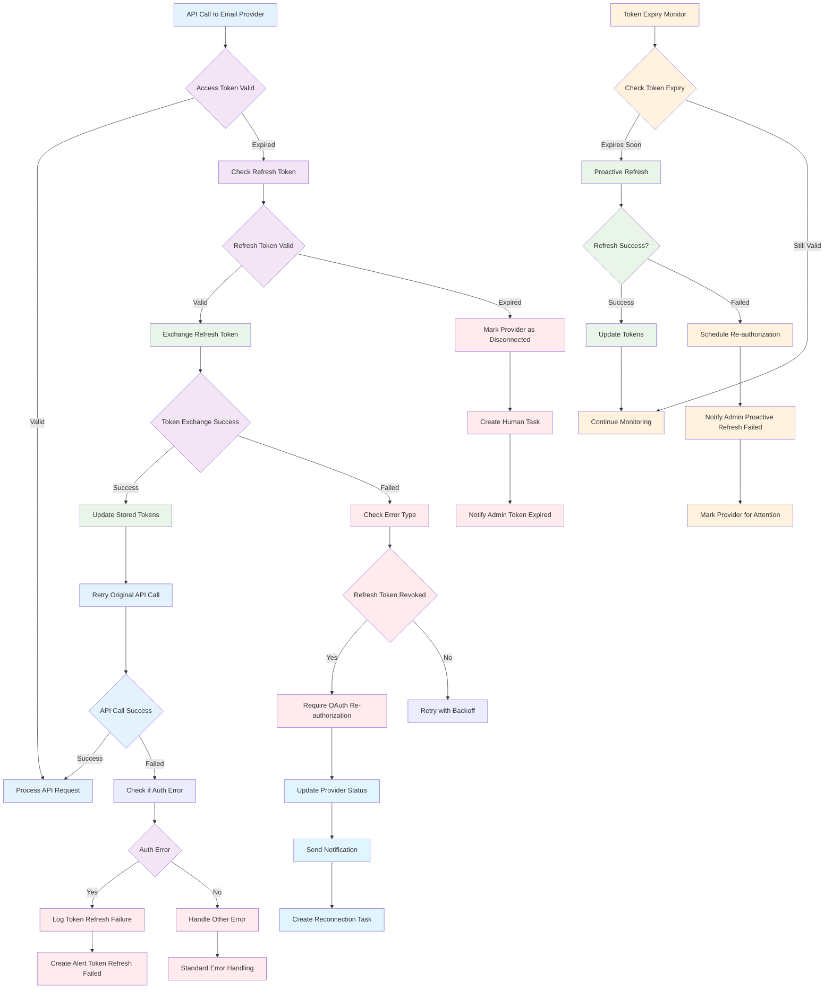

# Inbound Email API Guide

## Overview

This guide provides detailed API documentation for the Inbound Email feature, including endpoints, request/response formats, and integration examples.

## Authentication

All API endpoints require authentication. Include the authorization header in all requests:

```bash
Authorization: Bearer <your-access-token>
```

## Base URL

All endpoints are relative to your application's base URL:
```
https://your-domain.com/api/email/
```

## Email Provider Management

### List Email Providers

Get all email providers for a tenant.

**Endpoint:** `GET /providers`

**Parameters:**
- `tenant` (required): Tenant UUID
- `providerType` (optional): Filter by `microsoft` or `google`
- `isActive` (optional): Filter by active status (`true`/`false`)

**Example Request:**
```bash
curl -X GET "https://your-domain.com/api/email/providers?tenant=123e4567-e89b-12d3-a456-426614174000" \
  -H "Authorization: Bearer <token>"
```

**Example Response:**
```json
{
  "success": true,
  "providers": [
    {
      "id": "provider-uuid",
      "tenant": "tenant-uuid",
      "providerType": "microsoft",
      "providerName": "Support Email",
      "mailbox": "support@company.com",
      "isActive": true,
      "status": "connected",
      "lastSyncAt": "2024-01-15T10:30:00Z",
      "vendorConfig": {
        "clientId": "...",
        "autoProcessEmails": true,
        "folderFilters": ["Inbox"],
        "maxEmailsPerSync": 50
      },
      "createdAt": "2024-01-10T09:00:00Z",
      "updatedAt": "2024-01-15T10:30:00Z"
    }
  ],
  "count": 1
}
```

### Get Single Provider

Retrieve details for a specific email provider.

**Endpoint:** `GET /providers/{providerId}`

**Example Request:**
```bash
curl -X GET "https://your-domain.com/api/email/providers/provider-uuid" \
  -H "Authorization: Bearer <token>"
```

**Example Response:**
```json
{
  "success": true,
  "provider": {
    "id": "provider-uuid",
    "tenant": "tenant-uuid",
    "providerType": "microsoft",
    "providerName": "Support Email",
    "mailbox": "support@company.com",
    "isActive": true,
    "status": "connected",
    "vendorConfig": {
      "clientId": "...",
      "autoProcessEmails": true,
      "folderFilters": ["Inbox"],
      "maxEmailsPerSync": 50
    }
  }
}
```

### Create Email Provider

Create a new email provider configuration.

**Endpoint:** `POST /providers`

**Microsoft Provider Example:**
```bash
curl -X POST "https://your-domain.com/api/email/providers" \
  -H "Authorization: Bearer <token>" \
  -H "Content-Type: application/json" \
  -d '{
    "tenant": "tenant-uuid",
    "providerType": "microsoft",
    "providerName": "Support Email",
    "mailbox": "support@company.com",
    "isActive": true,
    "vendorConfig": {
      "clientId": "your-client-id",
      "clientSecret": "your-client-secret",
      "tenantId": "common",
      "redirectUri": "https://your-domain.com/api/auth/microsoft/callback",
      "autoProcessEmails": true,
      "folderFilters": ["Inbox"],
      "maxEmailsPerSync": 50
    }
  }'
```

**Gmail Provider Example:**
```bash
curl -X POST "https://your-domain.com/api/email/providers" \
  -H "Authorization: Bearer <token>" \
  -H "Content-Type: application/json" \
  -d '{
    "tenant": "tenant-uuid",
    "providerType": "google",
    "providerName": "Gmail Support",
    "mailbox": "support@company.com",
    "isActive": true,
    "vendorConfig": {
      "clientId": "your-client-id",
      "clientSecret": "your-client-secret",
      "projectId": "your-gcp-project",
      "redirectUri": "https://your-domain.com/api/auth/google/callback",
      "pubsubTopicName": "gmail-notifications",
      "pubsubSubscriptionName": "gmail-webhook-subscription",
      "autoProcessEmails": true,
      "labelFilters": ["INBOX"],
      "maxEmailsPerSync": 50
    }
  }'
```

**Success Response:**
```json
{
  "success": true,
  "provider": {
    "id": "new-provider-uuid",
    "tenant": "tenant-uuid",
    "providerType": "microsoft",
    "providerName": "Support Email",
    "mailbox": "support@company.com",
    "isActive": true,
    "status": "configuring"
  },
  "message": "Email provider created successfully"
}
```

### Update Email Provider

Update an existing email provider configuration.

**Endpoint:** `PUT /providers/{providerId}`

**Example Request:**
```bash
curl -X PUT "https://your-domain.com/api/email/providers/provider-uuid" \
  -H "Authorization: Bearer <token>" \
  -H "Content-Type: application/json" \
  -d '{
    "providerName": "Updated Support Email",
    "isActive": false,
    "vendorConfig": {
      "maxEmailsPerSync": 100
    }
  }'
```

### Test Provider Connection

Test the connection to an email provider.

**Endpoint:** `POST /providers/{providerId}/test`

**Example Request:**
```bash
curl -X POST "https://your-domain.com/api/email/providers/provider-uuid/test" \
  -H "Authorization: Bearer <token>"
```

**Success Response:**
```json
{
  "success": true,
  "message": "Connection test successful",
  "provider": {
    "id": "provider-uuid",
    "providerName": "Support Email",
    "status": "connected",
    "lastTestedAt": "2024-01-15T10:30:00Z"
  }
}
```

**Failure Response:**
```json
{
  "success": false,
  "error": "Authentication failed",
  "message": "Connection test failed",
  "provider": {
    "id": "provider-uuid",
    "status": "error",
    "errorMessage": "Invalid credentials",
    "lastTestedAt": "2024-01-15T10:30:00Z"
  }
}
```

### Delete Email Provider

Delete an email provider configuration.

**Endpoint:** `DELETE /providers/{providerId}`

**Example Request:**
```bash
curl -X DELETE "https://your-domain.com/api/email/providers/provider-uuid" \
  -H "Authorization: Bearer <token>"
```

**Response:**
```json
{
  "success": true,
  "message": "Email provider deleted successfully"
}
```

## Auto-Wiring

### Auto-Wire Email Provider

Automatically configure and set up an email provider using OAuth authorization.

**Endpoint:** `POST /providers/auto-wire`

**Microsoft Auto-Wire Example:**
```bash
curl -X POST "https://your-domain.com/api/email/providers/auto-wire" \
  -H "Authorization: Bearer <token>" \
  -H "Content-Type: application/json" \
  -d '{
    "providerType": "microsoft",
    "config": {
      "tenant": "tenant-uuid",
      "providerName": "Support Email",
      "mailbox": "support@company.com",
      "clientId": "your-client-id",
      "clientSecret": "your-client-secret",
      "tenantId": "common",
      "redirectUri": "https://your-domain.com/api/auth/microsoft/callback",
      "authorizationCode": "oauth-auth-code-from-frontend"
    }
  }'
```

**Gmail Auto-Wire Example:**
```bash
curl -X POST "https://your-domain.com/api/email/providers/auto-wire" \
  -H "Authorization: Bearer <token>" \
  -H "Content-Type: application/json" \
  -d '{
    "providerType": "google",
    "config": {
      "tenant": "tenant-uuid",
      "providerName": "Gmail Support",
      "mailbox": "support@company.com",
      "clientId": "your-client-id",
      "clientSecret": "your-client-secret",
      "projectId": "your-gcp-project",
      "redirectUri": "https://your-domain.com/api/auth/google/callback",
      "authorizationCode": "oauth-auth-code-from-frontend",
      "pubsubTopicName": "gmail-notifications",
      "pubsubSubscriptionName": "gmail-webhook-subscription"
    }
  }'
```

**Success Response:**
```json
{
  "success": true,
  "message": "microsoft email provider configured successfully",
  "provider": {
    "id": "provider-uuid",
    "status": "connected"
  },
  "status": "configured",
  "steps": [
    {
      "step": "oauth_exchange",
      "description": "Exchange authorization code for access tokens",
      "status": "completed",
      "timestamp": "2024-01-15T10:30:00Z"
    },
    {
      "step": "create_provider",
      "description": "Create email provider configuration",
      "status": "completed",
      "timestamp": "2024-01-15T10:30:15Z"
    }
  ]
}
```

## Google Pub/Sub Setup

### Setup Pub/Sub Infrastructure

Set up Google Cloud Pub/Sub topic and subscription for Gmail webhooks.

**Endpoint:** `POST /providers/setup-pubsub`

**Example Request:**
```bash
curl -X POST "https://your-domain.com/api/email/providers/setup-pubsub" \
  -H "Authorization: Bearer <token>" \
  -H "Content-Type: application/json" \
  -d '{
    "projectId": "your-gcp-project",
    "topicName": "gmail-notifications",
    "subscriptionName": "gmail-webhook-subscription",
    "webhookUrl": "https://your-domain.com/api/email/webhooks/google"
  }'
```

**Response:**
```json
{
  "success": true,
  "message": "Google Pub/Sub setup completed successfully",
  "result": {
    "topicName": "projects/your-gcp-project/topics/gmail-notifications",
    "subscriptionName": "projects/your-gcp-project/subscriptions/gmail-webhook-subscription",
    "webhookUrl": "https://your-domain.com/api/email/webhooks/google",
    "projectId": "your-gcp-project"
  }
}
```

## Webhook Endpoints

### Microsoft Webhook

Receives notifications from Microsoft Graph API when new emails arrive.

**Endpoint:** `POST /webhooks/microsoft`

This endpoint is called by Microsoft Graph API and should not be called directly.

### Google Webhook

Receives notifications from Google Pub/Sub when new Gmail messages arrive.

**Endpoint:** `POST /webhooks/google`

This endpoint is called by Google Cloud Pub/Sub and should not be called directly.

## Error Responses

All endpoints return standard error responses:

### 400 Bad Request
```json
{
  "error": "Invalid request data",
  "details": [
    {
      "field": "mailbox",
      "message": "Valid email address is required"
    }
  ]
}
```

### 401 Unauthorized
```json
{
  "error": "Unauthorized",
  "message": "Authentication required"
}
```

### 404 Not Found
```json
{
  "error": "Provider not found",
  "message": "Email provider with ID provider-uuid not found"
}
```

### 409 Conflict
```json
{
  "error": "Provider already exists",
  "message": "An email provider for support@company.com already exists"
}
```

### 500 Internal Server Error
```json
{
  "error": "Internal server error",
  "message": "Failed to process request"
}
```

## Rate Limits

- **Provider Management**: 100 requests per minute per tenant
- **Connection Testing**: 10 requests per minute per provider
- **Auto-Wiring**: 5 requests per minute per tenant

## SDKs and Libraries

### JavaScript/TypeScript

```typescript
// Example using fetch API
interface EmailProvider {
  id: string;
  tenant: string;
  providerType: 'microsoft' | 'google';
  providerName: string;
  mailbox: string;
  isActive: boolean;
}

async function getEmailProviders(tenant: string, token: string): Promise<EmailProvider[]> {
  const response = await fetch(`/api/email/providers?tenant=${tenant}`, {
    headers: {
      'Authorization': `Bearer ${token}`,
      'Content-Type': 'application/json'
    }
  });
  
  if (!response.ok) {
    throw new Error('Failed to fetch providers');
  }
  
  const data = await response.json();
  return data.providers;
}
```

### Integration Examples

#### React Hook for Provider Management

```typescript
import { useState, useEffect } from 'react';

export function useEmailProviders(tenant: string) {
  const [providers, setProviders] = useState<EmailProvider[]>([]);
  const [loading, setLoading] = useState(true);
  const [error, setError] = useState<string | null>(null);

  useEffect(() => {
    fetchProviders();
  }, [tenant]);

  const fetchProviders = async () => {
    try {
      setLoading(true);
      const response = await fetch(`/api/email/providers?tenant=${tenant}`);
      const data = await response.json();
      setProviders(data.providers);
    } catch (err: any) {
      setError(err.message);
    } finally {
      setLoading(false);
    }
  };

  const createProvider = async (providerData: CreateProviderData) => {
    const response = await fetch('/api/email/providers', {
      method: 'POST',
      headers: { 'Content-Type': 'application/json' },
      body: JSON.stringify(providerData)
    });
    
    if (response.ok) {
      await fetchProviders(); // Refresh list
    }
  };

  return { providers, loading, error, createProvider, refresh: fetchProviders };
}
```

## OAuth Token Expiration Handling

The system automatically handles OAuth token expiration and refresh to maintain continuous email processing without manual intervention.



### Token Refresh Implementation Details

1. **Automatic Detection**: API calls check token expiry before each request
2. **Proactive Refresh**: Background process refreshes tokens 5 minutes before expiration
3. **Fallback Logic**: If proactive refresh fails, on-demand refresh is attempted
4. **Error Handling**: Distinguishes between temporary failures and permanent revocation
5. **User Notification**: Alerts administrators when manual re-authorization is required

## Webhook Security

### Microsoft Graph Webhooks

Microsoft webhooks include a validation token that must be verified:

```typescript
// Webhook validation example
function validateMicrosoftWebhook(req: Request): boolean {
  const validationToken = req.query.validationToken;
  if (validationToken) {
    // Initial validation - echo back the token
    return true;
  }
  
  // Verify the webhook signature
  const signature = req.headers['x-ms-signature'];
  // Implement signature verification logic
  return verifySignature(req.body, signature);
}
```

### Google Pub/Sub Webhooks

Google webhooks are authenticated through IAM:

```typescript
// Pub/Sub message structure
interface PubSubMessage {
  message: {
    data: string; // Base64 encoded JSON
    messageId: string;
    publishTime: string;
  };
  subscription: string;
}

function processPubSubMessage(message: PubSubMessage) {
  const data = JSON.parse(Buffer.from(message.data, 'base64').toString());
  // Process Gmail notification
}
```

## Best Practices

### Error Handling

Always implement proper error handling:

```typescript
try {
  const provider = await createEmailProvider(config);
  console.log('Provider created:', provider.id);
} catch (error) {
  if (error.status === 409) {
    console.error('Provider already exists');
  } else if (error.status === 400) {
    console.error('Invalid configuration:', error.details);
  } else {
    console.error('Unexpected error:', error.message);
  }
}
```

### Retry Logic

Implement exponential backoff for API calls:

```typescript
async function apiCallWithRetry(url: string, options: RequestInit, maxRetries = 3) {
  for (let i = 0; i < maxRetries; i++) {
    try {
      const response = await fetch(url, options);
      if (response.ok) return response;
      
      if (response.status >= 500) {
        // Server error - retry with exponential backoff
        await new Promise(resolve => setTimeout(resolve, Math.pow(2, i) * 1000));
        continue;
      }
      
      // Client error - don't retry
      throw new Error(`HTTP ${response.status}: ${response.statusText}`);
    } catch (error) {
      if (i === maxRetries - 1) throw error;
    }
  }
}
```

### Security

- Store OAuth tokens securely
- Use HTTPS for all webhook endpoints
- Validate webhook signatures
- Implement proper CORS policies
- Use least-privilege access tokens

For more information, see the main [README.md](./README.md) documentation.