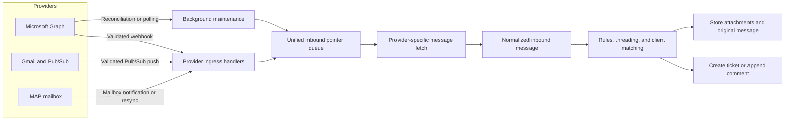

# Inbound Email Overall Architecture

Inbound email providers detect a message, enqueue a provider pointer, and fetch
the message only inside a worker. The processing pipeline then normalizes the
provider payload and creates a new ticket or adds a reply to an existing ticket.

The queue contains a provider, tenant, provider ID, and remote message pointer.
It does not need the full message body. The worker uses the tenant-scoped
provider configuration to fetch the source message, normalize headers and MIME
content, and pass it to the common ticket-processing path. Processed-message
records and queue idempotency prevent the same provider message from creating
duplicate work.

See [`workflow.md`](workflow.md) for the detailed ticket decision flow.

## Microsoft 365 path

1. An administrator authorizes delegated `Mail.Read`, `Mail.Read.Shared`, and
   `offline_access`. Alga PSA stores the OAuth tokens server-side with the
   provider configuration. The Email-bound Microsoft profile supplies the app
   credentials used for token refresh. Hosted deployments can use the platform
   app when no tenant Email binding exists.
2. For a user mailbox, Alga PSA attempts to create a Microsoft Graph
   change-notification subscription for the watched folder. Graph validates the
   public HTTPS notification URL during creation.
3. A notification is accepted only when its subscription maps to an active
   provider and its `clientState` matches the stored verification token. The
   handler then enqueues the Graph message ID.
4. A maintenance cycle renews subscriptions and reconciles Inbox. If webhook
   validation fails or webhook delivery repeatedly misses messages, polling
   enqueues the same kind of message pointer instead.
5. The queue worker uses Graph to download the message source and passes the
   normalized message to the shared processing pipeline.

Microsoft's delegated shared-mail scopes can read mailboxes the signed-in user
already has access to, but they do not support change-notification subscriptions
on shared or delegated folders. Shared-mailbox providers therefore normally use
polling. See [`../setup/microsoft.md`](../setup/microsoft.md) for the setup and
permission checklist.

## Other provider paths

| Provider | Detection path | Provider-specific state |
| --- | --- | --- |
| Gmail | Google Pub/Sub push and Gmail history | OAuth tokens, Pub/Sub topic/subscription, Gmail watch, and history cursor |
| IMAP | IMAP mailbox notification/resync path | Host, TLS and authentication settings, mailbox folder, and message UID |

Google Pub/Sub provisioning is initialized separately from the shared queue
pipeline. See [`pubsub.md`](pubsub.md) for that design. See
[`../setup/imap.md`](../setup/imap.md) for the current IMAP in-app processing
flags.

## Trust boundaries

* Inbound connectors read source mail. Processing state is stored in Alga PSA;
  the connectors do not mark source messages as read, move them, or send mail.
* Client secrets, access tokens, refresh tokens, and mailbox credentials stay on
  the server. Browser forms receive readiness state, not stored secret values.
* Provider webhooks are validated before queueing. Microsoft notifications are
  matched by subscription and `clientState`; Gmail Pub/Sub requests require a
  Google-signed bearer token.
* Provider lookup, queue jobs, message fetches, and ticket writes retain tenant
  and provider identity across the pipeline.
