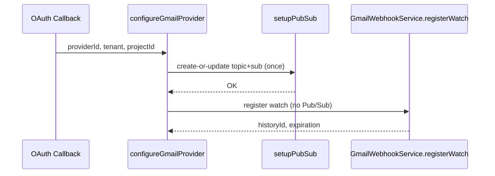

# Pub/Sub Architecture – Single-Initialisation Design

> Last updated: 2025-07-19

This document explains the **single-run** Google Pub/Sub initialisation strategy that replaced the previous logic where the same topic/subscription could be created up to four times during a single Gmail OAuth flow.  The refactor prevents Google from disabling subscriptions due to excessive creation attempts and clarifies the separation of concerns in the codebase.

## Problem Recap

Previously the stack called `setupPubSub` four times:

1. `upsertEmailProvider → finalizeGoogleProvider`  
2. `finalizeGoogleProvider → GmailWebhookService.setupGmailWebhook`  
3. `updateEmailProvider → finalizeGoogleProvider` (when the user hit **Save**)  
4. Same nested path as #2

Google interpreted this as spammy topic/subscription creation and suspended the push subscription.

## Target Design



Key points:

* **`configureGmailProvider`** is the *only* function that may call `setupPubSub`.
* Provider CRUD operations set `skipAutomation=true`, so normal **Save** does *not* touch Pub/Sub.
* A timestamp `pubsub_initialised_at` in `google_email_provider_config` guards against accidental extra runs (24-hour cool-down) unless `force=true`.

### Code Pointers

* Orchestration: `server/src/lib/actions/email-actions/configureGmailProvider.ts`
* Gmail watch only: `server/src/services/email/GmailWebhookService.ts`
* Low-level GCP client: `server/src/lib/actions/email-actions/setupPubSub.ts`

## Refresh Endpoint

Admins can explicitly refresh the topic/subscription:

```http
POST /api/email/refresh-watch
```

Internally this calls `configureGmailProvider({ force: true })` and therefore bypasses the 24-hour guard.

## Migration Notes

Details of the implementation phases, testing matrix and roll-out strategy are preserved in the original engineering plan (git history of this file).
