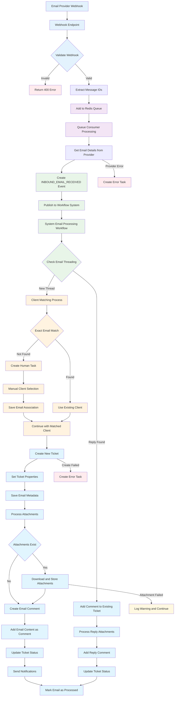

# Email-to-Ticket Workflow Architecture

This document contains the canonical flow diagram for converting an inbound email into a Ticket through the workflow engine.  All other docs should reference this file instead of embedding their own copy.

## Mermaid Diagram

### Notes

* The workflow file in code is `workflows/system-email-processing.json`.
* Human task generation points are highlighted in yellow.

