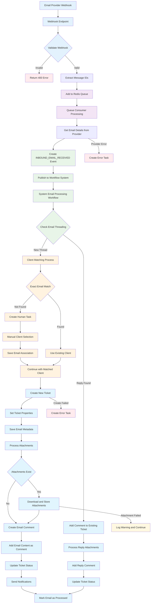

# Email-to-Ticket Workflow Architecture

This document contains the canonical flow diagram for converting an inbound email into a Ticket through the workflow engine.  All other docs should reference this file instead of embedding their own copy.

## Mermaid Diagram

```mermaid
flowchart TD
    A[Email Provider Webhook] --> B[Webhook Endpoint]
    B --> C{Validate Webhook}
    C -->|Invalid| ERROR1[Return 400 Error]
    C -->|Valid| D[Extract Message IDs]

    D --> E[Add to Redis Queue]
    E --> F[Queue Consumer Processing]
    F --> G[Get Email Details from Provider]

    G --> H[Create INBOUND_EMAIL_RECEIVED Event]
    H --> I[Publish to Workflow System]
    I --> J[System Email Processing Workflow]

    J --> K{Check Email Threading}
    K -->|Reply Found| L[Add Comment to Existing Ticket]
    K -->|New Thread| M[Client Matching Process]

    M --> N{Exact Email Match}
    N -->|Found| O[Use Existing Client]
    N -->|Not Found| P[Create Human Task]

    P --> Q[Manual Client Selection]
    Q --> R[Save Email Association]
    R --> S[Continue with Matched Client]
    O --> S

    S --> T[Create New Ticket]
    T --> U[Set Ticket Properties]
    U --> V[Save Email Metadata]
    V --> W[Process Attachments]

    W --> X{Attachments Exist}
    X -->|Yes| Y[Download and Store Attachments]
    X -->|No| Z[Create Email Comment]
    Y --> Z

    Z --> AA[Add Email Content as Comment]
    AA --> BB[Update Ticket Status]
    BB --> CC[Send Notifications]
    CC --> DD[Mark Email as Processed]

    G -->|Provider Error| ERROR2[Create Error Task]
    T -->|Create Failed| ERROR3[Create Error Task]
    Y -->|Attachment Failed| WARN1[Log Warning and Continue]

    L --> LL[Process Reply Attachments]
    LL --> MM[Add Reply Comment]
    MM --> NN[Update Ticket Status]
    NN --> DD

    classDef webhook fill:#e3f2fd
    classDef queue fill:#f3e5f5
    classDef workflow fill:#e8f5e8
    classDef client fill:#fff3e0
    classDef ticket fill:#e1f5fe
    classDef error fill:#ffebee
    classDef warning fill:#fff8e1

    class A,B,C webhook
    class E,F queue
    class H,I,J,K workflow
    class M,N,O,P,Q,R,S client
    class T,U,V,W,X,Y,Z,AA,BB,CC,DD,L,LL,MM,NN ticket
    class ERROR1,ERROR2,ERROR3 error
    class WARN1 warning
```

### Notes

* The workflow file in code is `workflows/system-email-processing.json`.
* Human task generation points are highlighted in yellow.

## Workflow events published

When the system email processing workflow creates a new ticket (node **T** in the diagram), it stamps an `occurredAt` timestamp and publishes a `TICKET_CREATED` event to the workflow event bus. Any custom workflow in the Automation Hub that is attached to the **Ticket Created** trigger will therefore fire for inbound-email tickets, just as it does for tickets created through the UI, API, or client portal.

If a matching workflow trigger is skipped — for example, because a payload field is missing, a schema reference is unrecognised, or a parameter mapping fails — the event row's `error_message` column is updated with a human-readable diagnostic. Query `workflow_events` where `error_message IS NOT NULL` to investigate silent non-fires.
