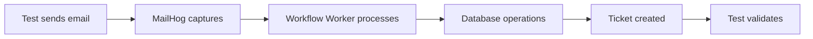

# Inbound Email E2E Testing Guide

## Overview

This guide explains how to test the complete inbound email processing pipeline using our comprehensive E2E testing infrastructure. The system validates the entire email-to-ticket workflow from email ingestion through workflow processing to ticket creation.

## Table of Contents

1. [Architecture Overview](#architecture-overview)
2. [Test Infrastructure](#test-infrastructure)
3. [Running Tests](#running-tests)
4. [Test Scenarios](#test-scenarios)
5. [Writing Custom Tests](#writing-custom-tests)
6. [Troubleshooting](#troubleshooting)
7. [CI/CD Integration](#cicd-integration)

## Architecture Overview

### Two-Layer Testing Architecture

Our E2E testing uses a two-layer architecture that integrates with the existing Vitest infrastructure:

#### 1. Infrastructure Layer (Docker Compose)
- **Purpose**: Provides real services for testing
- **File**: `docker-compose.e2e-with-worker.yaml`
- **Services**:
  - **PostgreSQL** (port 5433) - Test database
  - **Redis** (port 6380) - Test workflow streams
  - **Workflow Worker** (port 4001) - Email processing engine
  - **MailHog** (port 8025/1025) - Email capture service
  - **WireMock** (port 8080) - Webhook mocking

#### 2. Test Layer (Vitest + Utilities)
- **Purpose**: Orchestrates tests and validates infrastructure
- **Location**: `server/src/test/e2e/`
- **Integration**: Extends existing `TestContext` patterns

### Email Processing Flow



## Test Infrastructure

### Core Components

#### E2ETestContext
Extends the existing `TestContext` with E2E capabilities:

```typescript
import { E2ETestContext } from './utils/e2e-test-context';

const testHelpers = E2ETestContext.createE2EHelpers();
let context: E2ETestContext;

beforeAll(async () => {
  context = await testHelpers.beforeAll({
    runSeeds: true,
    testMode: 'e2e',
    autoStartServices: true,
    clearEmailsBeforeTest: true
  });
});
```

#### DockerServiceManager
Manages the lifecycle of Docker services:

```typescript
// Automatically starts services
await dockerServices.startE2EServices();

// Waits for health checks
await dockerServices.waitForHealthChecks();

// Monitors workflow processing
await dockerServices.waitForWorkflowProcessing();
```

#### MailHogClient
Handles email sending and capture validation:

```typescript
// Send and capture email in one operation
const { sentEmail, capturedEmail } = await context.sendAndCaptureEmail({
  from: 'customer@example.com',
  to: 'support@company.com',
  subject: 'Test Support Request',
  body: 'This is a test email'
});
```

#### EmailTestFactory
Creates comprehensive test scenarios:

```typescript
// Create a complete email scenario with tenant, company, and contact
const { tenant, company, contact } = await context.emailTestFactory.createBasicEmailScenario();

// Create email provider configuration
const emailProvider = await context.emailTestFactory.createTestEmailProvider(tenant.tenant);
```

## Running Tests

### Available Test Scripts

```bash
# Run all E2E tests
npm run test:e2e

# Run specific test files
npm run test:e2e:email      # Email processing tests
npm run test:e2e:workflow   # Workflow integration tests  
npm run test:e2e:pipeline   # Full pipeline tests

# Run with Vitest options
npm run test:e2e -- --reporter=verbose
npm run test:e2e -- --run    # Run once without watch mode
```

### Manual Service Management (Optional)

```bash
# Start services manually for debugging
cd /Users/robertisaacs/alga-psa
docker-compose -f docker-compose.e2e-with-worker.yaml up -d

# Check service health
curl http://localhost:8025        # MailHog web interface
curl http://localhost:4001/health # Workflow worker health

# View logs
docker-compose -f docker-compose.e2e-with-worker.yaml logs workflow-worker-test

# Stop services
docker-compose -f docker-compose.e2e-with-worker.yaml down
```

## Test Scenarios

### 1. Basic Email Ingestion

**Validates**: Email capture → Workflow processing → Ticket creation

```typescript
it('should process a simple email and create a ticket', async () => {
  // Arrange
  const { tenant, company, contact } = await context.emailTestFactory.createBasicEmailScenario();
  
  const testEmail = {
    from: contact.email,
    to: 'support@company.com',
    subject: 'Test Support Request',
    body: 'This is a test support request.'
  };

  // Act
  const { sentEmail, capturedEmail } = await context.sendAndCaptureEmail(testEmail);
  await context.waitForWorkflowProcessing();

  // Assert
  const tickets = await context.db.raw(`
    SELECT t.*, c.email as contact_email 
    FROM tickets t 
    JOIN contacts c ON t.contact_name_id = c.contact_name_id
    WHERE c.email = ?
  `, [contact.email]);
  
  expect(tickets).toHaveLength(1);
  expect(tickets[0].title).toContain(testEmail.subject);
});
```

### 2. Email Threading

**Validates**: Reply emails are properly threaded to existing tickets

```typescript
it('should properly thread email replies', async () => {
  // Send initial email → Creates ticket
  const initialEmail = { /* ... */ };
  const { sentEmail: initialSent } = await context.sendAndCaptureEmail(initialEmail);
  
  // Send reply email with proper headers
  const replyEmail = {
    subject: 'Re: Initial Support Request',
    inReplyTo: initialSent.messageId,
    references: initialSent.messageId
    // ...
  };
  
  // Validate threading
  const tickets = await context.db.raw(/* query for same ticket */);
  expect(tickets).toHaveLength(1); // Same ticket, not new one
});
```

### 3. Attachment Processing

**Validates**: Email attachments are properly processed and stored

```typescript
it('should handle emails with attachments', async () => {
  const testEmail = {
    // ...
    attachments: [{
      filename: 'test-document.pdf',
      content: Buffer.from('Test PDF content'),
      contentType: 'application/pdf'
    }]
  };
  
  // Validate attachment storage
  const attachments = await context.db.raw(/* query attachments */);
  expect(attachments[0].file_name).toBe('test-document.pdf');
});
```

### 4. Client Matching

**Validates**: Emails are matched to correct clients/contacts

```typescript
it('should match emails to existing clients', async () => {
  // Create known client scenario
  const { contact } = await context.emailTestFactory.createBasicEmailScenario();
  
  // Send email from known contact
  const testEmail = { from: contact.email /* ... */ };
  
  // Validate client association
  const tickets = await context.db.raw(/* query with joins */);
  expect(tickets[0].contact_email).toBe(contact.email);
});
```

### 5. Unknown Sender Handling

**Validates**: Unknown senders trigger manual workflow fallbacks

```typescript
it('should handle unknown email addresses with manual fallback', async () => {
  const unknownEmail = { from: 'unknown@example.com' /* ... */ };
  
  // Should create workflow event for manual processing
  const workflowEvents = await context.db.raw(`
    SELECT * FROM workflow_events 
    WHERE event_type = 'email_client_selection_required'
  `);
  
  expect(workflowEvents).toHaveLength(1);
  expect(workflowEvents[0].status).toBe('pending');
});
```

## Writing Custom Tests

### Basic Test Structure

```typescript
import { describe, it, expect, beforeAll, afterAll, beforeEach, afterEach } from 'vitest';
import { E2ETestContext } from './utils/e2e-test-context';

describe('Custom Email Processing Tests', () => {
  const testHelpers = E2ETestContext.createE2EHelpers();
  let context: E2ETestContext;

  beforeAll(async () => {
    context = await testHelpers.beforeAll({
      runSeeds: true,
      testMode: 'e2e'
    });
  });

  afterAll(async () => {
    await testHelpers.afterAll(context);
  });

  beforeEach(async () => {
    await testHelpers.beforeEach(context);
  });

  afterEach(async () => {
    await testHelpers.afterEach(context);
  });

  it('should handle custom scenario', async () => {
    // Your test logic here
  });
});
```

### Creating Test Data

```typescript
// Basic scenario (tenant + company + contact)
const scenario = await context.emailTestFactory.createBasicEmailScenario();

// Multi-client scenario
const multiClient = await context.emailTestFactory.createMultiClientScenario();

// Email threading scenario
const threading = await context.emailTestFactory.createEmailThreadScenario();

// Custom contact
const contact = await context.emailTestFactory.createContact(companyId, {
  email: 'custom@example.com',
  first_name: 'Custom',
  last_name: 'Contact'
});
```

### Email Testing Patterns

```typescript
// Simple email send and capture
const { sentEmail, capturedEmail } = await context.sendAndCaptureEmail(emailData);

// Manual email operations
const sentEmail = await context.mailhogClient.sendEmail(emailData);
const capturedEmail = await context.mailhogClient.waitForEmailCapture(sentEmail.messageId);

// Search captured emails
const emails = await context.mailhogClient.searchMessages({
  from: 'test@example.com',
  subject: 'Test Subject'
});

// Get email thread
const thread = await context.mailhogClient.getEmailThread(messageId);
```

### Database Validation

```typescript
// Query tickets with contact info
const tickets = await context.db.raw(`
  SELECT t.*, c.email, comp.company_name
  FROM tickets t 
  JOIN contacts c ON t.contact_name_id = c.contact_name_id
  JOIN companies comp ON c.company_id = comp.company_id
  WHERE c.email = ?
`, [emailAddress]);

// Query workflow events
const events = await context.db.raw(`
  SELECT * FROM workflow_events 
  WHERE event_type = ? 
  AND created_at > ?
`, [eventType, testStartTime]);

// Query email messages
const messages = await context.db.raw(`
  SELECT * FROM email_messages 
  WHERE ticket_id = ?
  ORDER BY created_at
`, [ticketId]);
```

## Troubleshooting

### Common Issues

#### 1. Services Not Starting

```bash
# Check service status
docker-compose -f docker-compose.e2e-with-worker.yaml ps

# View logs
docker-compose -f docker-compose.e2e-with-worker.yaml logs

# Restart specific service
docker-compose -f docker-compose.e2e-with-worker.yaml restart workflow-worker-test
```

#### 2. Test Timeouts

```typescript
// Increase timeout for slow operations
await context.waitForWorkflowProcessing(60000); // 60 seconds

// Check service health
const status = await context.getServicesStatus();
console.log('Service status:', status);
```

#### 3. Email Not Captured

```bash
# Check MailHog web interface
open http://localhost:8025

# Check MailHog API
curl http://localhost:8025/api/v1/messages
```

#### 4. Database Issues

```typescript
// Check database connectivity
const result = await context.db.raw('SELECT version()');
console.log('Database version:', result);

// Check test data
const tenants = await context.db('tenants').select();
console.log('Available tenants:', tenants);
```

### Debug Mode

```typescript
// Enable verbose logging in tests
const context = await testHelpers.beforeAll({
  testMode: 'e2e',
  // Add debug logging
  setupCommands: ['SET log_statement = "all"']
});

// Check service logs during test
const logs = await context.dockerServices.getContainerLogs('workflow-worker-test');
console.log('Worker logs:', logs);
```

### Manual Testing

```typescript
// Create a test that doesn't auto-cleanup for manual inspection
it.only('manual debugging test', async () => {
  const scenario = await context.emailTestFactory.createBasicEmailScenario();
  
  console.log('Test data created:');
  console.log('- Tenant:', scenario.tenant.tenant);
  console.log('- Company:', scenario.company.company_name);
  console.log('- Contact:', scenario.contact.email);
  
  // Send email and pause for manual inspection
  const email = await context.sendAndCaptureEmail({
    from: scenario.contact.email,
    to: 'support@company.com',
    subject: 'Manual Debug Email',
    body: 'Check MailHog and database manually'
  });
  
  console.log('Email sent, check:');
  console.log('- MailHog: http://localhost:8025');
  console.log('- Workflow: http://localhost:4001/health');
  
  // Don't cleanup automatically
  await new Promise(resolve => setTimeout(resolve, 300000)); // Wait 5 minutes
});
```

## CI/CD Integration

### GitHub Actions Example

```yaml
name: E2E Email Tests

on: [push, pull_request]

jobs:
  e2e-tests:
    runs-on: ubuntu-latest
    
    services:
      postgres:
        image: postgres:13
        env:
          POSTGRES_PASSWORD: postpass123
        options: >-
          --health-cmd pg_isready
          --health-interval 10s
          --health-timeout 5s
          --health-retries 5
    
    steps:
      - uses: actions/checkout@v3
      
      - name: Setup Node.js
        uses: actions/setup-node@v3
        with:
          node-version: '18'
          cache: 'npm'
          cache-dependency-path: server/package-lock.json
      
      - name: Install dependencies
        run: cd server && npm ci
      
      - name: Start E2E services
        run: |
          cd server
          docker-compose -f ../docker-compose.e2e-with-worker.yaml up -d
          
      - name: Wait for services
        run: |
          cd server
          npm run test:e2e -- --run --reporter=verbose
      
      - name: Cleanup
        if: always()
        run: |
          cd server
          docker-compose -f ../docker-compose.e2e-with-worker.yaml down
```

### Local Development Integration

```bash
# Add to your .zshrc or .bashrc
alias test-email="cd /path/to/alga-psa/server && npm run test:e2e:email"
alias test-e2e-debug="cd /path/to/alga-psa && docker-compose -f docker-compose.e2e-with-worker.yaml up"

# VS Code tasks.json
{
  "version": "2.0.0",
  "tasks": [
    {
      "label": "Run E2E Email Tests",
      "type": "shell",
      "command": "npm",
      "args": ["run", "test:e2e:email"],
      "group": "test",
      "presentation": {
        "echo": true,
        "reveal": "always",
        "focus": false,
        "panel": "shared"
      }
    }
  ]
}
```

## Best Practices

### Test Organization

1. **One scenario per test** - Keep tests focused and isolated
2. **Descriptive test names** - Clearly indicate what's being validated
3. **Proper cleanup** - Always clean up test data and services
4. **Realistic test data** - Use email addresses and content similar to production

### Performance Optimization

1. **Reuse services** - Let E2ETestContext manage service lifecycle
2. **Parallel execution** - Use Vitest's parallel capabilities where possible
3. **Targeted tests** - Run specific test files during development
4. **Service monitoring** - Check service health to avoid unnecessary restarts

### Debugging Strategies

1. **Incremental testing** - Start with simple scenarios and build up
2. **Service logs** - Use docker-compose logs to debug issues
3. **Manual verification** - Use MailHog web interface to verify email capture
4. **Database inspection** - Query database directly to verify data creation

This comprehensive E2E testing infrastructure provides robust validation of the entire inbound email processing pipeline while integrating seamlessly with your existing Vitest test suite.