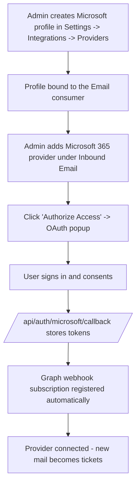

# Microsoft 365 Provider Setup (Outlook / Exchange Online)

This guide walks an administrator through connecting a Microsoft 365 / Exchange Online mailbox so that incoming email is turned into tickets. It uses a tenant-owned Microsoft Entra ID app registration plus Microsoft Graph change notifications (webhooks).

> **Inbound only — this connector never sends email.**
>
> The Microsoft 365 / Entra provider *reads* a mailbox and converts messages into
> tickets. It is not an outbound transport, and there is no Microsoft/Graph send
> path in the product — outbound email always goes through **SMTP** (all tiers) or
> **managed Resend domains** (Solo tier and up). See
> [Outbound email is configured separately](#outbound-email-is-configured-separately) below.
>
> A Microsoft provider (or integration profile) showing **Ready** only means the
> Entra app credentials (client ID + client secret, plus tenant ID for a profile)
> are configured — it says nothing about the ability to send email.

> Microsoft 365 inbound email is an Enterprise Edition feature; the provider type
> is not offered in Community Edition builds.

## Prerequisites

* A Microsoft Entra ID **app registration** the tenant owns, with:
  * **Client ID**, **client secret**, and (optionally) the **directory (tenant) ID**.
  * Sign-in audience allowing multi-tenant sign-in ("Accounts in any organizational directory") — authorization uses the `login.microsoftonline.com/common` endpoint.
  * Redirect URI (type *Web*): `https://<your-host>/api/auth/microsoft/callback`.
  * Delegated Microsoft Graph permissions: `Mail.Read`, `Mail.Read.Shared`, `offline_access` (the OAuth flow requests read-only mail access).
* The mailbox to connect (a licensed user mailbox or a shared mailbox the authorizing user can read).
* An Alga PSA user with permission to manage system settings (**Settings → Integrations → Providers** requires `system_settings:update`).
* The server must be reachable from the public internet at its configured base URL — Microsoft Graph delivers notifications to `https://<your-host>/api/email/webhooks/microsoft`.

## End-to-End Flow

## Step-by-Step

### 1. Register the Entra app

1. In the [Microsoft Entra admin center](https://entra.microsoft.com), create an **App registration**.
2. Add the *Web* redirect URI shown in the Providers screen: `https://<your-host>/api/auth/microsoft/callback`.
3. Under **API permissions**, add the delegated Graph permissions `Mail.Read`, `Mail.Read.Shared`, and `offline_access`.
4. Create a **client secret** and note the value.

### 2. Configure the tenant credentials (profile)

1. Open **Settings → Integrations → Providers**.
2. In the Microsoft section, click **New Profile** and enter a **display name**, the **Client ID**, the **Tenant ID** (or leave `common`), and the **Client secret**. Mark it as default if it is your only profile.
3. Make sure the profile is bound to the **Email** consumer (the consumer bindings section on the same screen). The provider form's **Authorize Access** button stays disabled until an Email-bound profile is ready.

Provider credentials are entered only here — the email provider form itself no longer asks for a client ID/secret. See `docs/integrations/provider-setup-order.md` for the recommended ordering across SSO, email, and calendar.

### 3. Add the inbound email provider

1. Open **Settings → Email → Inbound Email** (also reachable via **Settings → Integrations → Communication → Email**).
2. Click **Add Email Provider** and choose **Microsoft 365**.
3. Fill in:
   * **Configuration Name** — display name for the provider.
   * **Email Address** — the mailbox to ingest.
   * **Ticket Defaults** — which board/status/priority new email tickets get (optional).
   * **Folder Filters** — comma-separated folders to watch (defaults to `Inbox`).
   * **Max Emails Per Sync** — 1–1000, defaults to 50.
   * **Redirect URI** — pre-filled; must exactly match the URI registered in Entra.
4. Click **Authorize Access** and complete the Microsoft consent in the popup. The window closes automatically; the Graph webhook subscription is registered as part of the callback, and the provider shows as connected.

## How It Works at Runtime

* The OAuth callback stores the access/refresh tokens and immediately creates a Microsoft Graph **change-notification subscription** (`changeType: created`) on the watched folder(s), pointing at `https://<your-host>/api/email/webhooks/microsoft`.
* Graph subscriptions are short-lived (created for roughly 60 hours). A background maintenance job sweeps every 15 minutes with a 24-hour look-ahead, renews subscriptions before expiry, and recreates them if Graph reports them gone.
* Delivery is webhook-driven — there is no timed polling for Microsoft providers. Each notification enqueues the message pointer; a worker fetches the full message from Graph and runs the standard email-to-ticket workflow.
* The connector operates read-only against the mailbox: it does not mark messages, move them, or send replies.

If no tenant profile is bound to the Email consumer, hosted deployments fall back to the platform-level Microsoft app credentials (`MICROSOFT_CLIENT_ID` / `MICROSOFT_CLIENT_SECRET` / `MICROSOFT_TENANT_ID`). Self-hosted installs should always configure their own profile.

## Outbound Email Is Configured Separately

Connecting a Microsoft mailbox does **not** enable sending. Ticket replies, notifications, and all other outbound mail use one of:

* **SMTP** — available on every tier, and the only option on appliance / Essentials-tier installs (the outbound provider selector is locked to SMTP there).
* **Managed Resend domains** — Solo tier and up.

To enable outbound on an appliance install:

1. Go to **Settings → Email → Outbound**.
2. Fill in the SMTP **Host**, **Port**, **Username**, **Password**, and **From** address, then **Save**.
3. The outbound domain is derived from the SMTP **From** address (not from the Entra mailbox). Once saved, the **Ticketing From** field and its Save button become editable — set it to the address replies should come from (typically the same address as the inbound mailbox, so threading works for your customers).

## Troubleshooting

* **"Authorize Access" is disabled / alert about provider settings** — no Microsoft profile is bound to the Email consumer. Use the **Open Providers Settings** link (or **Settings → Integrations → Providers**) and create/bind a profile first.
* **OAuth popup fails** — confirm the redirect URI in the form exactly matches the one registered in the Entra app, and that the app allows multi-tenant sign-in (`/common` authority).
* **Provider says Ready/connected but customers get no email** — expected: this provider is inbound-only. Configure outbound SMTP (or Resend) as described above.
* **No new tickets from incoming mail** — check the provider's subscription health (`email_provider_health` / the renewal status in the provider list) and use the retry-renewal action; Graph subscriptions expire if renewal cannot reach Microsoft. Also confirm the server's base URL is publicly reachable, since notifications are pushed to `/api/email/webhooks/microsoft`.
* **Wrong folder being watched** — adjust **Folder Filters** on the provider and re-save; each watched folder needs its own subscription.
