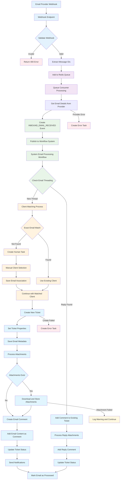
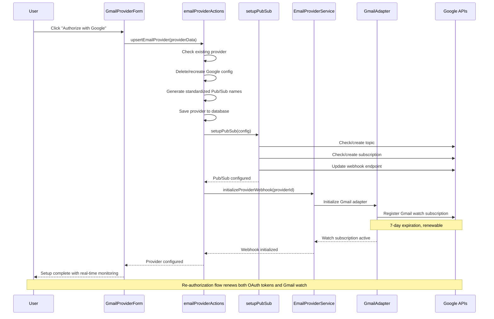

# Email Processing Workflow Guide

## Overview

The inbound email processing workflow is a system-managed workflow that automatically converts incoming emails into tickets. This guide explains how the workflow operates, its decision points, and customization options.

## Workflow Architecture

### System-Managed Workflow

The email processing workflow is **system-managed**, meaning:

- Not customizable per tenant
- Hardcoded business logic
- Consistent behavior across all tenants
- Automatic updates with system deployments

### Workflow Registration

The workflow is registered in the database as:
- **Name**: `system-email-processing`
- **Version**: `1.0.0`
- **Trigger Event**: `INBOUND_EMAIL_RECEIVED`
- **Type**: System workflow

## Email Webhook to Ticket Creation Flow

The complete flow from email webhook notification to ticket creation demonstrates the end-to-end processing through the workflow system.



## Gmail Provider OAuth Authorization Flow

The Gmail provider setup requires OAuth authorization and automatic Gmail watch subscription setup for real-time email notifications.



## Workflow Flow

### 1. Email Reception

**Trigger**: `INBOUND_EMAIL_RECEIVED` event

**Input Data**:
```json
{
  "triggerEvent": {
    "eventType": "INBOUND_EMAIL_RECEIVED",
    "payload": {
      "emailId": "email-123",
      "providerId": "provider-uuid",
      "tenant": "tenant-uuid",
      "emailData": {
        "id": "email-123",
        "provider": "microsoft|google",
        "receivedAt": "2024-01-15T10:30:00Z",
        "from": {
          "email": "customer@example.com",
          "name": "Customer Name"
        },
        "subject": "Support Request",
        "body": {
          "text": "Plain text content",
          "html": "<p>HTML content</p>"
        },
        "threadId": "thread-456",
        "inReplyTo": "<previous-message-id>",
        "references": ["<ref1>", "<ref2>"],
        "attachments": [...]
      }
    }
  }
}
```

### 2. Email Threading Check

**Purpose**: Determine if email is part of existing conversation

**Logic**:
1. Check for `inReplyTo` header
2. Check for `references` headers
3. Look up existing tickets with matching email metadata
4. If match found → Route to reply handler
5. If no match → Continue to client matching

**Threading Headers Used**:
- `In-Reply-To`: Direct reply reference
- `References`: Full conversation chain
- `Thread-ID`: Provider-specific thread identifier
- `Message-ID`: Unique message identifier

**Example Threading Query**:
```sql
SELECT t.id, t.ticket_number, t.subject, s.name as status
FROM tickets t
LEFT JOIN statuses s ON t.status_id = s.id
WHERE t.tenant = ?
  AND (
    t.email_metadata->>'messageId' = ? OR
    t.email_metadata->'references' ? ? OR
    t.email_metadata->>'inReplyTo' = ? OR
    t.email_metadata->>'threadId' = ?
  )
```

### 3. Client Matching

**Purpose**: Associate email sender with existing client/company

**Exact Matching Process**:
1. Search contacts table for exact email match
2. If found → Use existing client association
3. If not found → Create human task for manual matching

**No Fuzzy Matching**: The system intentionally uses only exact email matches to avoid incorrect associations.

**Manual Matching Task**:
When no exact match is found, a human task is created with an inline form:

```json
{
  "taskType": "match_email_to_client",
  "title": "Match Email to Client: Support Request",
  "description": "Please match this email from customer@example.com to a client.",
  "formSchema": {
    "type": "object",
    "properties": {
      "selectedCompanyId": {
        "type": "string",
        "format": "uuid",
        "title": "Select Existing Company"
      },
      "createNewCompany": {
        "type": "boolean",
        "title": "Create New Company"
      },
      "newCompanyName": {
        "type": "string",
        "title": "New Company Name"
      },
      "contactName": {
        "type": "string",
        "title": "Contact Name"
      },
      "saveEmailAssociation": {
        "type": "boolean",
        "title": "Remember this email association",
        "default": true
      }
    }
  }
}
```

### 4. Ticket Creation

**Purpose**: Create new ticket from email content

**Ticket Data**:
```typescript
{
  title: emailData.subject,
  description: emailData.body.text,
  company_id: matchedClient?.companyId,
  contact_id: matchedClient?.contactId,
  source: 'email',
  channel_id: 'email-channel-id', // Auto-created if needed
  status_id: 'new-status-id',     // Default "New" status
  priority_id: 'medium-priority-id', // Default "Medium" priority
  email_metadata: {
    messageId: emailData.id,
    threadId: emailData.threadId,
    from: emailData.from,
    inReplyTo: emailData.inReplyTo,
    references: emailData.references,
    providerId: providerId
  }
}
```

### 5. Attachment Processing

**Purpose**: Download and associate email attachments with ticket

**Process**:
1. Iterate through email attachments
2. Download attachment content from provider
3. Store in document management system
4. Create document association with ticket

**Attachment Processing Logic**:
```typescript
for (const attachment of emailData.attachments) {
  try {
    await actions.process_email_attachment({
      emailId: emailData.id,
      attachmentId: attachment.id,
      ticketId: ticketResult.id,
      tenant: tenant,
      providerId: providerId,
      attachmentData: attachment
    });
  } catch (error) {
    // Log warning but continue processing other attachments
    logger.warn(`Failed to process attachment ${attachment.name}: ${error.message}`);
  }
}
```

### 6. Comment Creation

**Purpose**: Add original email content as initial ticket comment

**Comment Data**:
```typescript
{
  ticket_id: ticketResult.id,
  content: emailData.body.html || emailData.body.text,
  format: emailData.body.html ? 'html' : 'text',
  source: 'email',
  author_type: 'system',
  metadata: {
    emailSource: true,
    originalEmailId: emailData.id,
    fromEmail: emailData.from.email,
    fromName: emailData.from.name,
    emailSubject: emailData.subject,
    emailReceivedAt: emailData.receivedAt
  }
}
```

## Reply Handling

### Email Reply Detection

When an email is identified as a reply to an existing ticket:

1. **Skip client matching** (already associated)
2. **Add as comment** to existing ticket
3. **Process attachments** for the reply
4. **Maintain conversation thread**

### Reply Comment Format

```typescript
{
  ticket_id: existingTicket.ticketId,
  content: emailData.body.html || emailData.body.text,
  format: emailData.body.html ? 'html' : 'text',
  source: 'email',
  author_type: 'contact', // Reply from client
  metadata: {
    emailSource: true,
    emailId: emailData.id,
    fromEmail: emailData.from.email,
    fromName: emailData.from.name,
    emailSubject: emailData.subject,
    emailReceivedAt: emailData.receivedAt,
    isReply: true,
    replyToMessageId: emailData.inReplyTo
  }
}
```

## Error Handling

### Automatic Error Recovery

The workflow includes comprehensive error handling:

1. **Continue on attachment failures** (warn and proceed)
2. **Create human tasks for processing errors**
3. **Maintain email threading even with errors**
4. **Preserve original email data for manual review**

### Error Resolution Task

When workflow execution fails, a human task is created:

```json
{
  "taskType": "email_processing_error",
  "title": "Error Processing Inbound Email",
  "description": "Failed to process email: Support Request",
  "formSchema": {
    "type": "object",
    "properties": {
      "retryProcessing": {
        "type": "boolean",
        "title": "Retry Email Processing"
      },
      "skipEmail": {
        "type": "boolean",
        "title": "Skip This Email"
      },
      "manualTicketId": {
        "type": "string",
        "format": "uuid",
        "title": "Link to Existing Ticket"
      },
      "notes": {
        "type": "string",
        "title": "Resolution Notes"
      }
    }
  }
}
```

## Workflow Actions

### Core Actions Used

The workflow uses these workflow actions:

**Email Actions**:
- `find_ticket_by_email_thread`: Thread detection
- `process_email_attachment`: Attachment handling
- `find_contact_by_email`: Client matching
- `create_company`: New company creation
- `create_or_find_contact`: Contact management
- `save_email_client_association`: Association storage

**System Actions**:
- `find_channel_by_name`: Channel lookup
- `create_channel`: Channel creation
- `find_status_by_name`: Status lookup
- `find_priority_by_name`: Priority lookup

**Ticket Actions**:
- `create_ticket`: Ticket creation
- `create_ticket_comment`: Comment creation

### Action Registry

Actions are registered in the workflow runtime:

```typescript
export const ACTION_REGISTRY = {
  'find_contact_by_email': findContactByEmail,
  'create_ticket': createTicket,
  'create_ticket_comment': createTicketComment,
  // ... other actions
};
```

## Configuration Options

### Hardcoded Settings

These settings are hardcoded in the workflow:

- **Retry Policy**: 3 attempts with exponential backoff
- **Default Priority**: "Medium"
- **Default Status**: "New"
- **Default Channel**: "Email" (auto-created)
- **Threading Strategy**: Exact header matching only

### Configurable via Provider Settings

These settings can be configured per email provider:

- **Auto-processing**: Enable/disable automatic processing
- **Folder/Label filters**: Which folders/labels to monitor
- **Max emails per sync**: Rate limiting
- **Processing hours**: Time-based processing windows (future)

## Monitoring and Debugging

### Workflow State Tracking

The workflow tracks its state through these phases:

1. `PROCESSING_INBOUND_EMAIL`
2. `CHECKING_EMAIL_THREADING`
3. `MATCHING_EMAIL_CLIENT`
4. `CREATING_TICKET`
5. `PROCESSING_ATTACHMENTS`
6. `EMAIL_PROCESSED`

### Error States

- `ERROR_PROCESSING_EMAIL`: General processing error
- `AWAITING_MANUAL_RESOLUTION`: Waiting for human task completion

### Logging

Key events are logged with structured data:

```typescript
logger.info('Processing inbound email', {
  emailId: emailData.id,
  from: emailData.from.email,
  subject: emailData.subject,
  providerId: providerId,
  tenant: tenant
});
```

## Performance Considerations

### Queue Processing

- Emails are processed asynchronously via Redis queue
- Each email gets individual workflow execution
- No batching (by design for isolation)

### Database Queries

- Threading queries use indexed email metadata
- Client matching uses indexed email addresses
- Efficient attachment storage with streaming

### Memory Usage

- Email content is not stored permanently
- Attachments are streamed to storage
- Workflow context is lightweight

## Testing the Workflow

### Unit Testing

Test individual workflow actions:

```typescript
import { findContactByEmail } from '../actions/email/findContactByEmail';

describe('findContactByEmail', () => {
  it('should find existing contact by email', async () => {
    const result = await findContactByEmail.execute(
      { email: 'test@example.com' },
      mockContext
    );
    expect(result).toBeDefined();
    expect(result.email).toBe('test@example.com');
  });
});
```

### Integration Testing

Test complete workflow execution:

```typescript
import { systemEmailProcessingWorkflow } from '../workflows/system-email-processing-workflow';

describe('Email Processing Workflow', () => {
  it('should create ticket from new email', async () => {
    const context = createMockWorkflowContext({
      triggerEvent: {
        eventType: 'INBOUND_EMAIL_RECEIVED',
        payload: mockEmailData
      }
    });
    
    await systemEmailProcessingWorkflow(context);
    
    expect(context.actions.create_ticket).toHaveBeenCalled();
  });
});
```

### End-to-End Testing

Test with real email providers (use test accounts):

1. Send email to configured test provider
2. Verify webhook is triggered
3. Check email is queued for processing
4. Verify ticket is created correctly
5. Test reply handling with threaded emails

## Customization Guidelines

### When to Modify

The workflow should only be modified for:

- Critical bug fixes
- New provider support
- Enhanced threading logic
- Improved error handling

### When NOT to Modify

Do not modify the workflow for:

- Tenant-specific business rules
- Custom field mappings
- Different approval processes
- Custom notification logic

**Use custom workflows** for tenant-specific requirements instead.

### Modification Process

1. **Test thoroughly** in development environment
2. **Update workflow version** in registration
3. **Create database migration** for schema changes
4. **Document breaking changes**
5. **Coordinate deployment** across environments

## Future Enhancements

### Planned Features

- **Fuzzy client matching** (optional setting)
- **Custom field mapping** (per tenant configuration)
- **Advanced threading** (subject line analysis)
- **Spam detection** (integration with external services)
- **Priority detection** (keyword-based)
- **Auto-assignment rules** (based on email content)

### Extension Points

The workflow is designed to support future extensions:

- **Pre-processing hooks** (before workflow execution)
- **Post-processing hooks** (after ticket creation)
- **Custom action injection** (tenant-specific actions)
- **External service integration** (via webhook actions)

For more details on workflow development, see the [Workflow System Documentation](../workflow/README.md).