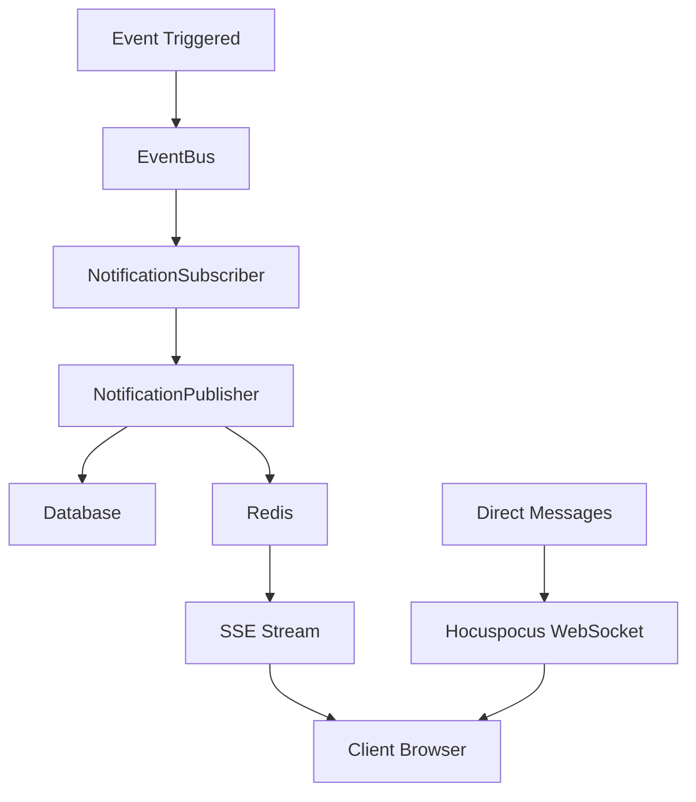

# Technical Implementation

This document describes the technical architecture and implementation details of the notification system.

## Architecture Overview

### System Components



### Core Files Structure

```
server/src/
├── lib/
│   ├── eventBus/
│   │   ├── index.ts                    # EventBus implementation
│   │   ├── events.ts                   # Event type definitions
│   │   └── subscribers/
│   │       └── notificationSubscriber.ts # Notification event handler
│   ├── notifications/
│   │   ├── publisher.ts                # NotificationPublisher class
│   │   └── sse.ts                      # Server-Sent Events implementation
│   └── actions/
│       └── notification-actions/       # Server actions for notifications
├── components/
│   └── notifications/                  # React components
└── app/
    ├── api/notifications/              # API endpoints
    └── msp/debug/notifications/        # Debug interface
```

## Database Schema

### Core Tables

#### `internal_notifications`
```sql
CREATE TABLE internal_notifications (
  internal_notification_id UUID PRIMARY KEY DEFAULT gen_random_uuid(),
  tenant VARCHAR NOT NULL,
  user_id UUID NOT NULL,
  type_id UUID NOT NULL REFERENCES internal_notification_types(internal_notification_type_id),
  title VARCHAR NOT NULL,
  message TEXT,
  data JSONB,
  action_url VARCHAR,
  priority_id UUID REFERENCES standard_priorities(priority_id),
  is_read BOOLEAN DEFAULT FALSE,
  read_at TIMESTAMP,
  created_at TIMESTAMP DEFAULT CURRENT_TIMESTAMP,
  expires_at TIMESTAMP
);
```

#### `internal_notification_types`
```sql
CREATE TABLE internal_notification_types (
  internal_notification_type_id UUID PRIMARY KEY DEFAULT gen_random_uuid(),
  type_name VARCHAR UNIQUE NOT NULL,
  category_name VARCHAR NOT NULL,
  description TEXT
);
```

#### `internal_notification_preferences`
```sql
CREATE TABLE internal_notification_preferences (
  tenant VARCHAR NOT NULL,
  user_id UUID NOT NULL,
  internal_notification_type_id UUID NOT NULL,
  channel VARCHAR NOT NULL DEFAULT 'in_app',
  enabled BOOLEAN DEFAULT TRUE,
  PRIMARY KEY (tenant, user_id, internal_notification_type_id, channel)
);
```

#### `internal_notification_templates`
```sql
CREATE TABLE internal_notification_templates (
  type_id UUID PRIMARY KEY REFERENCES internal_notification_types(internal_notification_type_id),
  title_template VARCHAR,
  message_template TEXT,
  default_priority_id UUID REFERENCES standard_priorities(priority_id)
);
```

## Event System Integration

### Event Types

The notification system responds to these automation hub events:

- `TICKET_CREATED`, `TICKET_ASSIGNED`, `TICKET_UPDATED`, `TICKET_CLOSED`, `TICKET_COMMENT_ADDED`
- `PROJECT_CREATED`, `PROJECT_ASSIGNED`, `PROJECT_TASK_ASSIGNED`, `PROJECT_CLOSED`
- `INVOICE_GENERATED`, `INVOICE_FINALIZED`
- `TIME_ENTRY_SUBMITTED`, `TIME_ENTRY_APPROVED`

### Event Processing Flow

1. **Event Publication**: Events are published to the EventBus
2. **Subscriber Processing**: NotificationSubscriber receives events
3. **User Determination**: Based on permissions and event-specific logic
4. **Notification Creation**: NotificationPublisher creates database records
5. **Real-time Delivery**: SSE broadcasts to connected clients

### EventBus Implementation

```typescript
// Event subscription
export async function registerNotificationSubscriber(): Promise<void> {
  const eventBus = getEventBus();
  const eventTypes = Object.keys(eventNotificationConfigs) as EventType[];
  
  for (const eventType of eventTypes) {
    await eventBus.subscribe(eventType, handleNotificationEvent);
  }
}

// Event handling
export async function handleNotificationEvent(event: BaseEvent): Promise<void> {
  const config = eventNotificationConfigs[event.eventType];
  const tenantId = (event.payload as any)?.tenantId;
  const tenantKnex = await getConnection(tenantId);
  
  // Determine users to notify
  const usersWithPermission = await getUsersWithPermission(resource, action, tenantKnex);
  const additionalUsers = config.getAdditionalUsers ? 
    await config.getAdditionalUsers(event, tenantKnex) : [];
  
  // Create notifications
  for (const userId of userIdsToNotify) {
    await publisher.publishNotification({...}, tenantId);
  }
}
```

## Database Connection Pattern

### Tenant-Specific Connections

```typescript
// Correct pattern for background operations
import { getConnection } from 'server/src/lib/db/db';
import { withTransaction } from '@shared/db';

// Get tenant-specific connection
const tenantKnex = await getConnection(tenantId);

// Use with transactions
await withTransaction(tenantKnex, async (trx) => {
  // Database operations here
});
```

### Multi-Tenant Isolation

- Each tenant has isolated database connections
- Row-Level Security (RLS) enforces tenant boundaries
- Event payloads must include `tenantId` for proper routing

## Real-Time Delivery

### Server-Sent Events (SSE)

```typescript
// SSE endpoint: /api/notifications/stream
export async function GET(request: NextRequest) {
  const stream = new ReadableStream({
    start(controller) {
      // Redis subscription for real-time events
      subscriber.subscribe([
        `notifications:user:${userId}`,
        `notifications:tenant:${tenant}`
      ]);
      
      subscriber.on('message', (channel, message) => {
        controller.enqueue(`data: ${message}\n\n`);
      });
    }
  });
  
  return new Response(stream, {
    headers: {
      'Content-Type': 'text/event-stream',
      'Cache-Control': 'no-cache',
      'Connection': 'keep-alive'
    }
  });
}
```

### WebSocket Direct Messaging

```typescript
// Hocuspocus integration for real-time messaging
const hocuspocus = new Hocuspocus({
  extensions: [
    new Logger(),
    new Database({
      fetch: async ({ documentName }) => {
        // Load document from database
      },
      store: async ({ documentName, state }) => {
        // Save document to database
      }
    })
  ]
});
```

## Notification Publisher

### Core Implementation

```typescript
export class NotificationPublisher {
  async publishNotification(
    notificationData: CreateNotificationData, 
    tenantId: string
  ): Promise<InternalNotification> {
    // 1. Get tenant-specific database connection
    const tenantKnex = await getConnection(tenantId);
    
    // 2. Fetch notification template
    const template = await knex('internal_notification_templates')
      .where('type_id', notificationData.type_id)
      .first();
    
    // 3. Compile title and message from template
    const title = compileTemplate(template.title_template, templateData);
    const message = compileTemplate(template.message_template, templateData);
    
    // 4. Save to database
    const savedNotification = await withTransaction(tenantKnex, async (trx) => {
      return await trx('internal_notifications').insert({...}).returning('*');
    });
    
    // 5. Broadcast via Redis for real-time delivery
    if (this.redisConnected) {
      await this.publishToChannels([
        `notifications:user:${userId}`,
        `notifications:tenant:${tenantId}`
      ], { event: 'notification', data: sseEventPayload });
    }
    
    return savedNotification;
  }
}
```

## Frontend Components

### NotificationBell Component

```typescript
// Real-time updates via SSE
useEffect(() => {
  const eventSource = new EventSource('/api/notifications/stream');
  
  eventSource.onmessage = (event) => {
    const data = JSON.parse(event.data);
    if (data.event === 'notification') {
      setNotifications(prev => [data.data, ...prev]);
      setUnreadCount(prev => prev + 1);
    }
  };
  
  return () => eventSource.close();
}, []);
```

### Message Components

```typescript
// Direct messaging with Hocuspocus
const provider = new HocuspocusProvider({
  url: 'ws://localhost:1234',
  name: `messages:${conversationId}`,
});

const yDoc = provider.document;
const yMessages = yDoc.getArray('messages');
```

## Error Handling and Resilience

### EventBus Resilience

- Multiple handler processing (continues if one handler fails)
- Redis reconnection logic
- Graceful degradation when Redis is unavailable

### Database Transactions

- All notification creation wrapped in transactions
- Rollback on failure to maintain consistency
- Proper error logging and monitoring

### Client-Side Resilience

- SSE reconnection on connection loss
- Offline notification queuing
- Error boundary components

## Performance Considerations

### Database Optimization

- Indexes on frequently queried columns
- Efficient permission checks
- Bulk notification creation for multiple users

### Redis Optimization

- Connection pooling
- Appropriate TTL for cached data
- Pub/sub channel organization

### Frontend Optimization

- Notification batching and deduplication
- Lazy loading of notification history
- Memory management for long-running connections

## Security

### Authentication & Authorization

- Server actions validate user sessions
- Permission-based notification filtering
- Tenant isolation at database level

### Data Protection

- Sensitive data excluded from event payloads
- Secure WebSocket connections
- Proper CORS configuration for SSE

## Monitoring and Debugging

### Logging

- Comprehensive logging throughout the notification flow
- Event processing metrics
- Redis connection status monitoring

### Debug Interface

- `/msp/debug/notifications` - Interactive debugging
- Test functions for each component
- Event flow tracing capabilities

## Configuration

### Environment Variables

```bash
REDIS_URL=redis://localhost:6379
REDIS_PASSWORD=your_password
NOTIFICATION_SSE_TIMEOUT=300000
HOCUSPOCUS_PORT=1234
```

### Feature Flags

- Notification types can be enabled/disabled per tenant
- User preferences override system defaults
- Debug mode for development environments