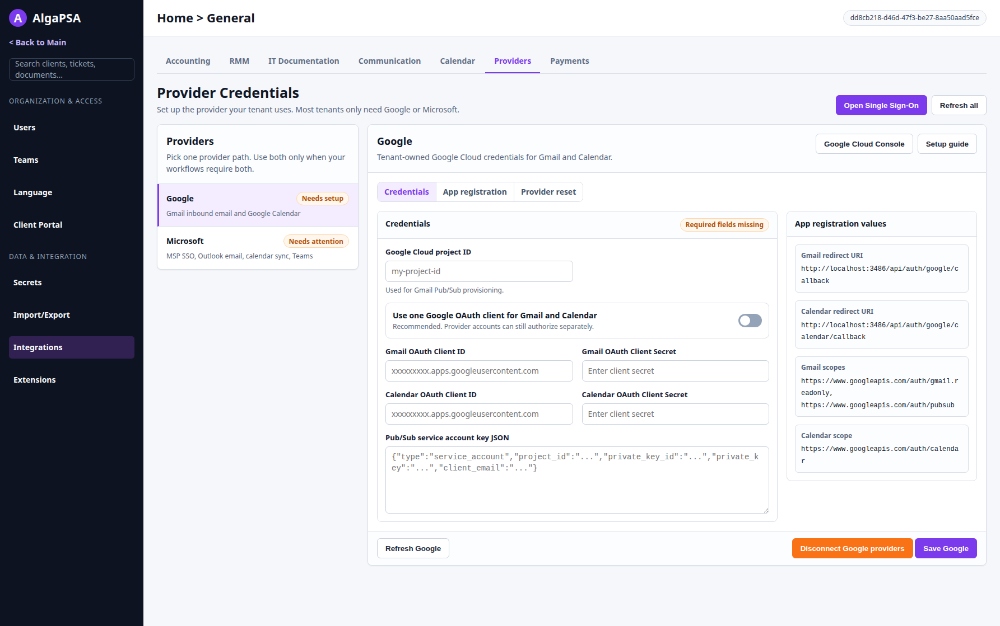

# Integrations Providers Reorganization

**Branch:** `improve/integrations-providers-screen`
**Date:** 2026-07-09
**Type:** Settings information architecture and UI reorganization

## Mockup Artifacts

- HTML mockup: [2026-07-09-integrations-providers-reorganization-mockup.html](./2026-07-09-integrations-providers-reorganization-mockup.html)
- Screenshot: [2026-07-09-integrations-providers-reorganization-mockup.png](./2026-07-09-integrations-providers-reorganization-mockup.png)

## Mockup Authority

The HTML and screenshot are **directional mockups only**. They define the intended information
architecture, grouping, visual priority, and copy direction for the Providers tab reorganization.

They are not a functional specification. The implementation must maintain functional fidelity
with the existing Providers screen. Where the mockup conflicts with existing screen behavior,
available data, validation, permissions, loading/error states, persistence semantics, or edge
cases, **the existing screen wins**.

Examples:

- The mockup may omit loading, empty, error, saved-secret, confirmation, and i18n details for
  visual clarity. The implemented screen must keep or improve those states.
- The mockup shows simplified action placement. Existing save/reset/archive/binding behaviors
  must stay accurate.
- The mockup includes a Microsoft action area for visual balance. Do not invent a fake global
  Microsoft save if the real screen persists Microsoft profile and binding changes through
  their existing per-action flows.
- The mockup shows one selected provider at a time. This does not mean tenants must configure
  both providers. Most tenants will configure either Google or Microsoft.

## Background

The current Settings -> General -> Integrations -> Providers screen stacks several unrelated
jobs in one long page:

- a large "Providers Integrations" hero panel,
- a moved-location notice for MSP SSO login domains,
- a generic "Provider Credentials" intro card,
- the full Google credential form,
- the full Microsoft profile, binding, readiness, and guidance surface.

This makes the screen read as if Google and Microsoft both need setup. In practice, most tenants
choose one provider path. The page should present Google and Microsoft as alternate provider
paths while preserving the ability to configure both when needed.

## Goals

1. Make the Providers tab a work surface, not a landing page.
2. Present Google and Microsoft as selectable provider paths.
3. Keep MSP SSO login-domain routing as a single top-level action to Security -> Single Sign-On.
4. Keep Google-only content inside the Google detail pane.
5. Keep Microsoft-only content inside the Microsoft detail pane.
6. Preserve all current functionality from the existing Providers screen.

## Target Design

### Page Header

Replace the current large centered provider hero with a compact, left-aligned page header:

- Title: `Provider Credentials`
- Supporting copy: explain that tenants normally set up the provider they use, and only use both
  when workflows require both.
- Top actions:
  - `Open Single Sign-On` linking to `/msp/security-settings?tab=single-sign-on`
  - `Refresh all`, if a real refresh-all action exists; otherwise keep refresh controls where
    they exist today.

Do not add a separate "Moved" badge or a third provider row for MSP SSO. The Single Sign-On
button is enough.

### Provider Selector

Add a compact provider selector rail or equivalent two-option switch:

- `Google`
  - Status badge derived from real Google setup status when available.
  - Description: Gmail inbound email and Google Calendar.
- `Microsoft`
  - Status badge derived from real Microsoft profile/binding readiness when available.
  - Description: MSP SSO, Outlook email, calendar sync, and Teams.

The UI should imply "choose the provider path you use", not "complete both provider paths".

### Google Detail

The Google detail pane should contain only Google setup:

- Google title and description.
- Existing external links:
  - Google Cloud Console
  - Setup guide
- Existing Google credential fields and controls:
  - Google Cloud project ID
  - OAuth client mode
  - Gmail OAuth Client ID and secret
  - Calendar OAuth Client ID and secret, when separate credentials are applicable
  - Pub/Sub service account key JSON
  - refresh, save, disconnect/reset providers, and post-save reauthorization messaging
- Google OAuth app values:
  - redirect URIs
  - scopes

The mockup shows these in a compact master/detail layout. Implementation can use existing
components where that better preserves behavior. It should not display Microsoft profile or
binding controls inside the Google pane.

### Microsoft Detail

The Microsoft detail pane should contain only Microsoft setup:

- Microsoft title and description.
- Existing actions that are real and correctly targeted:
  - Microsoft Entra link
  - New profile
  - refresh
  - disconnect/reset providers, with existing behavior preserved and confirmation if added
- Service profile bindings:
  - MSP SSO
  - Email
  - Calendar
  - Teams when available
- Profile library:
  - profile name
  - tenant ID
  - client ID
  - stored-secret readiness
  - services using the profile
  - edit, archive, set-default/legacy-default behavior as applicable
- Microsoft Entra app values:
  - redirect URIs
  - scopes
  - Teams Application ID URI when applicable

The mockup presents bindings first and profile details below. The implementation may adjust the
order if the existing screen's data dependencies make another order safer, but Microsoft content
must remain isolated to the Microsoft pane.

## Copy Direction

Use plainer service-oriented labels:

- `Provider Credentials` instead of `Providers Integrations`.
- `Service profile bindings` instead of `Explicit consumer bindings`.
- `Each service uses the Microsoft profile selected below.` instead of "source of truth" copy.
- `Open Single Sign-On` instead of `Open Single Sign-On settings`.
- `Disconnect Google providers` / `Disconnect Microsoft providers` instead of "Reset" labels,
  if the implementation also keeps or adds the correct confirmation and impact copy.
- `Microsoft Entra app values` instead of `Microsoft app registration guidance`.
- `Use one Google OAuth client for Gmail and Calendar` instead of `Use the same OAuth app for
  Gmail + Calendar`.

Keep existing i18n patterns. Any new user-facing strings need locale keys and default values
consistent with nearby integration strings.

## Implementation Plan

### 1. Preserve the Current Functional Surface

Before reorganizing markup, inventory the existing Google and Microsoft controls and states:

- loading, empty, error, and success states,
- saved/masked secret hints,
- field validation and save gating,
- reset/disconnect behavior,
- archive confirmation,
- binding updates,
- profile create/edit flows,
- feature-gated Teams behavior,
- CE/EE differences,
- i18n keys and tests.

Use this inventory as the implementation checklist. The reorganization is not allowed to drop a
state or action just because it is absent from the mockup.

### 2. Replace the Providers Intro Stack

In `packages/integrations/src/components/settings/integrations/IntegrationsSettingsPage.tsx`:

- Remove the large centered Providers hero treatment for this category.
- Remove the generic header-only `Provider Credentials` card.
- Keep a compact page title and the Single Sign-On action.
- Keep the Providers category tab itself unchanged.

### 3. Introduce a Provider Workbench

Add a small provider workbench component for the Providers category. It can live beside the
existing integration settings components, for example:

- `packages/integrations/src/components/settings/integrations/ProviderCredentialsWorkbench.tsx`

Responsibilities:

- Own the selected provider state (`google` or `microsoft`).
- Render the provider selector.
- Render only the selected provider's detail surface.
- Keep each provider's state stable when switching where practical. If unmounting inactive panes
  is simpler, verify that unsaved edits are not silently discarded in an unacceptable way.
- Pass through existing feature gates such as `canUseTeams`.

### 4. Adapt the Google Surface

In `GoogleIntegrationSettings.tsx` or a thin wrapper:

- Keep current fields, load/save/reset actions, and error handling.
- Move external links into a consistent header action area.
- Move redirect URIs and scopes into a quieter `Google OAuth app values` section or disclosure.
- Keep Pub/Sub setup and OAuth setup distinct enough that admins can understand what each does.
- Do not render Microsoft controls in or below the Google pane.

If this work exposes existing bugs, such as requiring stored secrets to be re-entered on every
save, document or fix them only if they are in scope for the implementation agent.

### 5. Adapt the Microsoft Surface

In `MicrosoftIntegrationSettings.tsx` or a thin wrapper:

- Keep current profile CRUD, archive confirmation, binding updates, readiness messages, reset,
  and feature-gated Teams behavior.
- Rename user-facing "consumer" language to service language where possible.
- Present bindings as a compact row/matrix rather than repeated nested cards.
- Present profiles as a compact profile library rather than large mini settings pages.
- Keep app values accessible without implying that every tenant must configure every service.
- Remove or repair any Teams setup link that does not navigate to a real Teams settings target.

### 6. SSO Action

Keep the moved-location affordance as one compact top-level action:

- Button text: `Open Single Sign-On`
- Target: `/msp/security-settings?tab=single-sign-on`

Do not add an extra provider selector row, a `Moved` badge, or a second card repeating the same
message.

### 7. Verification

Run focused unit tests for the changed integration settings components. Update existing tests that
assert the old hero, generic card, or stacked provider layout.

Manual smoke on the running dev stack:

1. Providers tab opens with compact header and provider selector.
2. Google selected:
   - no Microsoft controls are visible,
   - Google load/save/error states still work,
   - OAuth values are still available,
   - disconnect/reset behavior is still correct.
3. Microsoft selected:
   - no Google fields are visible,
   - bindings update correctly,
   - profile create/edit/archive flows still work,
   - readiness messages remain accurate,
   - feature-gated Teams behavior remains accurate.
4. `Open Single Sign-On` lands on the Security Single Sign-On tab.
5. Switching providers does not imply both are required and does not lose important unsaved state
   without warning.

## Out of Scope

- Changing provider credential storage semantics unless required to preserve existing behavior.
- Adding a new backend API solely for the mockup.
- Making Google and Microsoft setup mandatory.
- Replacing the Security -> Single Sign-On screen.
- Implementing a global Microsoft save if current Microsoft behavior is per-profile/per-binding.
- Treating the HTML mockup as pixel-perfect product code.
