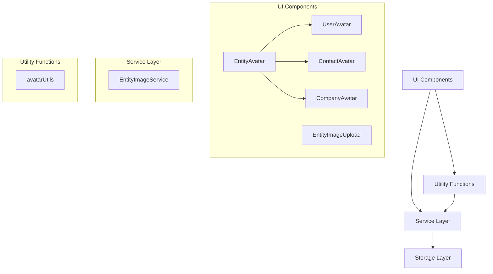
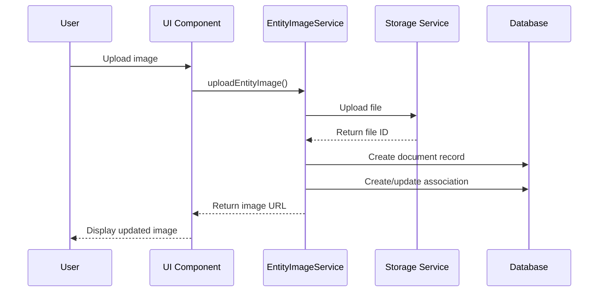

# Avatar System Documentation

## Overview

The Avatar System is a comprehensive solution for managing and displaying user, contact, and company profile images throughout the application. It provides a consistent way to upload, store, retrieve, and display images with appropriate fallbacks when images are not available.

The system follows a component-based architecture with a central base component (`EntityAvatar`) that is extended by entity-specific components (`UserAvatar`, `ContactAvatar`, `CompanyAvatar`). This approach ensures consistent styling and behavior while allowing for entity-specific customizations.

## Architecture

The Avatar System is built on a layered architecture:



### Key Components

1. **Base Components**:
   - `EntityAvatar`: The core component that handles image display, fallbacks, and loading states
   - `EntityImageUpload`: Handles image upload, preview, and deletion for all entity types

2. **Entity-Specific Components**:
   - `UserAvatar`: Specialized for user avatars
   - `ContactAvatar`: Specialized for contact avatars
   - `CompanyAvatar`: Specialized for company logos

3. **Service Layer**:
   - `EntityImageService`: Provides methods for uploading and deleting entity images

4. **Utilities**:
   - `avatarUtils`: Helper functions for retrieving image URLs and other common operations

### Data Flow



## Components

### EntityAvatar

The base component that renders an avatar with fallback to initials when no image is available.

#### Props

| Prop | Type | Description |
|------|------|-------------|
| `entityId` | `string \| number` | Unique identifier for the entity |
| `entityName` | `string` | Name of the entity (used for generating initials and colors) |
| `imageUrl` | `string \| null` | URL to the entity's image |
| `size` | `'xs' \| 'sm' \| 'md' \| 'lg' \| 'xl' \| number` | Size of the avatar (predefined or custom pixel value) |
| `className` | `string` | Optional additional CSS classes |
| `getInitials` | `(name: string) => string` | Optional custom function to generate initials |
| `altText` | `string` | Optional alt text for the image |

#### Usage Example

```tsx
import EntityAvatar from 'server/src/components/ui/EntityAvatar';

<EntityAvatar
  entityId="123"
  entityName="John Doe"
  imageUrl="https://example.com/avatar.jpg"
  size="md"
/>
```

### UserAvatar

Specialized component for displaying user avatars.

#### Props

| Prop | Type | Description |
|------|------|-------------|
| `userId` | `string` | User's unique identifier |
| `userName` | `string` | User's name |
| `avatarUrl` | `string \| null` | URL to the user's avatar |
| `size` | `'xs' \| 'sm' \| 'md' \| 'lg' \| 'xl' \| number` | Size of the avatar |
| `className` | `string` | Optional additional CSS classes |

#### Usage Example

```tsx
import UserAvatar from 'server/src/components/ui/UserAvatar';

<UserAvatar
  userId="user-123"
  userName="John Doe"
  avatarUrl={userAvatarUrl}
  size="md"
/>
```

### ContactAvatar

Specialized component for displaying contact avatars.

#### Props

| Prop | Type | Description |
|------|------|-------------|
| `contactId` | `string` | Contact's unique identifier |
| `contactName` | `string` | Contact's name |
| `avatarUrl` | `string \| null` | URL to the contact's avatar |
| `size` | `'xs' \| 'sm' \| 'md' \| 'lg' \| 'xl' \| number` | Size of the avatar |
| `className` | `string` | Optional additional CSS classes |

#### Usage Example

```tsx
import ContactAvatar from 'server/src/components/ui/ContactAvatar';

<ContactAvatar
  contactId="contact-123"
  contactName="Jane Smith"
  avatarUrl={contactAvatarUrl}
  size="md"
/>
```

### CompanyAvatar

Specialized component for displaying company logos.

#### Props

| Prop | Type | Description |
|------|------|-------------|
| `companyId` | `string \| number` | Company's unique identifier |
| `companyName` | `string` | Company's name |
| `logoUrl` | `string \| null` | URL to the company's logo |
| `size` | `'xs' \| 'sm' \| 'md' \| 'lg' \| 'xl' \| number` | Size of the avatar |
| `className` | `string` | Optional additional CSS classes |

#### Usage Example

```tsx
import CompanyAvatar from 'server/src/components/ui/CompanyAvatar';

<CompanyAvatar
  companyId="company-123"
  companyName="Acme Inc."
  logoUrl={companyLogoUrl}
  size="md"
/>
```

### EntityImageUpload

Component for uploading, previewing, and deleting entity images.

#### Props

| Prop | Type | Description |
|------|------|-------------|
| `entityType` | `'user' \| 'contact' \| 'company'` | Type of entity |
| `entityId` | `string` | Entity's unique identifier |
| `entityName` | `string` | Entity's name |
| `imageUrl` | `string \| null` | Current image URL |
| `onImageChange` | `(newImageUrl: string \| null) => void` | Callback when image changes |
| `uploadAction` | `(entityId: string, formData: FormData) => Promise<{...}>` | Function to handle upload |
| `deleteAction` | `(entityId: string) => Promise<{...}>` | Function to handle deletion |
| `userType` | `string` | Optional user type for permission checks |
| `userEntityId` | `string` | Optional user entity ID for permission checks |
| `canModify` | `boolean` | Whether the current user can modify the image |
| `className` | `string` | Optional additional CSS classes |
| `size` | `'sm' \| 'md' \| 'lg' \| 'xl'` | Size of the avatar preview |

#### Usage Example

```tsx
import EntityImageUpload from 'server/src/components/ui/EntityImageUpload';
import { uploadUserAvatar, deleteUserAvatar } from 'server/src/lib/actions/user-actions/userActions';

<EntityImageUpload
  entityType="user"
  entityId={userId}
  entityName={userName}
  imageUrl={avatarUrl}
  onImageChange={(newUrl) => setAvatarUrl(newUrl)}
  uploadAction={uploadUserAvatar}
  deleteAction={deleteUserAvatar}
  size="lg"
/>
```

## Services

### EntityImageService

Service for managing entity images, handling upload and deletion operations.

#### Methods

##### `uploadEntityImage`

Uploads an image for an entity and associates it with the entity.

```typescript
async function uploadEntityImage(
  entityType: EntityType,
  entityId: string,
  file: File,
  userId: string,
  tenant: string,
  contextName?: string
): Promise<UploadResult>
```

**Parameters:**
- `entityType`: Type of entity ('user', 'contact', or 'company')
- `entityId`: Entity's unique identifier
- `file`: File object to upload
- `userId`: ID of the user performing the upload
- `tenant`: Tenant context
- `contextName`: Optional context name override

**Returns:**
- Promise resolving to an object with:
  - `success`: Boolean indicating success
  - `message`: Optional message
  - `imageUrl`: Optional new image URL

##### `deleteEntityImage`

Deletes an image associated with an entity.

```typescript
async function deleteEntityImage(
  entityType: EntityType,
  entityId: string,
  userId: string,
  tenant: string
): Promise<{ success: boolean; message?: string }>
```

**Parameters:**
- `entityType`: Type of entity ('user', 'contact', or 'company')
- `entityId`: Entity's unique identifier
- `userId`: ID of the user performing the deletion
- `tenant`: Tenant context

**Returns:**
- Promise resolving to an object with:
  - `success`: Boolean indicating success
  - `message`: Optional message

## Utilities

### avatarUtils

Utility functions for working with entity images.

#### Functions

##### `getEntityImageUrl`

Retrieves the image URL for an entity.

```typescript
async function getEntityImageUrl(
  entityType: EntityType,
  entityId: string,
  tenant: string
): Promise<string | null>
```

**Parameters:**
- `entityType`: Type of entity ('user', 'contact', or 'company')
- `entityId`: Entity's unique identifier
- `tenant`: Tenant context

**Returns:**
- Promise resolving to the image URL or null if not found

##### Convenience Functions

```typescript
// Get a user's avatar URL
async function getUserAvatarUrl(userId: string, tenant: string): Promise<string | null>

// Get a contact's avatar URL
async function getContactAvatarUrl(contactId: string, tenant: string): Promise<string | null>

// Get a company's logo URL
async function getCompanyLogoUrl(companyId: string, tenant: string): Promise<string | null>
```

## Integration Examples

### User Profile Page

```tsx
import { useState, useEffect } from 'react';
import UserAvatar from 'server/src/components/ui/UserAvatar';
import EntityImageUpload from 'server/src/components/ui/EntityImageUpload';
import { uploadUserAvatar, deleteUserAvatar } from 'server/src/lib/actions/user-actions/userActions';
import { getUserAvatarUrl } from 'server/src/lib/utils/avatarUtils';

const UserProfilePage = ({ userId, userName, tenant }) => {
  const [avatarUrl, setAvatarUrl] = useState<string | null>(null);
  
  useEffect(() => {
    const fetchAvatarUrl = async () => {
      const url = await getUserAvatarUrl(userId, tenant);
      setAvatarUrl(url);
    };
    
    fetchAvatarUrl();
  }, [userId, tenant]);
  
  return (
    <div className="profile-page">
      <h1>User Profile</h1>
      
      <div className="avatar-section">
        <EntityImageUpload
          entityType="user"
          entityId={userId}
          entityName={userName}
          imageUrl={avatarUrl}
          onImageChange={(newUrl) => setAvatarUrl(newUrl)}
          uploadAction={uploadUserAvatar}
          deleteAction={deleteUserAvatar}
          size="lg"
        />
      </div>
      
      {/* Rest of profile content */}
    </div>
  );
};
```

### Company Details Page

```tsx
import { useState, useEffect } from 'react';
import CompanyAvatar from 'server/src/components/ui/CompanyAvatar';
import EntityImageUpload from 'server/src/components/ui/EntityImageUpload';
import { uploadCompanyLogo, deleteCompanyLogo } from 'server/src/lib/actions/company-actions/companyActions';
import { getCompanyLogoUrl } from 'server/src/lib/utils/avatarUtils';

const CompanyDetailsPage = ({ companyId, companyName, tenant }) => {
  const [logoUrl, setLogoUrl] = useState<string | null>(null);
  
  useEffect(() => {
    const fetchLogoUrl = async () => {
      const url = await getCompanyLogoUrl(companyId, tenant);
      setLogoUrl(url);
    };
    
    fetchLogoUrl();
  }, [companyId, tenant]);
  
  return (
    <div className="company-details">
      <div className="company-header">
        <EntityImageUpload
          entityType="company"
          entityId={companyId}
          entityName={companyName}
          imageUrl={logoUrl}
          onImageChange={(newUrl) => setLogoUrl(newUrl)}
          uploadAction={uploadCompanyLogo}
          deleteAction={deleteCompanyLogo}
          size="xl"
        />
        
        <h1>{companyName}</h1>
      </div>
      
      {/* Rest of company details */}
    </div>
  );
};
```

### Ticket Conversation with User Avatars

```tsx
import UserAvatar from 'server/src/components/ui/UserAvatar';
import ContactAvatar from 'server/src/components/ui/ContactAvatar';

const TicketComment = ({ comment, author, isContact }) => {
  return (
    <div className="comment">
      <div className="comment-avatar">
        {isContact ? (
          <ContactAvatar
            contactId={author.id}
            contactName={author.name}
            avatarUrl={author.avatarUrl}
            size="md"
          />
        ) : (
          <UserAvatar
            userId={author.id}
            userName={author.name}
            avatarUrl={author.avatarUrl}
            size="md"
          />
        )}
      </div>
      
      <div className="comment-content">
        <div className="comment-header">
          <span className="author-name">{author.name}</span>
          <span className="comment-time">{comment.timestamp}</span>
        </div>
        
        <div className="comment-body">
          {comment.content}
        </div>
      </div>
    </div>
  );
};
```

## Best Practices

### When to Use Each Component

- **EntityAvatar**: Use directly only when creating a new entity-specific avatar component. For most cases, use one of the specialized components.
- **UserAvatar**: Use for displaying user avatars throughout the application.
- **ContactAvatar**: Use for displaying contact avatars throughout the application.
- **CompanyAvatar**: Use for displaying company logos throughout the application.
- **EntityImageUpload**: Use on profile/details pages where users should be able to upload or change images.

### Performance Considerations

1. **Image Optimization**:
   - The system automatically processes uploaded images to optimize them for display.
   - Images are stored efficiently in the storage system.

2. **Loading States**:
   - The avatar components include built-in loading states to provide visual feedback during image loading.
   - Use the `key` prop with a timestamp when updating images to force re-rendering.

3. **Caching**:
   - Image URLs include a timestamp query parameter to prevent browser caching issues.
   - Consider implementing a client-side cache for frequently accessed avatar URLs.

### Error Handling

1. **Upload Errors**:
   - The `EntityImageUpload` component handles upload errors and displays appropriate toast messages.
   - Server-side validation ensures only valid images are accepted.

2. **Display Fallbacks**:
   - All avatar components automatically fall back to displaying initials when no image is available.
   - The fallback colors are consistently generated based on the entity name.

## Troubleshooting

### Common Issues

#### Images Not Updating Immediately

**Symptoms**: After uploading a new image, the old image still appears in some places.

**Solutions**:
- Ensure the `onImageChange` callback is properly updating state in parent components.
- Add a timestamp query parameter to the image URL to bypass browser caching.
- Use the `key` prop with a timestamp to force React to re-render the component.

#### Missing Avatars

**Symptoms**: Avatars not appearing in certain parts of the application.

**Solutions**:
- Check if the component is correctly retrieving the avatar URL.
- Verify that the entity ID and tenant are correctly passed to the utility functions.
- Ensure the document association exists in the database.

#### Upload Failures

**Symptoms**: Image uploads fail with error messages.

**Solutions**:
- Check file size (must be under 2MB).
- Ensure the file is a valid image format (PNG, JPG, GIF).
- Verify that the user has permission to upload images for the entity.
- Check server logs for detailed error information.

## Integration Points

The Avatar System integrates with several other system components:

1. **Storage System**: For storing and retrieving image files.
2. **Document System**: For managing document metadata and associations.
3. **User Management**: For user avatars and permissions.
4. **Company Management**: For company logos.
5. **Contact Management**: For contact avatars.

## Future Enhancements

Potential improvements to consider for the Avatar System:

1. **Image Cropping**: Add support for cropping images during upload.
2. **Multiple Image Sizes**: Generate and store multiple sizes of each image for different display contexts.
3. **Animated Avatars**: Support for animated GIFs or short video avatars.
4. **Default Avatars**: Provide a selection of default avatars instead of just initials.
5. **Group Avatars**: Support for displaying multiple avatars in a group (e.g., for teams).
