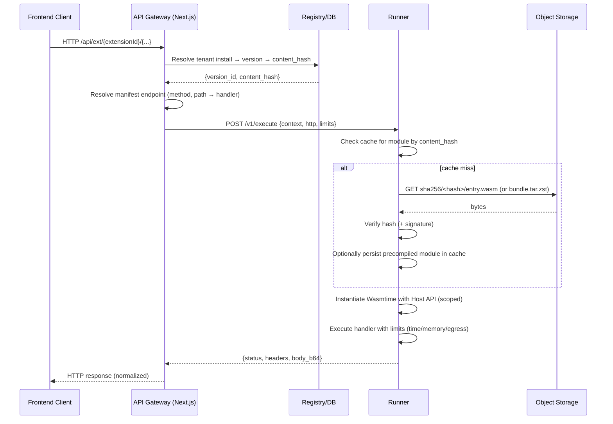

# Extension Serving and Execution System (EE)

This document specifies the v2-only serving and execution model. All extension server handlers execute out-of-process in the Runner, and all UI assets are served by the Runner. The host app never dynamically imports tenant code and does not serve ext-ui via Next.js.

Key guarantees: See “Correctness Rules” in the README for the canonical list (Gateway route, Runner static UI, iframe bootstrap).

## Overview

- Out-of-process execution: Extension handlers run in a separate Runner service (Wasmtime).
- Signed, content-addressed bundles: Stored in object storage (e.g., S3/MinIO), addressed by `sha256/<hash>`, with signature verification.
- Secure Gateway: Host exposes `/api/ext/[extensionId]/[...]`, resolves tenant install → version → manifest endpoint, and invokes Runner.
- UI via iframe (Runner-hosted): Client UI assets are served by the Runner at `${RUNNER_PUBLIC_BASE}/ext-ui/{extensionId}/{content_hash}/[...]`. There is no Next.js route for ext-ui.

## Components (by concern)

- API Gateway (Next.js): `server/src/app/api/ext/[extensionId]/[...path]/route.ts`
  - Resolves tenant install, version/content hash, manifest endpoint, and proxies to the Runner.
  - Enforces header/size/time restrictions, RBAC, and request normalization.
  - Reference scaffold: [ee/server/src/app/api/ext/[extensionId]/[...path]/route.ts](ee/server/src/app/api/ext/%5BextensionId%5D/%5B...path%5D/route.ts)

- Runner (EE): `ee/runner/...`
  - Rust service embedding Wasmtime; fetches modules by content hash; verifies integrity/signatures; enforces capability-scoped Host API.
  - Serves static UI assets for iframe delivery at `${RUNNER_PUBLIC_BASE}/ext-ui/{extensionId}/{content_hash}/[...]`.

- Registry + Services (EE): `ee/server/src/lib/extensions/**`
  - Registry/read models, installation flow, bundle resolution, and signature/trust-bundle integration.
  - Registry v2 service scaffold: [ExtensionRegistryServiceV2](ee/server/src/lib/extensions/registry-v2.ts:48)

- Object Storage (S3/MinIO):
  - Stores published bundles at content-addressed keys, plus optional precompiled Wasmtime artifacts.

## Bundle Layout (canonical)

Object storage key prefix:

```
sha256/<content_hash>/
  ├── bundle.tar.zst        # canonical artifact with manifest.json, entry.wasm, ui/**/*
  ├── manifest.json         # duplicated for quick access (optional)
  ├── entry.wasm            # duplicated for quick access (optional)
  └── precompiled/
      └── <target>.cwasm    # optional Wasmtime precompiled module
```

Notes:
- The Runner verifies path-integrity (content hash) and verifies signatures against a trust bundle (when configured).
- The `ui/**/*` subtree is served by the Runner as immutable static assets; the server does not dynamic-import tenant JS.

## Pod-/Process-Local Caches (illustrative)

Runner and API pods may maintain caches keyed by `content_hash`:

```
<CACHE_ROOT>/
  └── <content_hash>/
      ├── index.json               # cache index/metadata
      ├── ui/                      # extracted UI subtree (Runner-managed)
      ├── entry.wasm               # fetched module or extracted
      └── precompiled/<target>.cwasm
```

Eviction follows LRU with capacity constraints. Integrity is verified by SHA-256. Signatures checked at install/load per policy.

## Server-Side Handler Flow (Gateway → Runner)

Mermaid sequence diagram:



Key points:
- Gateway derives tenant context, validates RBAC, and normalizes request/headers/body.
- Runner enforces execution limits and capability policies; egress is allowlisted.

## UI Asset Serving Flow (Runner-hosted)

Mermaid sequence diagram:

```mermaid
sequenceDiagram
  participant BR as Browser (iframe)
  participant RUN as Runner (Static UI Host)
  participant S3 as Object Storage

  BR->>RUN: GET ${RUNNER_PUBLIC_BASE}/ext-ui/{extensionId}/{contentHash}/index.html
  RUN->>RUN: ensureUiCached(contentHash)
  alt not cached
    RUN->>S3: GET sha256/<hash>/bundle.tar.zst
    S3-->>RUN: bytes
    RUN->>RUN: Verify hash; extract ui/**/* to cache
  end
  RUN-->>BR: 200 OK (file) + ETag + immutable Cache-Control
```

The URL embeds `contentHash`, enabling long‑lived immutable caching for UI assets. The host app constructs the iframe src via [buildExtUiSrc()](ee/server/src/lib/extensions/ui/iframeBridge.ts:38) and initializes postMessage bridge via [bootstrapIframe()](ee/server/src/lib/extensions/ui/iframeBridge.ts:45).

## Iframe Bootstrap (Host App)

Client bootstrap features implemented in the host:
- Defaults sandbox to `allow-scripts` (no implicit `allow-same-origin`).
- Validates origins based on `RUNNER_PUBLIC_BASE` and enforces postMessage target origin.
- Bridges theme tokens into `:root` and via postMessage; handles `ready`, `resize`, and `navigate` messages.

References:
- [buildExtUiSrc()](ee/server/src/lib/extensions/ui/iframeBridge.ts:38)
- [bootstrapIframe()](ee/server/src/lib/extensions/ui/iframeBridge.ts:45)

## Environment & Configuration

Gateway:
- `RUNNER_BASE_URL` — internal URL for Runner (`POST /v1/execute`)
- `EXT_GATEWAY_TIMEOUT_MS` — default gateway timeout (ms)

Runner:
- `RUNNER_PUBLIC_BASE` — public base for serving ext-ui assets
- `SIGNING_TRUST_BUNDLE` — trust anchors for signature verification
- `EXT_EGRESS_ALLOWLIST` — hostnames allowed for `alga.http.fetch`
- Memory/timeouts — enforced per invocation

Object Storage (S3/MinIO):
- `BUNDLE_STORE_BASE` — content-addressed root/prefix
- `STORAGE_S3_ENDPOINT`, `STORAGE_S3_ACCESS_KEY`, `STORAGE_S3_SECRET_KEY`
- `STORAGE_S3_BUCKET`, `STORAGE_S3_REGION`, `STORAGE_S3_FORCE_PATH_STYLE`

Caches:
- Runner manages its own in-proc/pod-local cache for modules and UI assets.

## Security Properties

- No in-process tenant code execution in the app; isolated WASM runtime in the Runner.
- Capability-scoped Host API; no preopened filesystem; egress deny-by-default with allowlist.
- Content-addressed artifacts; hash verification on use; signature verification against trust bundle.
- Quotas/limits: memory caps, timeouts, and concurrency per tenant/extension.
- UI isolation: sandboxed iframes; origin validation aligned with `RUNNER_PUBLIC_BASE`.

## Error Handling & Retries

- Gateway: short timeouts; idempotency keys for non-GET; limited retries on 502/503/504.
- Runner: structured errors for policy violations; quarantine or disable misbehaving extensions.
- UI assets (Runner): 404 on path mismatch; immutable caching with ETag; safe defaults for mime types.

## Local Development Notes

- Use MinIO (or compatible) locally; set `BUNDLE_STORE_BASE` to the content-address root.
- Publish a test bundle (with `manifest.json` and `ui/**/*`) and record its content hash.
- Access UI via `${RUNNER_PUBLIC_BASE}/ext-ui/{extensionId}/{contentHash}/index.html` and APIs via `/api/ext/{extensionId}/...`.

## Related Sources

- Gateway route scaffold: [ee/server/src/app/api/ext/[extensionId]/[...path]/route.ts](ee/server/src/app/api/ext/%5BextensionId%5D/%5B...path%5D/route.ts)
- Iframe bootstrap + src builder: [ee/server/src/lib/extensions/ui/iframeBridge.ts](ee/server/src/lib/extensions/ui/iframeBridge.ts:38)
- Registry v2 service scaffold: [ExtensionRegistryServiceV2](ee/server/src/lib/extensions/registry-v2.ts:48)
- Runner overview: [runner.md](runner.md)
