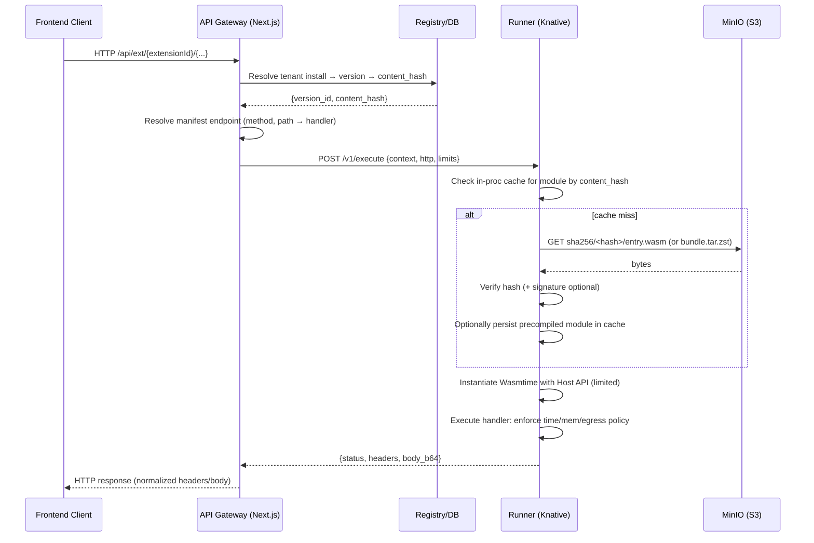
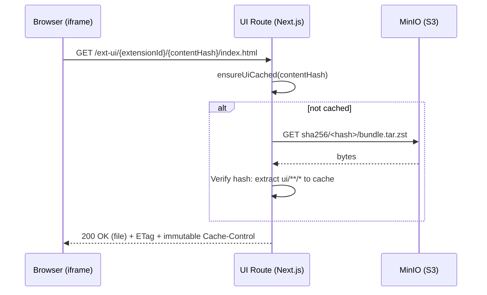
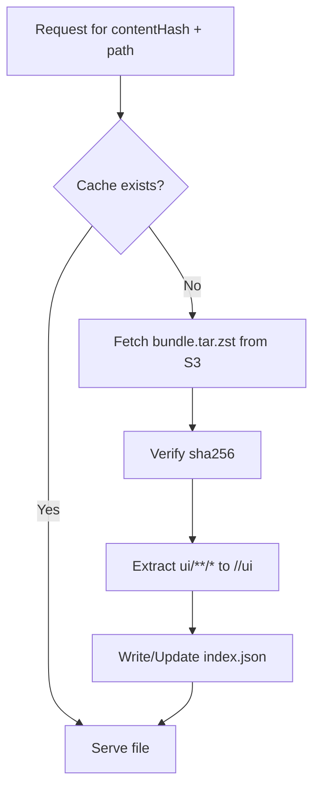

# Extension Serving and Execution System (EE)
> Status
>
> This document outlines the target UI delivery system. Client-side iframe bootstrap and security controls are implemented, but the server route for static UI delivery (`/ext-ui/{extensionId}/{content_hash}/[...]`) is not yet present in `ee/server`. See the implemented iframe bootstrap behavior in [iframeBridge.ts](ee/server/src/lib/extensions/ui/iframeBridge.ts) and the migration notice in [ExtensionRenderer.tsx](ee/server/src/lib/extensions/ui/ExtensionRenderer.tsx).

Implementation notes:
- Iframe bootstrap behavior (implemented):
  - Defaults sandbox to `allow-scripts` (no implicit `allow-same-origin`)
  - Validates origins when `RUNNER_PUBLIC_BASE` is absolute, and enforces postMessage target origin
  - Bridges theme tokens into `:root` and via postMessage; handles `ready`, `resize`, and `navigate` messages
  - See [bootstrapIframe()](ee/server/src/lib/extensions/ui/iframeBridge.ts:45) and helpers in [iframeBridge.ts](ee/server/src/lib/extensions/ui/iframeBridge.ts).
- Server delivery (planned):
  - Immutable path: `/ext-ui/{extensionId}/{content_hash}/[...]`
  - Pod-local caching keyed by `content_hash`
  - Alignment with URL builder used by the iframe bridge

This document explains how extensions are served and executed in the Enterprise Edition. It covers module resolution, bundle fetching from S3/MinIO, pod‑local caching, request routing via the Next.js gateway, and execution in the Runner service on Knative. Diagrams are included to illustrate flows.

## Overview

- Out‑of‑process execution: All server‑side handlers run in a separate Runner service (Wasmtime).
- Content‑addressed bundles: Extensions are immutable bundles stored in object storage (S3/MinIO) keyed by `sha256/<hash>`.
- Pod‑local caches: API pods and the Runner keep small ephemeral caches keyed by content hash.
- Secure gateway: The host exposes a stable gateway under `/api/ext/[extensionId]/[...]` that resolves tenant → version → manifest endpoint and invokes the Runner.
- UI via iframe: Client UI assets are served at `/ext-ui/[extensionId]/[contentHash]/[...]` from pod‑local cache only, never injected into the host app.

## Components (by concern)

- API Gateway (Next.js): `server/src/app/api/ext/[extensionId]/[...path]/route.ts`
  - Resolves tenant install, version/content hash, manifest endpoint, and proxies to Runner.
  - Enforces header/size/time restrictions and RBAC.

- UI Asset Route (Next.js): `server/src/app/ext-ui/[extensionId]/[contentHash]/[...path]/route.ts`
  - Ensures `ui/**/*` subtree for the content hash exists in pod‑local cache; otherwise fetches and extracts it from object storage.
  - Serves files with SPA fallback and strong caching headers.

- Registry + Services (EE): `ee/server/src/lib/extensions/**`
  - Registry/read models, installation flow, S3 provider, and related helpers.

- Runner (EE): `ee/runner/...`
  - Rust service embedding Wasmtime; runs as a Knative Service; fetches modules by content hash; executes with strict capability‑scoped Host API.

- Object Storage (S3/MinIO):
  - Stores published bundles at content‑addressed keys, plus optional precompiled Wasmtime artifacts.

## Bundle Layout (canonical)

Object storage key prefix:

```
sha256/<content_hash>/
  ├── bundle.tar.zst        # canonical artifact with manifest.json, entry.wasm, ui/**/*
  ├── manifest.json         # duplicated for quick access (optional)
  ├── entry.wasm            # duplicated for quick access (optional)
  └── precompiled/
      └── <target>.cwasm    # optional Wasmtime precompiled module
```

Notes:
- The Runner verifies that the path matches the hash and (optionally) verifies signatures before use.
- UI subtree (`ui/**/*`) is only used by the UI asset route; server never dynamic‑imports tenant JS.

## Pod‑Local Cache Layout (illustrative)

```
<CACHE_ROOT>/
  └── <content_hash>/
      ├── index.json               # cache index/metadata
      ├── ui/                      # extracted UI subtree
      ├── entry.wasm               # fetched module or extracted
      └── precompiled/<target>.cwasm
```

Eviction follows LRU with capacity constraints (size/file count). Integrity is verified by SHA‑256.

## Server‑Side Handler Flow (Gateway → Runner)

Mermaid sequence diagram:



Key points:
- Gateway derives tenant context, validates RBAC, and normalizes request.
- Runner enforces execution limits and capability policies.
- No ambient filesystem access; egress controlled by allowlist.

## UI Asset Serving Flow (Cache‑then‑Serve)

Mermaid sequence diagram:



The URL embeds `contentHash`, enabling long‑lived immutable caching for UI assets.

## Cache Decision Flow (UI route)



## Knative Runner (Deployment Profile)

- Runner runs as a Knative Service (KService) with concurrency‑based autoscaling.
- Configure `containerConcurrency` aligned to memory limits set in Wasmtime.
- Optional warmup endpoint can prefetch hot bundles and initialize engine state.
- Limit egress via network policies and enforce allowlist at Host API.

Example (abridged) KService highlights:
- Autoscaling metric: concurrency
- Min/max scale bounds
- Readiness probe + optional warmup
- Runner exposes `/v1/execute`, `/healthz`, and `/warmup`

## Environment & Configuration

Server/Gateway:
- `RUNNER_BASE_URL` — URL for Runner service
- `EXT_GATEWAY_TIMEOUT_MS` — default gateway timeout (ms)

Object Storage (S3/MinIO):
- `BUNDLE_STORE_BASE` — base URL/prefix for bundles (used by gateway/runner helpers)
- `STORAGE_S3_ENDPOINT`, `STORAGE_S3_ACCESS_KEY`, `STORAGE_S3_SECRET_KEY`
- `STORAGE_S3_BUCKET`, `STORAGE_S3_REGION`, `STORAGE_S3_FORCE_PATH_STYLE`

Runner:
- `BUNDLE_STORE_BASE` — content‑addressed root (same as above)
- `SIGNING_TRUST_BUNDLE` — optional trust anchors for signature verification
- `EXT_EGRESS_ALLOWLIST` — hostnames allowed for `alga.http.fetch`
- Memory/timeouts: configured in Runner and enforced per invocation

Pod‑Local Cache:
- `EXT_CACHE_ROOT` — directory for cached artifacts on API pods
- Runner maintains its own in‑proc and optional pod‑local cache

## Security Properties

- No in‑process tenant code execution in the app; isolated WASM runtime in Runner.
- Capability‑scoped Host API; no preopened filesystem; egress deny‑by‑default.
- Content‑addressed artifacts; hash verification on use; optional signature verification.
- Quotas/limits: memory caps, timeouts, and concurrency per tenant/extension.

## Error Handling & Retries

- Gateway: short timeouts; idempotency keys for non‑GET; limited retries on 502/503/504.
- Runner: structured errors for policy violations; quarantine misbehaving extensions.
- UI route: 404 on path mismatch; 412/304 via ETag; safe defaults for mime types.

## Local Development Notes

- Use MinIO locally; set `BUNDLE_STORE_BASE` to the content‑address root.
- Publish a test bundle (with `manifest.json` and `ui/**/*`) and record its content hash.
- Access UI via `/ext-ui/{extensionId}/{contentHash}/index.html` and APIs via `/api/ext/{extensionId}/...`.

## Related Sources

- API Gateway route: `server/src/app/api/ext/[extensionId]/[...path]/route.ts`
- UI Asset route: `server/src/app/ext-ui/[extensionId]/[contentHash]/[...path]/route.ts`
- EE extensions services: `ee/server/src/lib/extensions/**`
- Runner (Wasmtime): `ee/runner/`

