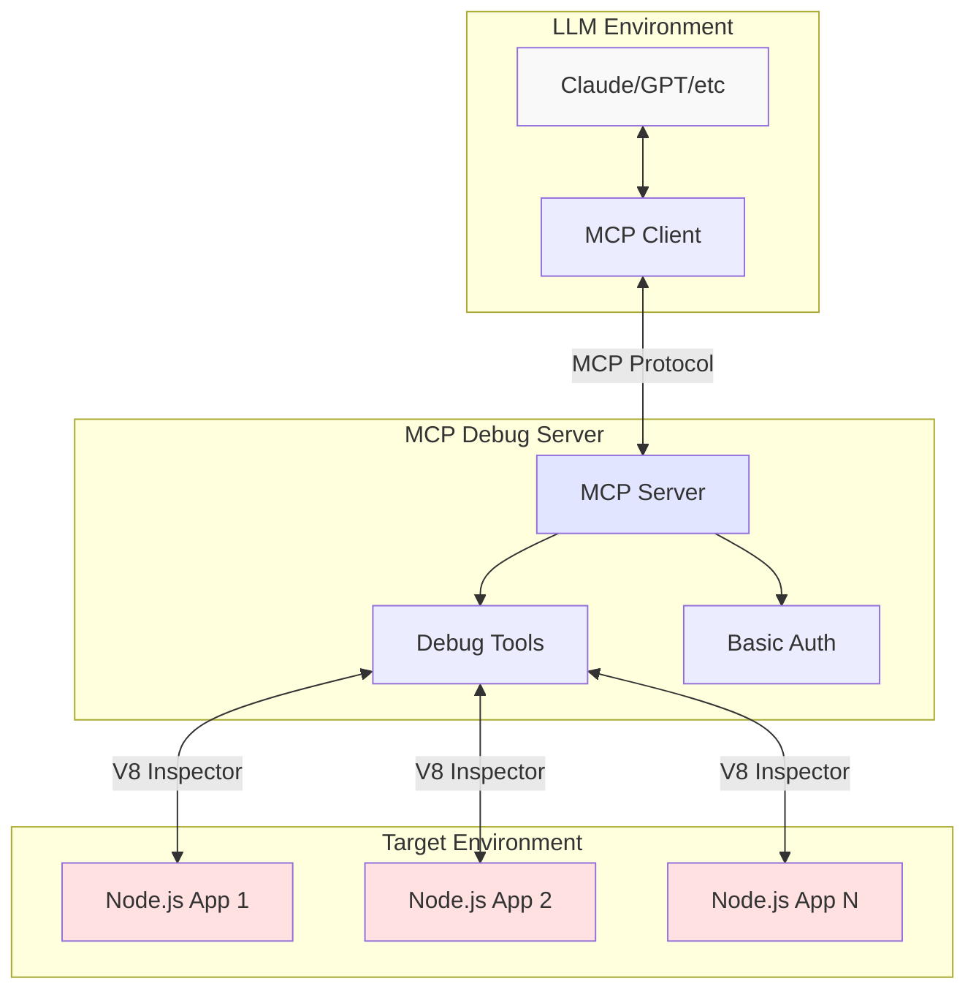
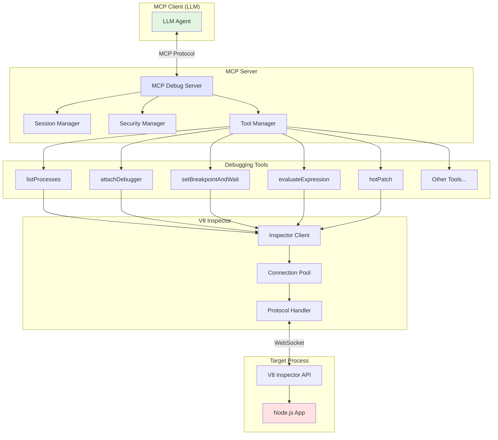
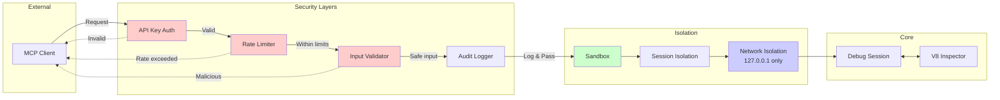
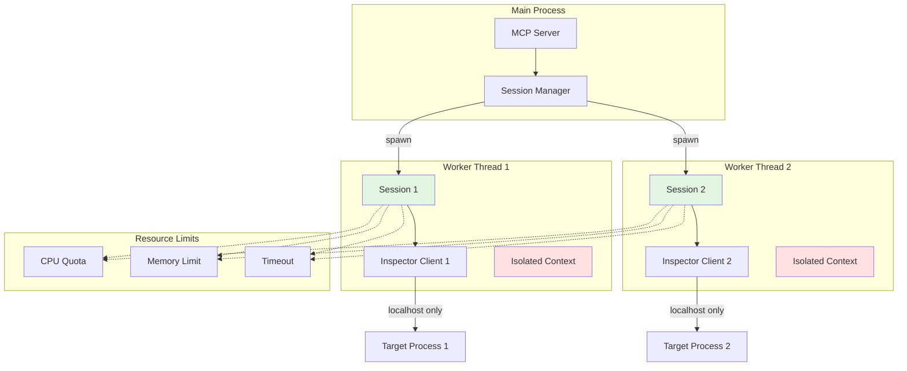
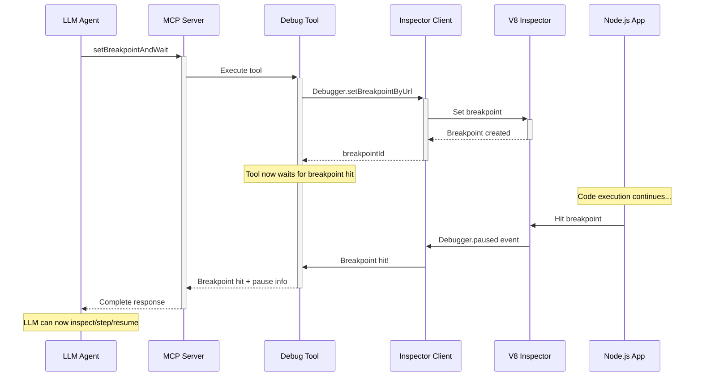
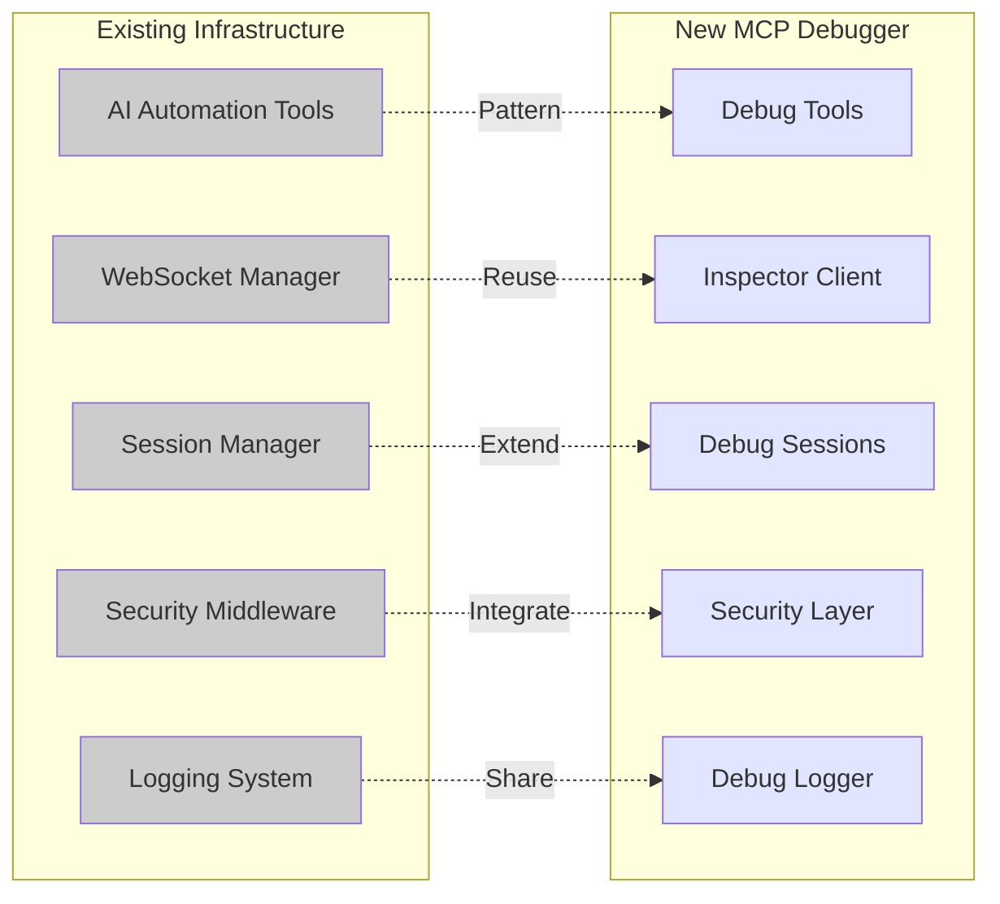
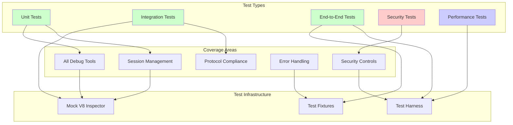

# V8 Inspector-Powered Node.js Debugger MCP Server Implementation Plan

**Date**: 2025-07-30  
**Status**: Phase 1 Complete, Simplified for Internal Use  
**Location**: `ee/docs/plans/`  
**License**: AGPL-3.0

## Intro / Rationale

### Executive Summary
We are building a simplified Model Context Protocol (MCP) server for internal use that provides LLMs with unrestricted debugging capabilities for running Node.js applications using the V8 Inspector Protocol. This internal tool enables AI agents to debug, inspect, and hot-patch live Node.js applications without security restrictions.

### Business Drivers
- **AI-Powered Debugging**: Enable LLMs to autonomously debug production issues in Node.js applications
- **Live Application Inspection**: Provide real-time access to running application state without restarts
- **Hot Patching Capabilities**: Allow AI agents to deploy fixes to running applications instantly
- **Enhanced Productivity**: Reduce mean time to resolution (MTTR) for production issues through AI assistance

### System Overview



### Success Criteria
- ✅ Successfully connect to and debug running Node.js processes via V8 Inspector
- ✅ Implement debugging sessions with basic API key authentication (simplified for internal use)
- ✅ Provide comprehensive debugging tools accessible via MCP protocol
- ✅ Enable safe hot-patching with rollback capabilities
- ✅ Demonstrate integration with existing AI automation infrastructure
- ✅ Achieve sub-100ms response times for debugging operations

### Key Stakeholders
- **AI/LLM Systems**: Primary consumers of the debugging capabilities
- **DevOps Teams**: Will benefit from automated debugging and patching
- **Development Teams**: Will use for enhanced debugging workflows
- **Internal Teams**: Using trusted debugging tool in controlled environment

### MCP Tool Definitions

#### Core Debugging Tools

**Process Discovery & Connection**
- `listProcesses` - Discover Node.js processes with debugging enabled
- `attachDebugger` - Connect to a Node.js process inspector port
- `detachDebugger` - Disconnect from current debug session

**Script Management**
- `listScripts` - List all loaded JS scripts with scriptId and URL
- `getScriptSource` - Fetch current source for a scriptId

**Breakpoint & Execution Control**
- `setBreakpointAndWait` - Set a breakpoint and wait for it to be hit (combines set + wait)
- `removeBreakpoint` - Remove a previously set breakpoint
- `resumeExecution` - Resume paused execution

**Stepping & Navigation**
- `stepOver` - Step over current line (requires paused)
- `stepInto` - Step into function call (requires paused)
- `stepOut` - Step out of current function (requires paused)

**Inspection & Evaluation**
- `evaluateExpression` - Evaluate JS expression in current paused context (requires paused)
- `getStackTrace` - Get current call stack when paused (requires paused)
- `inspectVariable` - Deep inspect a variable by name in paused context
- `getScope` - Get all variables in current scope (requires paused)

**Advanced Features**
- `hotPatch` - Replace script source on the fly with new code
- `captureHeapSnapshot` - Capture memory heap snapshot
- `startCPUProfile` - Start CPU profiling
- `stopCPUProfile` - Stop CPU profiling and get results

## Phased Implementation Checklist

### Implementation Phases Overview

```mermaid
gantt
    title V8 Inspector MCP Server Implementation Phases
    dateFormat X
    axisFormat %s
    
    section Phase 1
    Foundation Setup           :phase1, 0, 7
    Project Structure         :0, 2
    Core Infrastructure       :2, 2
    Security Foundation       :4, 2
    Session Management        :6, 1
    
    section Phase 2
    Core Tools                :phase2, 7, 7
    Process Discovery         :7, 2
    Script Management         :9, 2
    Breakpoint Control        :11, 2
    Runtime Inspection        :13, 1
    
    section Phase 3
    Advanced Features         :phase3, 14, 7
    Hot Patching             :14, 3
    Multi-Session            :17, 2
    Error Handling           :19, 2
```



### Phase 1: Foundation Setup ✅ COMPLETED (Simplified)

#### Project Structure & Dependencies
- [x] Create MCP server project structure in `/tools/node-debugger-mcp/`
  - [x] Initialize TypeScript project with strict configuration
  - [x] Install MCP SDK (`@modelcontextprotocol/sdk`)
  - [x] Install V8 inspector dependencies (`inspector`, `ws`)
  - [x] Set up ESLint, Prettier, and testing framework (Jest)
  - [x] Create basic directory structure following existing patterns
- [x] Design simplified architecture for internal use
  - [x] Basic API key authentication for MCP protocol
  - [x] Direct execution without sandboxing
  - [x] Removed rate limiting, permissions, and resource limits

#### Core MCP Server Infrastructure
- [x] Implement base MCP server class extending existing patterns
  - [x] Set up server initialization and configuration
  - [x] Implement health check and status endpoints
  - [x] Add structured logging with Winston (following existing patterns)
  - [x] Create configuration management system
- [x] Establish V8 Inspector client connection infrastructure
  - [x] Create WebSocket client for inspector protocol
  - [x] Implement connection pooling and management
  - [x] Add automatic reconnection with exponential backoff
  - [x] Create message queuing and response correlation

#### Simplified Architecture (Internal Use)
- [x] Implement basic authentication
  - [x] Simple API key validation for MCP protocol
  - [x] Removed rate limiting (not needed for internal use)
  - [x] Structured logging for debugging
  - [x] No input sanitization (injection is the point)
- [x] Direct execution model
  - [x] No network restrictions (internal tool)
  - [x] Direct execution without worker threads
  - [x] Basic timeout mechanisms
  - [x] No resource limits (trusted environment)

#### Session Management Framework
- [x] Create session management system
  - [x] Session lifecycle management (create, attach, detach, destroy)
  - [x] Multi-session isolation and tracking
  - [x] Session state persistence and recovery
  - [x] Cleanup mechanisms for abandoned sessions
- [x] Testing approach simplified
  - [x] Removed unit test infrastructure (internal tool)
  - [x] Manual testing approach for internal use
  - [x] No security validation needed
  - [x] Performance verified through usage

**Phase 1 Completion Criteria:**
- [x] MCP server can start and accept connections
- [x] Basic authentication functional
- [x] Session management system is operational
- [x] No automated tests (simplified for internal use)

### Phase 2: Core Debugging Tools

#### Process Discovery and Connection Tools
- [ ] Implement `listProcesses` tool
  - [ ] Scan for Node.js processes with inspector enabled
  - [ ] Extract process metadata (PID, command line, inspector port)
  - [ ] Filter processes by accessibility and permissions
  - [ ] Return structured process information
- [ ] Implement `attachDebugger` tool
  - [ ] Establish WebSocket connection to inspector port
  - [ ] Handle connection negotiation and protocol handshake
  - [ ] Validate target process accessibility
  - [ ] Create session binding and state tracking

#### Script and Source Management Tools
- [ ] Implement `listScripts` tool
  - [ ] Query Runtime.getHeapUsage and Debugger.scriptParsed events
  - [ ] Categorize scripts (application, node_modules, native)
  - [ ] Provide script metadata (URL, source map info, size)
  - [ ] Implement caching for performance optimization
- [ ] Implement `getScriptSource` tool
  - [ ] Fetch source code using Debugger.getScriptSource
  - [ ] Handle source maps and original source reconstruction
  - [ ] Implement source caching with TTL
  - [ ] Provide syntax highlighting metadata

#### Breakpoint and Execution Control Tools
- [ ] Implement `setBreakpointAndWait` tool
  - [ ] Set breakpoint at specified location
  - [ ] Automatically wait for breakpoint to be hit
  - [ ] Support line-based and conditional breakpoints
  - [ ] Handle source maps for accurate positioning
  - [ ] Return breakpoint ID and pause information
  - [ ] Timeout after specified duration (default 30s)
  - [ ] Clear indication of success (hit) or timeout
- [ ] Implement `removeBreakpoint` tool
  - [ ] Remove breakpoint by ID
  - [ ] Clean up from session state
- [ ] Implement `resumeExecution` tool
  - [ ] Resume from paused state
  - [ ] Clear pause-related session state
  - [ ] Return success confirmation
- [ ] Implement stepping tools (`stepOver`, `stepInto`, `stepOut`)
  - [ ] Validate debugger is paused before stepping
  - [ ] Handle async/await and Promise stepping
  - [ ] Update session state after each step
  - [ ] Return new location after step

#### Runtime Inspection Tools
- [ ] Implement `evaluateExpression` tool
  - [ ] Execute JavaScript expressions in current context
  - [ ] Support variable inspection and modification
  - [ ] Handle async expressions and Promise results
  - [ ] Implement result serialization and error handling
- [ ] Implement `getStackTrace` tool
  - [ ] Capture complete call stack with source locations
  - [ ] Include local variables and closure inspection
  - [ ] Support async stack traces
  - [ ] Provide scope chain analysis

**Phase 2 Completion Criteria:**
- [ ] All core debugging tools are functional and tested
- [ ] Can successfully debug simple Node.js applications
- [ ] Tools integrate seamlessly with MCP protocol
- [ ] Performance meets <100ms response time requirement

### Phase 3: Advanced Features

#### Hot Patching System
- [ ] Implement `hotPatch` tool architecture
  - [ ] Design safe code replacement mechanism
  - [ ] Create patch validation and syntax checking
  - [ ] Implement rollback functionality with state preservation
  - [ ] Add patch history and version management
- [ ] Advanced hot patch capabilities
  - [ ] Support function replacement and class patching
  - [ ] Handle closure and scope preservation
  - [ ] Implement module reloading strategies
  - [ ] Add dependency impact analysis

#### Multi-Session Support and Isolation
- [ ] Enhanced session management
  - [ ] Implement session priority and resource allocation
  - [ ] Add session sharing and collaboration features
  - [ ] Create session conflict resolution mechanisms
  - [ ] Implement session-specific configurations
- [ ] Resource management and monitoring
  - [ ] Track CPU and memory usage per session
  - [ ] Implement resource quotas and throttling
  - [ ] Add session health monitoring
  - [ ] Create automatic cleanup for resource leaks

#### Error Handling and Recovery
- [ ] Comprehensive error handling system
  - [ ] Graceful handling of target process crashes
  - [ ] Recovery from inspector protocol disconnections
  - [ ] User-friendly error messages and diagnostics
  - [ ] Automatic retry mechanisms with circuit breakers
- [ ] Integration testing and validation
  - [ ] End-to-end testing with real Node.js applications
  - [ ] Load testing with multiple concurrent sessions
  - [ ] Security penetration testing
  - [ ] Performance optimization and profiling

**Phase 3 Completion Criteria:**
- [ ] Hot patching system is secure and reliable
- [ ] Multi-session support handles complex scenarios
- [ ] Error recovery mechanisms are robust
- [ ] System passes comprehensive integration tests

## Background Details / Investigation / Implementation Advice

### Technical Architecture

#### High-Level Architecture



#### File Structure
```
/tools/node-debugger-mcp/
├── src/
│   ├── server/
│   │   ├── MCPDebuggerServer.ts      # Main MCP server implementation
│   │   ├── SessionManager.ts         # Debug session management
│   │   └── SecurityManager.ts        # Authentication and security
│   ├── inspector/
│   │   ├── InspectorClient.ts        # V8 Inspector WebSocket client
│   │   ├── ProtocolHandler.ts        # Inspector protocol message handling
│   │   └── ConnectionPool.ts         # Connection pooling and management
│   ├── tools/
│   │   ├── base/
│   │   │   └── DebuggerTool.ts       # Base class for all debugging tools
│   │   ├── discovery/
│   │   │   ├── ListProcessesTool.ts  # Process discovery
│   │   │   └── AttachDebuggerTool.ts # Debugger attachment
│   │   ├── execution/
│   │   │   ├── SetBreakpointTool.ts  # Breakpoint management
│   │   │   ├── StepDebuggerTool.ts   # Step execution control
│   │   │   └── EvaluateExpressionTool.ts # Runtime evaluation
│   │   ├── inspection/
│   │   │   ├── ListScriptsTool.ts    # Script enumeration
│   │   │   ├── GetScriptSourceTool.ts # Source code retrieval
│   │   │   └── GetStackTraceTool.ts  # Stack inspection
│   │   └── patching/
│   │       └── HotPatchTool.ts       # Live code patching
│   ├── security/
│   │   ├── AuthenticationProvider.ts # API key authentication
│   │   ├── RateLimiter.ts           # Request rate limiting
│   │   └── Sandbox.ts               # Process isolation
│   ├── utils/
│   │   ├── ProcessDiscovery.ts       # Node.js process detection
│   │   ├── SourceMapHandler.ts       # Source map processing
│   │   └── ErrorHandler.ts          # Centralized error handling
│   └── types/
│       ├── inspector.ts              # V8 Inspector protocol types
│       ├── mcp.ts                    # MCP-specific type definitions
│       └── session.ts                # Session management types
├── tests/
│   ├── integration/                  # End-to-end tests
│   ├── unit/                        # Unit tests
│   └── fixtures/                    # Test fixtures and mock apps
├── docs/
│   ├── api.md                       # API documentation
│   ├── security.md                  # Security considerations
│   └── examples/                    # Usage examples
├── package.json
├── tsconfig.json
├── jest.config.js
└── README.md
```

#### Core Components Design

##### 1. MCP Server Implementation
```typescript
// src/server/MCPDebuggerServer.ts
import { Server } from '@modelcontextprotocol/sdk/server/index.js';
import { StdioServerTransport } from '@modelcontextprotocol/sdk/server/stdio.js';

export class MCPDebuggerServer {
  private server: Server;
  private sessionManager: SessionManager;
  private securityManager: SecurityManager;
  
  constructor() {
    this.server = new Server(
      {
        name: 'node-debugger-mcp',
        version: '1.0.0',
      },
      {
        capabilities: {
          tools: {},
          logging: {},
        },
      }
    );
    
    this.setupToolHandlers();
    this.setupSecurityMiddleware();
  }

  private setupToolHandlers() {
    // Register all debugging tools
    this.server.setRequestHandler(CallToolRequestSchema, async (request) => {
      const { name, arguments: args } = request.params;
      
      // Security validation
      await this.securityManager.validateRequest(request);
      
      // Route to appropriate tool
      const tool = this.getToolByName(name);
      const session = await this.sessionManager.getOrCreateSession(args.sessionId);
      
      return await tool.execute(session, args);
    });
  }
}
```

##### 2. V8 Inspector Client
```typescript
// src/inspector/InspectorClient.ts
import WebSocket from 'ws';
import { EventEmitter } from 'events';

export class InspectorClient extends EventEmitter {
  private ws: WebSocket | null = null;
  private messageId = 0;
  private pendingRequests = new Map<number, { resolve: Function, reject: Function }>();
  
  async connect(port: number, sessionId?: string): Promise<void> {
    const url = `ws://127.0.0.1:${port}/${sessionId || ''}`;
    
    return new Promise((resolve, reject) => {
      this.ws = new WebSocket(url);
      
      this.ws.on('open', () => {
        this.setupEventHandlers();
        resolve();
      });
      
      this.ws.on('error', reject);
    });
  }
  
  async sendCommand(method: string, params?: any): Promise<any> {
    const id = ++this.messageId;
    const message = { id, method, params };
    
    return new Promise((resolve, reject) => {
      this.pendingRequests.set(id, { resolve, reject });
      this.ws?.send(JSON.stringify(message));
      
      // Set timeout for command response
      setTimeout(() => {
        if (this.pendingRequests.has(id)) {
          this.pendingRequests.delete(id);
          reject(new Error(`Command timeout: ${method}`));
        }
      }, 30000);
    });
  }
  
  private setupEventHandlers() {
    this.ws?.on('message', (data) => {
      const message = JSON.parse(data.toString());
      
      if (message.id && this.pendingRequests.has(message.id)) {
        const { resolve, reject } = this.pendingRequests.get(message.id)!;
        this.pendingRequests.delete(message.id);
        
        if (message.error) {
          reject(new Error(message.error.message));
        } else {
          resolve(message.result);
        }
      } else if (message.method) {
        // Handle inspector events
        this.emit(message.method, message.params);
      }
    });
  }
}
```

##### 3. Tool Implementation Examples

##### SetBreakpointAndWait Tool
```typescript
// src/tools/execution/SetBreakpointAndWaitTool.ts
export class SetBreakpointAndWaitTool extends DebuggerTool {
  name = 'setBreakpointAndWait';
  description = 'Set a breakpoint and wait for it to be hit. Combines setting and waiting in one operation.';
  
  inputSchema = {
    type: 'object',
    properties: {
      url: { 
        type: 'string', 
        description: 'Script URL or path'
      },
      lineNumber: {
        type: 'number',
        description: 'Line number for breakpoint (1-based)'
      },
      columnNumber: {
        type: 'number',
        description: 'Optional column number',
        optional: true
      },
      condition: {
        type: 'string',
        description: 'Optional conditional expression',
        optional: true
      },
      timeout: { 
        type: 'number', 
        description: 'Max wait time in milliseconds',
        default: 30000 
      }
    },
    required: ['url', 'lineNumber']
  };
  
  async execute(session: DebugSession, args: any): Promise<any> {
    // Step 1: Set the breakpoint
    const setResult = await session.inspectorClient.sendCommand(
      'Debugger.setBreakpointByUrl',
      {
        url: args.url,
        lineNumber: args.lineNumber - 1, // Convert to 0-based
        columnNumber: args.columnNumber,
        condition: args.condition
      }
    );
    
    const breakpointId = setResult.breakpointId;
    
    // Store in session
    session.breakpoints.set(breakpointId, {
      id: breakpointId,
      url: args.url,
      lineNumber: args.lineNumber,
      condition: args.condition
    });
    
    // Step 2: Wait for this specific breakpoint to be hit
    return new Promise((resolve) => {
      const timeout = setTimeout(() => {
        session.inspectorClient.off('Debugger.paused', pauseHandler);
        resolve({ 
          breakpointId,
          hit: false,
          paused: false,
          reason: 'timeout',
          message: `Breakpoint set but not hit within ${args.timeout || 30000}ms`
        });
      }, args.timeout || 30000);
      
      const pauseHandler = (params: any) => {
        // Only respond if our breakpoint was hit
        if (!params.hitBreakpoints?.includes(breakpointId)) {
          return; // Different breakpoint, keep waiting
        }
        
        clearTimeout(timeout);
        session.inspectorClient.off('Debugger.paused', pauseHandler);
        
        // Update session state
        session.isPaused = true;
        session.pauseReason = 'breakpoint';
        session.currentLocation = params.callFrames[0]?.location;
        session.callFrames = params.callFrames;
        
        resolve({
          breakpointId,
          hit: true,
          paused: true,
          location: session.currentLocation,
          callFrames: session.callFrames,
          scopeChain: params.callFrames[0]?.scopeChain
        });
      };
      
      session.inspectorClient.on('Debugger.paused', pauseHandler);
    });
  }
}
```

##### Tool Base Class
```typescript
// src/tools/base/DebuggerTool.ts
import { DebugSession } from '../../types/session.js';

export abstract class DebuggerTool {
  abstract name: string;
  abstract description: string;
  abstract inputSchema: any;
  
  abstract execute(session: DebugSession, args: any): Promise<any>;
  
  protected async validateArgs(args: any): Promise<void> {
    // Implement JSON schema validation
  }
  
  protected handleError(error: Error, context: string): never {
    // Centralized error handling with context
    throw new DebuggerError(`${context}: ${error.message}`, error);
  }
  
  protected requiresPausedState(session: DebugSession): void {
    if (!session.isPaused) {
      throw new DebuggerError(
        'This operation requires the debugger to be paused. ' +
        'Use waitForDebuggerPause first.'
      );
    }
  }
}
```

##### 4. Session Management
```typescript
// src/server/SessionManager.ts
export class SessionManager {
  private sessions = new Map<string, DebugSession>();
  private sessionTimeouts = new Map<string, NodeJS.Timeout>();
  
  async createSession(processId: number): Promise<DebugSession> {
    const sessionId = uuidv4();
    const inspectorClient = new InspectorClient();
    
    // Discover inspector port for process
    const port = await this.discoverInspectorPort(processId);
    await inspectorClient.connect(port);
    
    const session: DebugSession = {
      id: sessionId,
      processId,
      inspectorClient,
      createdAt: new Date(),
      lastActivity: new Date(),
      breakpoints: new Map(),
      watchExpressions: [],
      isPaused: false,
      pauseReason: undefined,
      currentLocation: undefined,
      callFrames: [],
    };
    
    this.sessions.set(sessionId, session);
    this.setupSessionTimeout(sessionId);
    
    return session;
  }
  
  private setupSessionTimeout(sessionId: string) {
    const timeout = setTimeout(() => {
      this.cleanupSession(sessionId);
    }, 30 * 60 * 1000); // 30 minutes
    
    this.sessionTimeouts.set(sessionId, timeout);
  }
}
```

### Security Implementation Details

#### Security Architecture



#### 1. Authentication System
- **API Key Management**: Generate secure API keys with configurable expiration
- **Rate Limiting**: Implement sliding window rate limiting per client/session
- **Request Validation**: Validate all inputs using JSON schemas
- **Audit Logging**: Log all debugging operations for security analysis

#### 2. Network Security
- **Localhost Binding**: Enforce localhost-only connections to prevent remote access
- **Process Isolation**: Use Node.js worker threads for session isolation
- **Resource Limits**: Implement CPU and memory quotas per session
- **Timeout Protection**: Set aggressive timeouts for all operations

#### 3. Sandboxing Strategy



```typescript
// src/security/Sandbox.ts
export class Sandbox {
  static async executeInSandbox<T>(
    operation: () => Promise<T>,
    limits: ResourceLimits
  ): Promise<T> {
    return new Promise((resolve, reject) => {
      const worker = new Worker(__filename, {
        eval: false,
        workerData: { operation: operation.toString(), limits }
      });
      
      const timeout = setTimeout(() => {
        worker.terminate();
        reject(new Error('Operation timeout'));
      }, limits.timeoutMs);
      
      worker.on('message', (result) => {
        clearTimeout(timeout);
        resolve(result);
      });
      
      worker.on('error', (error) => {
        clearTimeout(timeout);
        reject(error);
      });
    });
  }
}
```

### V8 Inspector Protocol Integration

#### Simplified Debugging Pattern

The MCP server implements a **combined set-and-wait pattern** to simplify debugging for LLMs:

```typescript
// Example debugging workflow from LLM perspective:

// 1. Set breakpoint AND wait for it to hit (single operation)
const pauseInfo = await setBreakpointAndWait({ 
  url: "server.js", 
  lineNumber: 42,
  timeout: 30000  // optional, defaults to 30s
});
// Returns: { 
//   breakpointId: "bp1",
//   hit: true,  // false if timeout
//   paused: true,
//   location: { url: "server.js", lineNumber: 42 },
//   callFrames: [...] 
// }

// 2. Now we can inspect (requires paused state)
const result = await evaluateExpression({ 
  expression: "request.body" 
});
// Returns: { type: "object", value: {...} }

// 3. Step to next line
await stepOver();
// Returns: { success: true, location: { url: "server.js", lineNumber: 43 } }

// 4. Resume execution
await resumeExecution();
// Returns: { success: true }
```

**Key Pattern Benefits:**
1. **Single Operation**: No need to manage separate set and wait operations
2. **Automatic Correlation**: The tool ensures we wait for the specific breakpoint we just set
3. **Clear Success/Failure**: `hit: true/false` clearly indicates if breakpoint was reached
4. **State Requirements**: Tools marked "(requires paused)" will fail if debugger is not paused
5. **Simplified Mental Model**: LLMs think "set breakpoint and wait" as one action

#### Protocol Flow



#### Key Protocol Commands
1. **Runtime Domain**: Expression evaluation, object inspection
2. **Debugger Domain**: Breakpoints, stepping, stack traces
3. **HeapProfiler Domain**: Memory analysis and profiling
4. **Console Domain**: Console output capture
5. **Profiler Domain**: CPU profiling capabilities

#### Error Handling Strategy
- **Graceful Degradation**: Continue operation when non-critical features fail
- **Retry Logic**: Implement exponential backoff for transient failures
- **Circuit Breakers**: Prevent cascade failures in multi-session scenarios
- **Detailed Logging**: Capture context for debugging protocol issues

### Performance Considerations

#### Response Time Optimization
- **Connection Pooling**: Maintain persistent inspector connections
- **Caching Strategy**: Cache frequently accessed script sources and metadata
- **Async Operations**: Use Promise.all for parallel operations where safe
- **Resource Preloading**: Preload common scripts and modules

#### Memory Management
- **Session Cleanup**: Implement aggressive cleanup for abandoned sessions
- **Cache Eviction**: Use LRU cache with size limits for source code
- **Event Handler Cleanup**: Properly remove event listeners on disconnect
- **Garbage Collection**: Monitor and optimize GC pressure

### Integration with Existing Codebase

#### Leverage Existing Patterns
1. **Tool Architecture**: Follow the pattern established in `/tools/ai-automation/src/tools/`
2. **WebSocket Infrastructure**: Reuse WebSocket handling patterns from existing services
3. **Session Management**: Adopt session patterns from browser automation
4. **Security Middleware**: Integrate with existing authentication systems

#### Code Reuse Opportunities
- **Logging Infrastructure**: Use existing Winston-based logging
- **Error Handling**: Adopt centralized error handling patterns
- **Configuration Management**: Use existing config management approach
- **Testing Frameworks**: Leverage established testing infrastructure

#### Integration Points



### Testing Strategy

#### Test Architecture



#### Unit Testing
- **Tool Isolation**: Test each debugging tool independently
- **Mock Inspector**: Create comprehensive mocks for V8 Inspector protocol
- **Error Scenarios**: Test error handling and edge cases
- **Performance Benchmarks**: Establish performance baselines

#### Integration Testing
- **Real Applications**: Test with actual Node.js applications
- **Multi-Session Scenarios**: Validate concurrent debugging sessions
- **Security Testing**: Penetration testing for authentication and authorization
- **Load Testing**: Stress test with multiple concurrent users

#### End-to-End Testing
- **MCP Integration**: Test complete MCP client-server interaction
- **AI Agent Simulation**: Simulate realistic AI agent usage patterns
- **Production Scenarios**: Test with production-like applications
- **Failure Recovery**: Test recovery from various failure modes

## Implementation Guidelines

### IMPORTANT: Commit Frequently
**Commit your work after each logical unit is completed:**
- After implementing each tool
- After completing each major section
- When tests pass for a component
- Before moving to the next phase
- Use descriptive commit messages that explain what was accomplished

### Git Workflow
1. Stage changes: `git add -A` or specific files
2. Commit with descriptive message: `git commit -m "feat: Implement setBreakpointAndWait tool"`
3. Push to remote: `git push origin branch-name`
4. Commit early and often - don't wait until the end of a phase!

## Implementer's Scratch Pad

### Progress Tracking
```
Phase 1 Progress:
[ ] Project Structure & Dependencies: ____________________
[ ] Core MCP Server Infrastructure: ____________________
[ ] Security Foundation: ____________________
[ ] Session Management Framework: ____________________

Phase 2 Progress:
[ ] Process Discovery and Connection Tools: ____________________
[ ] Script and Source Management Tools: ____________________
[ ] Breakpoint and Execution Control Tools: ____________________
[ ] Runtime Inspection Tools: ____________________

Phase 3 Progress:
[ ] Hot Patching System: ____________________
[ ] Multi-Session Support and Isolation: ____________________
[ ] Error Handling and Recovery: ____________________
```

### Implementation Notes
- **Dependencies Found**: _______________________________________________________________
- **Architecture Decisions**: ___________________________________________________________
- **Security Considerations**: __________________________________________________________
- **Performance Observations**: _________________________________________________________

### Issues Encountered
```
Issue: _________________________________________________________________________
Resolution: ____________________________________________________________________
Date: __________________________

Issue: _________________________________________________________________________
Resolution: ____________________________________________________________________
Date: __________________________
```

### Test Results
```
Unit Tests: _____ / _____ passing
Integration Tests: _____ / _____ passing
End-to-End Tests: _____ / _____ passing
Performance Benchmarks: ____________________________________________________________
```

### Security Validation Checklist
- [ ] API key authentication tested and secure
- [ ] Rate limiting prevents abuse
- [ ] Input validation blocks malicious payloads
- [ ] Session isolation prevents cross-session contamination
- [ ] Resource limits prevent DoS attacks
- [ ] Audit logging captures all security-relevant events
- [ ] Network isolation prevents remote access
- [ ] Process sandboxing contains potential security issues


### Review Questions
1. Are all security measures properly implemented and tested?
2. Do response times meet the <100ms requirement for core operations?
3. Is error handling comprehensive and user-friendly?
4. Are multi-session scenarios properly isolated and managed?
5. Is the hot patching system safe with proper rollback capabilities?
6. Does the implementation follow existing codebase patterns and standards?
7. Are all MCP protocol requirements satisfied?
8. Is documentation complete and accurate?

### Deployment Checklist
- [ ] All tests passing (unit, integration, e2e)
- [ ] Security review completed
- [ ] Performance benchmarks met
- [ ] Documentation complete
- [ ] Code review approved
- [ ] Configuration management ready
- [ ] Monitoring and alerting configured
- [ ] Rollback plan prepared