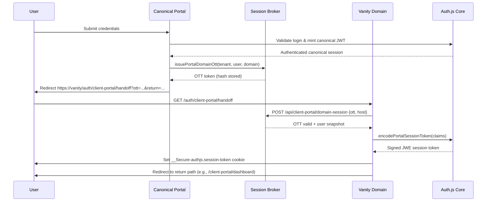

Title: Client Portal Custom Domain Authentication Plan
Date: 2025-09-25

## Status – 2025-10-01
- **Phases 1–4 complete**: shared session helpers, OTT persistence, and the `/api/client-portal/domain-session` cookie minting flow are live with unit coverage. Canonical logins now issue vanity OTTs even when domains include a port, the handoff page redeems them, and new Playwright journeys (`client-portal-login-e2e`, `client-portal-vanity-session`, `client-portal-redirects`) cover the canonical ➔ vanity loop end-to-end.
- **Phase 5 underway**: expanded logging is in place around OTT issuance/consumption, but telemetry wiring and documentation refresh are still pending.

### Outstanding Issues
- **Telemetry & docs**: finish documenting the new middleware behaviour, add runbooks, and wire PostHog events for OTT redemption failures/success.
- **Operational polishing**: surface vanity handoff metrics/dashboards and confirm production ingress honours the updated host+port matching.

## TODO – Phased Delivery
- **Phase 1 – Auth Foundations**: Extract shared session settings helpers, align NextAuth/edge-auth configs, and confirm `NEXTAUTH_SECRET` parity across environments.
- **Phase 2 – OTT Broker & Persistence**: Add the `portal_domain_session_otts` migration, build issuance/consumption/pruning helpers with tests, and wire RBAC + status checks.
- **Phase 3 – Exchange API & Cookie Handoff**: Implement the vanity-domain exchange route, mint Auth.js cookies via shared helpers, and harden middleware allowances.
- **Phase 4 – Login Integration & UX**: Update the canonical login success path for automatic vanity redirects, create the `/auth/client-portal/handoff` page, and handle return-path persistence + error toasts.
- **Phase 5 – Telemetry, Testing & Rollout**: Ship logging/PostHog events, add unit + Playwright coverage, refresh docs, and stage rollout with Temporal workflow validation.

Overview / Rationale
- Tenant admins can already register a custom portal hostname that CNAMEs to our canonical ingress, but authentication relies on cookies scoped to the login host. Logging in on the canonical host leaves the vanity domain without a usable session.
- We need a deterministic way to mint Auth.js-compatible session tokens for `portal.customer.com` immediately after the tenant authenticates on the canonical domain, without bypassing existing NextAuth/Temporal safeguards.
- Success means a client user lands on their vanity host, completes login once, and all subsequent navigation and middleware checks work identically to the existing canonical experience.

Goals
- Make NextAuth session cookies work on active customer domains backed by the `portal_domains` workflow.
- Provide an auditable one-time token (OTT) handoff from the canonical login flow to the vanity domain using Auth.js JWT helpers.
- Keep the canonical host behaviour unchanged and avoid reintroducing multiple session systems.
- Surface clear telemetry so ops can debug failed handoffs quickly.

Login Handoff Sequence

Non-Goals
- Supporting multiple simultaneous vanity domains per tenant.
- Replacing the existing Temporal DNS/certificate workflow.
- Sharing sessions between internal MSP portal and client portal users.
- Allowing logins from inactive or partially configured vanity domains.

Current State Snapshot
- `server/src/app/api/auth/[...nextauth]/options.ts` already uses `session: { strategy: "jwt" }` and a shared `NEXTAUTH_SECRET` sourced from the secret provider.
- The Temporal workflow (`ee/temporal-workflows/src/workflows/portal-domains/registration.workflow.ts`) and activities manage DNS verification, cert-manager resources, and status transitions in `portal_domains`.
- UI + EE server actions for domain status live in `ee/server/src/lib/actions/tenant-actions/portalDomainActions.ts`; CE fallback disables edits.
- Middleware (`server/src/middleware.ts`) guards `/client-portal/*` routes based on cookie-derived session data.

Key Constraints & Considerations
- Auth.js v5 expects encrypted JWE tokens; we must use `@auth/core/jwt`/`next-auth/jwt` helpers with the same secret + `session.maxAge`.
- Cookie name in production is `__Secure-authjs.session-token`; cookies must be `Secure`, `HttpOnly`, `SameSite=Lax`, path `/`, and scoped to the vanity host (no explicit domain attribute).
- OTTs cannot be reusable; they must expire quickly (<2 minutes) and be bound to `(tenant, user, targetDomain)` to prevent cross-tenant replay.
- Vanity-domain handoff must be disabled unless the domain is `active` and still points at the canonical host per the latest Temporal snapshot.
- Some routes (Edge middleware, edge-auth) rely on lightweight JWT parsing; the minted cookies must remain compatible.

Proposed Architecture
1. Unified Auth Session Configuration
   - Extract cookie metadata and JWT encoding helpers into `server/src/lib/auth/sessionCookies.ts` so both NextAuth callbacks and the OTT exchange reuse the same settings.
   - Ensure `NEXTAUTH_SECRET`/`AUTH_SECRET` are identical across the canonical and vanity deployments (documented in `docs/deployment/nextauth.md`).

2. Domain Session Broker (Server-side)
   - Create a new model `server/src/lib/models/PortalDomainSessionToken.ts` backed by table `portal_domain_session_otts` (id UUID, tenant, user_id, portal_domain_id, token_hash, expires_at, consumed_at, metadata JSON, timestamps).
   - Provide helpers `issuePortalDomainOtt`, `consumePortalDomainOtt`, and `pruneExpiredPortalDomainOtts` with hashing (e.g., SHA-256) to avoid storing raw tokens.
   - OTT creation validates tenant RBAC (only internal admins) and checks `portal_domains.status === 'active'` before issuing.
   - Store context needed to mint the JWT: user snapshot (id, email, tenant, roles, contact/company IDs) at issuance time.

3. Auth.js-Compatible Token Minting
   - Implement `encodePortalSessionToken` in `server/src/lib/auth/sessionCookies.ts`, using `encode` from `@auth/core/jwt` with `secret`, `maxAge`, and claims mirroring the NextAuth JWT callback.
   - Include standard claims (`sub`, `email`, `tenant`, `user_type`, `companyId`, `contactId`, `exp`, `iat`) and align `maxAge` with `NEXTAUTH_SESSION_EXPIRES`.
   - Return the JWE so the exchange endpoint can set the cookie directly.

4. Browser Handoff Flow
   - After successful login on the canonical host, check if the tenant has an active vanity domain (`getPortalDomainStatusAction`).
   - If active and the request host matches the canonical domain, call `issuePortalDomainOtt` and redirect the user to `https://<vanity-host>/auth/client-portal/handoff?ott=<token>&return=/client-portal/dashboard`.
   - Add a new route segment `/auth/client-portal/handoff/page.tsx` that calls the exchange endpoint via `POST`, waits for success, and then redirects to the desired return path.

5. Exchange API on Vanity Host
   - Add `server/src/app/api/client-portal/domain-session/route.ts` (or similar) that accepts `POST { ott, returnPath }`.
   - The handler validates the OTT (`consumePortalDomainOtt`), verifies `request.headers['Host']` matches the active vanity domain, and mints the Auth.js cookie with `cookies().set({ name: '__Secure-authjs.session-token', ... })`.
   - On success it responds `204` (or JSON) and the page performs a client-side redirect to the target path; on failure it clears any existing session cookie and shows guidance.

6. Middleware & Session Validation Updates
   - Update `server/src/middleware.ts` to allow unauthenticated access to `/auth/client-portal/handoff` and `/api/client-portal/domain-session` when the request includes a valid OTT; ensure existing guards stay intact for other routes.
   - Ensure `edge-auth.ts` can parse the minted token without change; adjust if new claims are added.

7. Observability & Ops Hooks
   - Emit structured logs/PostHog events for OTT issuance, redemption, and failure states (`portal_domain.ott_issued`, `portal_domain.ott_consumed`, `portal_domain.ott_failed`).
   - Extend the Temporal reconciliation activity to stash the most recent `expected_cname` and `last_verified_at`, so the OTT exchange can reject if DNS drift is detected.
   - Provide a lightweight CLI or script (`pnpm cli portal-domain sessions prune`) to clean expired OTTs.

Workstreams & Deliverables
1. Auth Configuration Hardening
   - Refactor shared session helpers in `server/src/lib/auth` and update NextAuth options to use them.
   - Verify `edge-auth` path and middleware reuse the helpers.

2. OTT Data Layer
   - Migration: `server/migrations/*_create_portal_domain_session_otts.cjs` with indexes on `(portal_domain_id, expires_at)` and `(token_hash)`.
   - Model + tests covering issuance, consumption, and expiry logic.

3. Exchange API & Cookie Setting
   - Implement OTT exchange route + helper utilities.
   - Ensure cookies are set via Next.js `cookies()` API and include `__Secure-` attributes in production builds.

4. Canonical Login Flow Integration
   - Enhance `ClientPortalSignIn` success path (and relevant server actions) to trigger the vanity-domain redirect when appropriate.
   - Persist the intended return path so deep-linking still works.

5. Frontend Hand-off UI/UX
   - Create `/auth/client-portal/handoff` page with loading state, error fallback, and optional "Return to canonical portal" link.
   - Update docs (`docs/client_portal_overview.md`, portal settings UI descriptions) with the new behaviour.

6. Quality Gates & Telemetry
   - Unit tests for OTT helpers, exchange route, and middleware adjustments.
   - Playwright end-to-end scenario: canonical login ➔ handoff ➔ dashboard on vanity domain.
   - Observability dashboards/alerts for repeated OTT failures or mismatched hosts.

Security & Compliance
- OTT tokens are random 256-bit strings, hashed at rest, expire after 90 seconds, and cannot be reused once `consumed_at` is set.
- OTT issuance requires tenant-level RBAC checks and fails closed if `portal_domains.status !== 'active'` or `canonical_host` mismatch.
- Exchange route enforces TLS (`Secure` cookies), strips `Referer` leakage by responding with redirects, and rate-limits OTT exchanges per tenant.
- All paths honour existing audit logging conventions (`analytics.capture`, structured logger) for compliance reviews.

Open Questions / Follow-ups
- Should we trigger the handoff only when the user originally navigated to the vanity host (detect via referer param), or always when an active domain exists? always on
- Do we need a background job to pre-warm OTTs for SSO scenarios (e.g., emailed magic links)? no
- How do we surface OTT redemption errors back to the tenant admin (email alert, UI toast, Status panel)? toast
- Should we store additional claims (e.g., locale, feature flags) in the minted token for parity with future NextAuth updates? not at this time.
