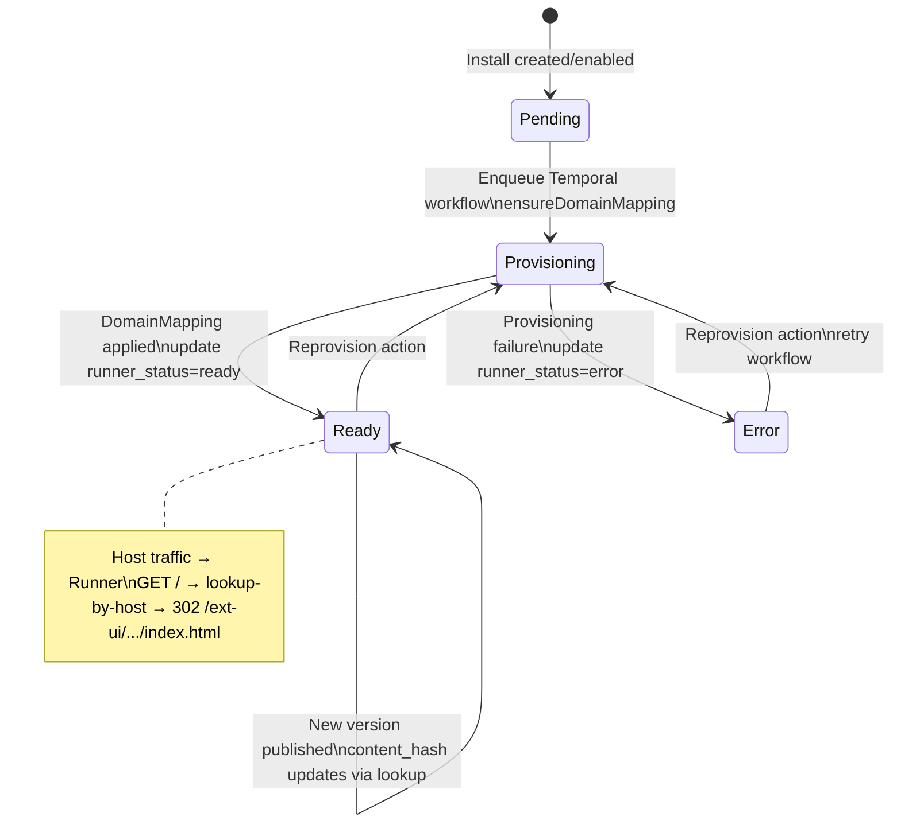

# Client Extension Multi-Tenancy Overhaul Plan

Last updated: 2025-08-09

Status update (2025-11-21):
- v2 extension system is live with out-of-process Runner + signed content-addressed bundles; legacy in-process/dynamic import path removed (see `extension-system-v2-migration.md`).
- UI delivery now uses Runner ext-ui host with iframe sandbox; gateway proxies all API calls to Runner `/v1/execute`.
- Remaining multi-tenant hardening tracks to the alignment plan (install_id propagation, RBAC, manifest enforcement).

## Context & Findings

- Current behavior: user-supplied extension code is uploaded into the running application environment and dynamically loaded. This violates multi-tenant isolation and increases operational risk (code execution in app context, shared process memory, filesystem access, and unrestricted egress).
- Repo state: Community Edition (CE) contains stubs; Enterprise Edition (EE) code is present under `ee/server`. The CE app dynamically imports EE initialization (`ee/server/src/lib/extensions/initialize`) when enterprise mode is enabled.
- Risk summary:
  - Cross-tenant impact via shared process or host resources.
  - In-process arbitrary code execution elevates the blast radius to the entire cluster.
  - Unbounded capabilities: filesystem, network, and secrets likely not capability-scoped.
  - Weak provenance: uploaded files lack signed, reproducible artifacts and verified dependency graphs.

## Goals

- Strong tenant isolation for compute, storage, cache, and network.
- No direct execution of tenant-supplied code in the application process.
- Capability-based, least-privilege runtime with explicit allowlists.
- Deterministic, reproducible, and signed extension artifacts.
- Auditable execution with traceability, quotas, and rate limits per tenant.
- Backwards-compatible migration path, with clear deprecation of unsafe paths.

## Overarching Phases

Phase 1 — Static Rendering via Rust Host (MinIO proxy)
- Scope: Serve prebuilt UI bundles (iframe apps) as immutable static assets via a Rust host that proxies reads from MinIO/S3, with strict path sanitation, tenant/contentHash validation, ETag/Cache-Control, and pod-local caching optional.
- Purpose: Quickly replace any dynamic module loading in the app with safe, static delivery. No guest code execution. Focus on asset integrity and isolation.
- Deliverables:
  - Rust static asset service (MinIO/S3 proxy) with SPA fallback and CSP guidance for iframes
  - URL model: /ext-ui/{extensionId}/{content_hash}/... mapped to object storage layout (sha256/<hash>/ui/...)
  - Basic registry/install wiring to resolve content_hash per tenant (read-only for UI)
  - Signing/hash verification for assets at fetch time (optional signature; hash required)
  - Docs + Client SDK usage for iframe embedding

Phase 2 — Dynamic WASM Features
- Scope: Out-of-process Runner (Rust + Wasmtime), Host API v1 (capability-based), Next.js API gateway to Runner, event-driven execution, quotas/limits, and per-tenant auditability.
- Purpose: Safely execute extension logic outside the app process with strong isolation and provenance.
- Deliverables:
  - Runner service with Wasmtime limits, host imports, and signature verification
  - Registry + bundle signing/publishing, versioning, and warmup/prefetch
  - API gateway for /api/ext/... to invoke handlers in Runner
  - Event subscriptions, logs/metrics, idempotency, and quota enforcement

Mapping to detailed sections
- Phase 1 aligns with: "Client UI Delivery (iframe-only)", "Client Asset Serving via Gateway", and parts of "Bundle Storage Integration" focused on static ui assets and integrity.
- Phase 2 aligns with: "Runner Service Design", "HTTP Routing for Plugin Endpoints", "Next.js API Router/Proxy", "Runtime Decision: Wasmtime", and remaining bundle signing/execute paths.

## Non-Goals (for this overhaul)

- Supporting all languages. Start with JS/TS to WASM or isolate; consider additional languages later.
- Full “bring-your-own container” marketplace. We will support a controlled out-of-process path, but not arbitrary images at first.

## Upfront Decisions (Simplifications)

- EE-only: Extensions ship only with Enterprise Edition; no feature flag toggle needed in CE. Remove extension initialization paths in non-EE builds.
- Runtime: Standardize on Wasmtime-based wasm_runner only; no alternate runtimes.
- Storage: Use S3-compatible storage via our existing S3StorageProvider against local MinIO only. No alternative providers. Canonical bucket and prefix are defined via env.
- UI: Iframe-only Client SDK approach. React-based example and docs only for SDK; no descriptor renderer.
- Fetch/serve model: Object storage is source of truth. Pods fetch bundles/UI on-demand into a pod-local cache and serve directly via Next.js/Knative.
- Framework: Use Axum 0.7 + tower-http for the unified Rust application server. Static asset routes (/ext-ui/...) and execute routes (/v1/execute) live in the same binary. This keeps Phase 1 minimal and allows Wasmtime to be bolted in for Phase 2 without changing frameworks. See [ee/runner/src/http/server.rs](ee/runner/src/http/server.rs:1) and dependency updates in [ee/runner/Cargo.toml](ee/runner/Cargo.toml).


## Executive Summary

We are splitting the extension overhaul into two phases: Phase 1 focuses on safe, static UI delivery via a Rust host proxying MinIO/S3 (no dynamic module loading, no guest code execution), and Phase 2 delivers dynamic WASM execution with a Rust Runner (Wasmtime), a capability-based Host API, and a Next.js API gateway. This preserves security and isolation while enabling a clear migration path.

## Server Actions-First Contract

- Principle: Business logic lives in server actions under `server/src/lib/actions` (EE overlays may live under `ee/server/src/lib/actions`). HTTP API routes exist only as thin wrappers that call these actions to support external/infra consumers (Runner, automation).
- Actions (conceptual names) and wrappers:
  - `extensions.publishVersion(bundle)` → verifies, computes `content_hash`, writes to `sha256/<hash>/bundle.tar.zst`, records `extension_bundle`. Wrapper: `POST /api/extensions/:id/versions`.
  - `installs.createOrEnable(tenant, extension, version)` → persists install, computes `runner_domain`, sets `runner_status='pending'`, enqueues provisioning workflow. Wrapper: `POST /api/installs` or server-initiated only.
  - `installs.lookupByHost(host)` → returns `{ tenant_id, extension_id, content_hash }`. Wrapper: `GET /api/installs/lookup-by-host` (used by Runner).
  - `installs.validate(tenant, extension, hash)` → returns `{ valid: boolean }`. Wrapper: `GET /api/installs/validate` (used by Runner `ext-ui` gate).
  - `installs.reprovision(installId)` → retries provisioning (Temporal). Wrapper: `POST /api/installs/:id/reprovision`.
- Testing guidance: unit/integration tests target server actions; API tests cover parameter parsing and delegation only.

## Proposed Document Map

Unified service approach
- We will deploy a single Rust application server that serves both static assets (/ext-ui/...) and the execute API (/v1/execute). CDN fronts /ext-ui with immutable caching by contentHash. Route-level isolation and config separation keep static and execute concerns safe within one binary.

- Phase 1 — Static Rendering via Rust Host (MinIO proxy)
  - See: Phase 1 section below. Consolidates: "Client UI Delivery (iframe-only)", "Client Asset Serving via Gateway", and the UI-asset portions of "Distributed Bundles, Assets, and Caching".
- Phase 2 — Dynamic WASM Features
  - See: Phase 2 section below. Consolidates: "Runner Service Design (Rust + Wasmtime)", "HTTP Routing for Plugin Endpoints", "Next.js API Router/Proxy", "Runtime Decision: Wasmtime", and WASM/precompiled portions of caching.
- Shared Foundations
  - See: Data Model and Registry section. Consolidates: "Data Model (initial)" and "Public APIs (EE)".

## Phase 1 — Static Rendering via Rust Host (MinIO proxy)

Scope & Objectives
- Serve prebuilt iframe UI bundles as immutable static assets from MinIO/S3 via a Rust host. Validate tenant/contentHash; sanitize paths; set strong caching and security headers. No dynamic JS import into host app.

Architecture
- Implementation: Served by the unified Rust application server within a dedicated route group (/ext-ui/...)
- URL model: /ext-ui/{extensionId}/{contentHash}/[...path]
- Object storage layout: sha256/<hash>/ui/**/* (extracted from bundle) or tar subtree on first touch; integrity via contentHash
- Caching: CDN as primary (immutable by contentHash); pod-local cache optional/minimal for origin efficiency; SPA fallback to index.html

Security
- Tenant/contentHash validation with registry lookups
- Path sanitization, file size caps, immutable caching, ETag/If-None-Match
- CSP for iframes (summary; full guidance in Appendix A)

Deployment & Operations
- Env: EXT_BUNDLE_STORE_URL, STORAGE_S3_*, EXT_CACHE_*, EXT_STATIC_STRICT_VALIDATION; health checks; metrics; autoscaling profile
- CDN: front /ext-ui with long-lived immutable caching keyed by full path; origin shielding to reduce S3 reads

Test Plan
- Unit/integration for sanitization, 404/304/200 paths, cache eviction, large file handling; load tests for warm/cold cache; S3 failure modes

References to detailed content in this doc
- Client UI Delivery (iframe-only with SDK)
- Client Asset Serving via Gateway (pod-local cache)
- Distributed Bundles, Assets, and Caching (UI aspects)

### Phase 1 — TODOs (Status)

1.a Client Asset Fetch-and-Serve (Pod-Local Cache)
- [x] Route: `server/src/app/ext-ui/[extensionId]/[contentHash]/[...path]/route.ts` (GET).
- [x] Cache manager: `server/src/lib/extensions/assets/cache.ts` (ensure and basic index write).
- [x] Static serve: `server/src/lib/extensions/assets/serve.ts` (SPA fallback; sanitize; caching headers).
- [x] Mime map: `server/src/lib/extensions/assets/mime.ts`.
- Details
  - [x] Tar/zip extraction for `ui/**/*`.
  - [x] LRU index file structure recorded; [x] eviction policy and GC.
  - [x] ETag generation and conditional GET support.
  - [x] Locking/concurrency control for first-touch extraction.
  - [x] Enforce tenant/contentHash match (404 on mismatch) in route handler.
  - [ ] CSP guidance for iframe pages.

1.b Client SDK (Iframe)
- [x] Packages created: `ee/server/packages/extension-iframe-sdk/`, `ee/server/packages/ui-kit/`.
- SDK files
  - [x] `src/index.ts`, [x] `src/bridge.ts`, [x] `src/auth.ts`, [x] `src/navigation.ts`, [x] `src/theme.ts`, [x] `src/types.ts`, [x] React hooks (`src/hooks.ts`), [x] README with React example and security guidance.
- UI Kit
  - [x] `src/index.ts`, [x] theme tokens CSS and theming entry, [x] MVP components, [x] hooks, [x] README (tokens + usage updated).
- Example app
  - [x] Vite + TS example (under `ee/server/packages/extension-iframe-sdk/examples/vite-react/`) with README and static build output.
- Host bridge bootstrap
  - [x] `ee/server/src/lib/extensions/ui/iframeBridge.ts` to inject theme tokens and session.
- Protocol & security
  - [x] Origin validation and sandbox attributes; author docs.
  - [x] Message types include `version`.
- Ergonomics
  - [x] React hooks: `useBridge`, `useTheme`, `useAuthToken`, `useResize`.

1.c Bundle Storage Integration (UI integrity)
- Details
  - [x] Hash verification on fetch and before use.
    - Archive integrity: archive sha256 is verified against the URL content-address (sha256/<hex>/bundle.tar.zst) during download. On mismatch, the request returns 502 (code: archive_hash_mismatch) and nothing is cached.
    - Per-file integrity: on every GET, a strong ETag is computed from the served file bytes using SHA-256 and returned as a quoted value: "sha256-<hex>". If the client supplies If-None-Match with this exact value, the server returns 304.
    - Operational note: URLs include the contentHash making CDN caching safe and immutable; origin fails closed on integrity mismatches and never serves partially extracted assets.

1.d Unified Rust Static Asset Host (MinIO/S3 proxy)
- Routing
  - [ ] Add GET route group in [ee/runner/src/http/server.rs](ee/runner/src/http/server.rs:1): `/ext-ui/{extensionId}/{contentHash}/*path`
  - [ ] Implement SPA fallback: serve `index.html` when file missing or path is a directory; honor `?path=/...` for client router hydration
  - [ ] Strict path sanitation: reject `..`, absolute paths, and illegal chars; normalize and ensure access remains within cache root
- Framework and dependencies
  - [ ] Framework: continue with Axum 0.7; add tower-http layers/services to simplify static hosting
  - [ ] Use `tower_http::services::ServeDir` for on-disk cache under `${EXT_CACHE_ROOT}/{hash}/ui/`; wrap with a custom handler for tenant/contentHash validation and SPA fallback
  - [ ] Add `mime_guess` for content-type mapping
  - [ ] Keep `reqwest` S3-compatible HTTP via `BUNDLE_STORE_BASE`; optionally switch to `aws-sdk-s3` if Range/HEAD origin features are required
  - [ ] Update [ee/runner/Cargo.toml](ee/runner/Cargo.toml:1) with:
    - `tower-http = "0.5"` features ["fs","compression","set-header","trace"]
    - `mime_guess = "2"`
    - `tar = "0.4"` and `zstd = "0.13"` (or `async-compression` with zstd feature)
    - optional `aws-sdk-s3 = { version = "1", features = ["rustls"] }`
- Registry/contentHash validation
  - [ ] Add lightweight registry validation client (HTTP or DB per deployment) to confirm tenant install → version → `content_hash` before serving
  - [ ] On mismatch or missing install/version, return 404 and never serve from cache
  - [ ] Short TTL (30–60s) cache for registry lookups keyed by `{tenant_id, extension_id, content_hash}`
- Object storage integration
  - [ ] Extend [ee/runner/src/engine/loader.rs](ee/runner/src/engine/loader.rs) with `fetch_object_range()` and `fetch_to_file()` helpers for large reads
  - [ ] Fetch bundle archive and extract only `ui/**/*` into cache on first touch
  - [ ] Enforce layout `sha256/<hash>/ui/**/*` and verify `sha256` during extract (per-file or archive-level validation)
- Pod-local cache
  - [ ] Introduce [ee/runner/src/cache/fs.rs](ee/runner/src/cache/fs.rs) with helpers to:
    - compute cache paths under `${EXT_CACHE_ROOT}/<hash>/ui/...`
    - write files atomically (temp + rename)
    - set read-only permissions after write
  - [-] Implement capacity-based LRU eviction (bytes and/or file-count) reusing [ee/runner/src/cache/lru.rs](ee/runner/src/cache/lru.rs) -- DELAY
  - [-] Background GC task and on-demand eviction on put; record cache index with last-access timestamps -- DELAY
- Headers and correctness
  - [ ] Content-Type mapping by extension (fallback `application/octet-stream`)
  - [ ] `Cache-Control: public, max-age=31536000, immutable` (URLs are content-hash addressed)
  - [ ] ETag generation from file content; support `If-None-Match` → 304
  - [ ] Optional range requests: `Accept-Ranges`, 206 `Content-Range` for large assets - DELAY
  - [ ] File size caps and response size caps; return 413/416 as appropriate
- Security
  - [ ] Enforce tenant/contentHash validation before any serve; never trust URL alone
  - [ ] Disallow directory traversal and hidden files; consider allowlist of extensions (html, js, css, json, map, svg, png, jpg, webp, woff, woff2)
  - [ ] CSP guidance for iframe pages; document default CSP and sandbox attributes
- Configuration and ops
  - [ ] Env: `BUNDLE_STORE_BASE`, `STORAGE_S3_*`, `EXT_CACHE_ROOT`, `EXT_CACHE_MAX_BYTES`, `EXT_STATIC_STRICT_VALIDATION`, `EXT_STATIC_MAX_FILE_BYTES`
  - [ ] Enhance `/healthz` in [ee/runner/src/http/server.rs](ee/runner/src/http/server.rs:1) to check cache dir writable and object store reachable (HEAD on bucket/prefix)
  - [ ] `/warmup` supports prefetch of `{contentHash}` UI subtree into cache
  - [ ] Structured tracing fields on serve: `request_id`, `tenant`, `extension`, `content_hash`, `file_path`, `status`, `duration_ms`, `cache_status` (hit/miss)
- Tests
  - [ ] Unit: path sanitizer; content-type mapper; ETag calc; cache LRU; extract-only-UI correctness
  - [ ] Integration: cold fetch → extract → 200; repeat with `If-None-Match` → 304; tenant/contentHash mismatch → 404; large file → 413; traversal attempts → 400/404
- Docs
  - [ ] Update Client SDK README to reference iframe `src="/ext-ui/{extensionId}/{content_hash}/index.html?path=/..."` and CSP/sandbox guidance

1.e Bundle Format Alignment (zstd)
- Rationale
  - Uploader/finalizer and authoring tooling standardize on `bundle.tar.zst` (zstd-compressed tar).
  - Runner must align on the same artifact name and compression to avoid format mismatches.
- Tasks
  - [x] Runner: change bundle URL to `sha256/<hex>/bundle.tar.zst` in `ee/runner/src/engine/loader.rs::bundle_url()` and any hard-coded paths.
  - [x] Runner: replace gzip decoding with zstd decoding in `ee/runner/src/http/ext_ui.rs` (use `zstd::stream::read::Decoder` or `async-compression` zstd reader) for UI extraction.
  - [x] Runner: update temporary file naming in `verify_archive_sha256()` to `.tar.zst` for clarity (no functional change required).
  - [x] Tests: update `ee/runner/tests/ext_ui_integration.rs` to generate `.tar.zst` bundles and serve `/sha256/:hex/bundle.tar.zst` in the in-memory server.
  - [x] Cargo: add `zstd = "^0.13"` (or enable zstd in `async-compression`) and remove the `flate2` dependency if no longer needed.
  - [x] Docs: ensure all references in this plan and related docs use `bundle.tar.zst` consistently.

1.f Per-Extension App Domains (Knative)
- Rationale
  - Assign a dedicated app domain per tenant’s extension install so Knative can autoscale the Runner on host hits and we have clean, predictable URLs.
  - Keep a single Runner KService; provision a DomainMapping per extension install that targets that KService.

- Data model
  - [x] Add columns to `tenant_extension_install`:
    - `runner_domain` (text, unique, indexed)
    - `runner_status` (jsonb; { state: 'pending'|'provisioning'|'ready'|'error', message?, last_updated? })
    - `runner_ref` (jsonb; optional: KService/DomainMapping identifiers for troubleshooting)
  - [x] Config: `EXT_DOMAIN_ROOT` (e.g., `ext.example.com`) and domain pattern `<t8>--<e8>.<EXT_DOMAIN_ROOT>` where:
    - `t8` = first 8 hex chars if `tenantId` is UUID-like, else first 12 slug chars
    - `e8` = first 8 hex chars if `extensionId` is UUID-like, else first 12 slug chars
    - Rationale: ensures DomainMapping `metadata.name` stays within 63-char limit.

- Provisioning (Option B: Temporal worker)
  - [x] Create provisioning workflow in Temporal (ee/temporal-workflows/src/worker.ts task queue):
    - Activity: `computeDomain(tenantId, extensionId, EXT_DOMAIN_ROOT)` returns domain string.
    - Activity: `ensureDomainMapping({ domain, kservice, namespace })` uses Kubernetes API to create DomainMapping:
      - `apiVersion: serving.knative.dev/v1beta1`, `kind: DomainMapping`, `metadata.name: <domain>`
      - `spec.ref: { apiVersion: 'serving.knative.dev/v1', kind: 'Service', name: <runner-kservice> }`
    - Update DB status: set `runner_status.state` to `provisioned` or `error` with message.
  - [x] Trigger workflow on install.
  - [ ] Trigger workflow on enable.
  - [x] Expose a “reprovision domain” action to retry.
  - [ ] RBAC/secret: ServiceAccount with permission to manage DomainMappings in the Runner namespace.

- Server (Next.js)
  - [x] Server actions-first:
    - `installs.createOrEnable(...)` computes `runner_domain`, persists `runner_status='pending'`, enqueues Temporal provisioning.
    - `installs.lookupByHost(host)` → `{ tenant_id, extension_id, content_hash }` (resolves latest bundle by domain).
    - `installs.validate(tenant, extension, hash)` → `{ valid: boolean }` (strict ext-ui gating).
  - [x] Expose thin API wrappers that delegate to actions:
    - `GET /api/installs/lookup-by-host?host=...`
    - `GET /api/installs/validate?tenant=...&extension=...&hash=...`
    - `POST /api/installs/:id/reprovision` (calls `installs.reprovision`).

- Runner changes
  - [x] GET `/` host entry: read Host header, call `REGISTRY_BASE_URL/api/installs/lookup-by-host?host=...` (with short TTL cache), 302 → `/ext-ui/{extensionId}/{content_hash}/index.html`.
  - [x] Keep ext-ui strict validation as-is (host lookup is just a dispatcher).

- UI updates
  - [x] Extensions list/details: display `runner_domain`, status (pending/provisioned/error), copy/open links.
  - [x] Add action to reprovision if status=error.

- Ops
  - [ ] Wildcard DNS `*.${EXT_DOMAIN_ROOT}` → Knative ingress (or automate DNS records per domain).
  - [x] KService env/secrets documented: `BUNDLE_STORE_BASE`, `REGISTRY_BASE_URL`, `EXT_CACHE_MAX_BYTES`, `EXT_STATIC_STRICT_VALIDATION`, `EXT_EGRESS_ALLOWLIST`, S3 creds. See `ee/docs/extension-system/knative-app-domains.md`.

- Failure modes & handling
  - [ ] On provisioning failure: persist error in `runner_status`, surface in UI, provide retry.
  - [x] On lookup miss: Runner returns 404.
  - [ ] Audit install-to-domain mapping (log/metrics on lookup miss).

### Install Provisioning — State Diagram



## Phase 2 — Dynamic WASM Features

Implementation note
- Phase 2 routes (/v1/execute) are served by the same unified Rust application server. The Wasmtime engine, egress allowlists, and secrets are only wired into the execute route group; static routes remain read-only and do not mount runner secrets.

Scope & Objectives
- Out-of-process execution with Rust Runner (Wasmtime), capability-based Host API, Next.js API gateway, events, quotas, provenance (signed bundles).

Architecture
- Runner Service Design (Rust + Wasmtime)
- HTTP Routing for Plugin Endpoints and API gateway
- Runtime Decision: Wasmtime (WASM-only)
- Distributed Bundles and Caching (WASM/precompiled aspects)

Security & Isolation
- Resource limits, egress allowlists, secrets brokering, audit logs, idempotency

Deployment & Operations
- Knative Serving profile, autoscaling, warmup/precompile

Test Plan
- Execute API behavior, policy enforcement, quotas, error codes, telemetry

References to detailed content in this doc
- Runner Service Design (Rust + Wasmtime)
- HTTP Routing for Plugin Endpoints
- Next.js API Router/Proxy (design)

### Phase 2 — TODOs (Status)

2.a Database Schema and Registry Services
- [x] Migrations (EE): create base tables
  - [x] `extension_registry`
  - [x] `extension_version`
  - [x] `extension_bundle` (includes `precompiled` map)
  - [x] `tenant_extension_install`
  - [x] `extension_event_subscription`
  - [x] `extension_execution_log`
  - [x] `extension_quota_usage`
  - [ ] RLS plan and enforcement for tenant-scoped tables
- [x] Registry service scaffold (`ee/server/src/lib/extensions/registry-v2.ts`).
- [x] Tenant install service scaffold (`ee/server/src/lib/extensions/install-v2.ts`).
- [x] Signature verification util (stub) in `server/src/lib/extensions/signing.ts`.
- [ ] Admin CLI for publish/deprecate/install flows.
- Details
  - [x] PK/FK relationships and cascade deletes confirmed in migrations.
  - [x] Indexes: `execution_log (tenant_id, created_at)`, `event_subscription (tenant_id, topic)`, `tenant_install (tenant_id)`.
  - [ ] Consider `extension_id` normalization vs. `registry_id` lookups.

2.b Bundle Storage Integration (signing and precompiled)
- [x] EE S3 provider implemented against MinIO (scaffold).
- [x] CE bundle helpers added in `server/src/lib/extensions/bundles.ts` (placeholders for EE wiring).
- [x] Precompiled cwasm support in schema (DB) and manifest; [ ] runtime selection logic in loader.
- Details
  - [x] Canonical content-address layout documented.
  - [ ] Signature format decision and trust bundle format.
  - [ ] Signature verification: runner mandatory; gateway optional.

2.c Runner Service (Rust + Wasmtime)
- [x] Runner crate scaffolding: `Cargo.toml`, `src/main.rs`, `src/http/server.rs` (`POST /v1/execute`), `src/models.rs`.
- [x] Engine/loader/cache modules created (placeholders).
- Wasmtime configuration
  - [x] Engine/Config: async enabled, epoch_interruption on
  - [x] PoolingAllocationConfig with conservative caps
  - [x] Static/dynamic guard sizes; static max size set
  - [x] Store limits: custom ResourceLimiter and Store.limiter installed
  - [x] Timeouts: epoch-based deadline mapped from timeout_ms with background engine.increment_epoch
  - [ ] Fuel: optional fuel metering toggle and budgeting (currently disabled)
- Host imports (alga.*)
  - Logging
    - [x] alga.log_info(ptr,len)
    - [x] alga.log_error(ptr,len)
  - HTTP
    - [x] alga.http.fetch(req_ptr,req_len,out_ptr) async via reqwest
    - [x] EXT_EGRESS_ALLOWLIST enforcement (exact/subdomain host match)
    - [ ] Limits/policy: size/time caps; header allowlist; method/body policy
  - Storage (KV/doc)
    - [ ] alga.storage.* (API design + stubs)
  - Secrets
    - [ ] alga.secrets.get (API design + stubs)
  - Metrics/observability
    - [ ] alga.metrics.* (counters/timers) or host-collected hooks
- Module fetch/cache from S3
  - Source
    - [x] Fetch via BUNDLE_STORE_BASE + content-addressed key
  - Caching
    - [x] In-memory per-process cache (HashMap)
    - [ ] Pod-local LRU with capacity limits (disk/mem)
  - Integrity
    - [x] SHA-256 verification against key path (sha256/<hash>/…)
    - [ ] Signature verification using SIGNING_TRUST_BUNDLE (deferred)
  - Precompiled
    - [ ] Precompiled module fetch/use (optional), keyed by hash+target
- Execute flow
  - Input handling
    - [x] Normalize ExecuteRequest → guest input JSON (context + http)
    - [x] Idempotency cache (in-memory) based on x-idempotency-key
    - [ ] Additional validation of method/path/header/body limits
  - Instantiate
    - [x] Engine/Store with limits + linker imports
  - ABI call
    - [x] Require guest exports: memory, alloc, handler(req_ptr, req_len, out_ptr)
    - [x] Optional dealloc support
    - [x] Read resp tuple (ptr,len) → bytes
  - Response
    - [x] Parse as normalized response JSON {status, headers, body_b64}
    - [x] Fallback: if not JSON, base64 opaque bytes
  - Logging/metrics
    - [x] Start/end logging with request_id, tenant, extension, status
    - [x] duration_ms, resp_b64_len, configured timeout/mem
    - [ ] Counters/histograms (egress bytes, status code buckets), per-tenant metrics
    - [ ] Structured error codes mapping
- [ ] Errors/tests: standardized error codes + unit/integration tests.
- [x] Containerization: `ee/runner/Dockerfile` and KService YAML with `/healthz` and `/warmup`.
- Details
  - [ ] Observability: tracing fields and metrics; persist execution logs.
  - [x] Idempotency handling with gateway-provided key.

2.d Next.js API Gateway for Server-Side Handlers
- [x] Route added: `server/src/app/api/ext/[extensionId]/[...path]/route.ts` (GET/POST/PUT/PATCH/DELETE).
- [x] Helpers: `auth.ts`, `registry.ts`, `endpoints.ts`, `headers.ts` (scaffolds).
- [ ] Request policy
  - [x] Header allowlist (strip `authorization`).
  - [x] Body size caps.
  - [x] Timeout via `EXT_GATEWAY_TIMEOUT_MS`.
- [ ] Proxy and telemetry
  - [x] Proxy to Runner `/v1/execute` with normalized payload.
  - [x] Map response back to client.
  - [ ] Emit telemetry (tracing/metrics).
- Details
  - [ ] AuthN/Z: derive tenant from session/API key; enforce RBAC. (Scaffolding present in `server/src/lib/extensions/gateway/auth.ts`; production wiring pending.)
  - [x] Idempotency key for non-GET; [ ] retry policy (502/503/504 with jitter).
  - [x] Propagate `x-request-id`; record correlation IDs.
  - [ ] Normalize `user-agent`.
  - [x] Resolve `version_id → content_hash` via `extension_bundle` join in gateway helpers (`registry.ts`).

2.e Knative Serving (Runner)
- [x] KService manifest with autoscaling annotations.
- [x] `/healthz` and `/warmup` endpoints implemented.
- [ ] CI/CD step to build/publish runner and smoke-test `/v1/execute`.
- Details
  - [ ] Autoscale tuning; resource requests/limits aligned to memory caps.
  - [ ] Warmup prefetch strategy for hot bundles.
  - [ ] Rollout notes for revision updates.
- Runtime Decision: Wasmtime (WASM-only)

## Data Model and Registry (Shared Foundations)

- Consolidates: Data Model (initial) and Public APIs (EE)
- Used by Phase 1 for read-only UI delivery (install → version → content_hash)
- Used by Phase 2 for full execution, logging, and quotas

## Proposed Architecture

WASM-only runner model:

1) Out-of-Process Runner (single runtime path)
- Execute all extensions in an external Runner Service using a WASM runtime with a strict, capability-based Host API.
- No direct filesystem access; no raw network access. All I/O occurs through brokered host functions that enforce tenant- and capability-scoped policies.
- Deterministic execution with configurable timeouts, memory limits, and concurrency controls per tenant/extension.

2) Signed, Reproducible Bundles
- Extensions are packaged as immutable bundles (content-addressed by SHA256) with a manifest and lockfile.
- Build pipeline compiles/transpiles and freezes dependencies; no dynamic require/import at runtime.
- Bundles stored in object storage (e.g., S3/GCS) and verified by signature on install and on load.

3) Capability-Based Host API (stable, versioned)
- Minimal surface: events, HTTP fetch via broker, key-value/doc store, scheduled tasks, secrets, and logging/metrics.
- Explicit grants recorded per tenant install (manifest + admin approvals). All calls carry `tenant_id` and `extension_id`.
- Timeouts, memory/cpu quotas, and concurrency limits enforced by the runner.

4) Event-Driven Execution
- Core app publishes events (domain, data changes, schedules) to an event bus.
- Registry maps tenant subscriptions to installed extension entrypoints.
- Runner pulls events, resolves bundle, executes handler in isolated sandbox, and reports result/metrics.

5) UI Extension Sandboxing
- UI integrates exclusively via sandboxed iframes powered by the Alga Extension Client SDK.
- Enforce strict CSP, postMessage bridge, and explicit allowlists for APIs and assets.
- UI assets are served from signed bundles or CDN; no runtime code injection into the host app.

### Components
- Extension Registry: catalogs extensions, versions, capabilities, and maintainers.
- Tenant Install Store: per-tenant install with granted capabilities, secrets, and config.
- Bundle Storage: object storage for signed, content-addressed bundles.
- Build Service: validates, compiles, and signs bundles (CI-integrated and/or hosted).
- Runner Service: isolated execution engine with quotas, metrics, and audit logs (implemented with Wasmtime).
- Host API Broker: mediates storage, network egress, secrets, and queues; enforces policy.
- Event Bus: routes events and schedules executions.
- UI Host: renders UI extensions using sandbox constraints.

### Distributed Bundles, Assets, and Caching (multi-pod safe)
- Object storage as source of truth: All extension bundles and UI assets live in object storage using content-addressed paths (`sha256/<hash>`). No persistent host volumes across pods.
- Pod-local caches: Runner and API pods maintain small ephemeral LRU caches on local disk/memory. On first request for a given `content_hash`, the pod pulls only the needed artifacts (WASM and/or `ui/**/*`) into its local cache.
- Optional prefetch: On pod startup or install/upgrade events, selectively prefetch hot bundles/UI to reduce first-request latency.
- No app-managed CDN or signed URLs: Assets are served directly from the pod over Knative Serving once cached locally.
- Precompiled module cache: Store optional precompiled Wasmtime artifacts in object storage; pods fetch on demand and keep an ephemeral cache per target triple. Validate hash on use.
- GC policy: Capacity-based eviction (e.g., max N GB or file count) with background GC to remove least-recently-used artifacts.
- Consistency & integrity: Content-hash directory layout ensures deterministic assets. Verify signatures for bundles before use; verify file hashes when extracting.

### Runner Service Design (Rust + Wasmtime)
- Embedding: Rust service embedding Wasmtime with PoolingAllocator; Store limits configured for memory/tables.
- Invocation API: Internal gRPC/HTTP accepting `tenant_id`, `extension_id`, `version_id`, `content_hash`, `entry`, `input`, and idempotency key. Runner fetches module artifacts, verifies signature, instantiates, and executes.
- Host imports (capabilities): Namespaced imports `alga.*` for storage, http, secrets, events, logging. All calls scope to tenant/extension and enforce quotas and egress policy. No preopened FS; no ambient WASI.
- Resource controls: Per-invocation memory caps, epoch timeouts, optional fuel metering; concurrency throttles per tenant/extension. Hard stop on policy violations with structured errors.
- Event integration: Pull from event bus/queue with per-tenant partitions; support push-based execution for admin test-runs.
- Observability: Structured logs with correlation IDs, metrics (duration, mem, fuel, egress), and tracing.
- Failure handling: Retries via idempotency; quarantine misbehaving extensions; circuit breakers for upstream/broker failures.

### Client UI Delivery (iframe-only with SDK)
- Iframe-only UI: Extensions ship prebuilt static apps (e.g., React/Vite build). On first request, the API pod pulls the `ui/**/*` subtree for the installed `content_hash` into a pod-local cache and serves assets directly.
- Client SDK: Provide `@alga/ui-kit` and `@alga/extension-iframe-sdk` for consistent components, theming, a11y, and a postMessage bridge (auth, navigation, theme tokens, telemetry, viewport sizing).
- Theming: Host propagates design tokens to the iframe via the bridge; UI Kit consumes CSS variables for live theme updates.
- Security: Sandbox iframes (`allow-scripts` by default; add `allow-same-origin` only if needed by SDK). All API calls go through `/api/ext/...` gateway. Prevent directory traversal in asset serving.

### Client Asset Serving via Gateway (pod-local cache)
- Entry route: `server/src/app/ext-ui/[extensionId]/[contentHash]/[...path]/route.ts` (GET)
  - Resolves tenant install → `content_hash` (the URL’s `[contentHash]` must match; otherwise 404) to avoid serving stale assets.
  - Ensures `ui/**/*` for `[contentHash]` exists in the pod-local cache directory, otherwise pulls and extracts just the `ui` subtree from the bundle archive.
  - Serves files from `<CACHE_ROOT>/<contentHash>/ui/` with SPA fallback to `index.html` when `path` is missing or not found.
  - Sets headers: `Cache-Control: public, max-age=31536000, immutable` because `contentHash` makes URLs immutable; adds `ETag` based on file hash; sets content-type by extension.
- Iframe src: Host pages set iframe `src="/ext-ui/{extensionId}/{content_hash}/index.html?path=/desired/route"`.
- Safety: Sanitize path, disallow `..` segments, and restrict to the cached directory. Limit individual file size and total cache size.

### Knative Serving Profile (initial)
- Serving only (no Eventing initially). The unified Rust application server ships as a Knative Service (KService) to leverage revisioning and concurrency-based autoscaling. It exposes both /ext-ui (static) and /v1/execute (execute) routes.
- Autoscaling metric: concurrency. Configure `containerConcurrency` (e.g., 4–16 depending on per-invocation memory) and use the Knative Pod Autoscaler (KPA) with a simple target concurrency (e.g., 10) as a starting point. Final SLOs/policies to be tuned later.
- Scale policy: keep `minScale` configurable (0 for non-critical, 1+ for production to reduce cold starts). Set `maxScale` to cap cost. Revisions roll out code safely; extension versions are handled at the bundle layer, not via Knative revisions. Prefer CDN to absorb /ext-ui traffic so autoscaling is driven by execute workloads.
- Probes and warmup: add a warmup endpoint to prefetch common bundles and initialize Wasmtime; use readiness probes that succeed only after caches are primed if needed.
- Security: run under a restricted ServiceAccount with egress policies; use Kubernetes secrets for broker credentials and object store credentials. Static routes do not require runner secrets; ensure secret mounts are scoped to execute path usage.

Example KService (abridged):
```
apiVersion: serving.knative.dev/v1
kind: Service
metadata:
  name: alga-ext-runner
spec:
  template:
    metadata:
      annotations:
        autoscaling.knative.dev/metric: concurrency
        autoscaling.knative.dev/target: "10"
        # Optional, tune later
        autoscaling.knative.dev/minScale: "1"
        autoscaling.knative.dev/maxScale: "50"
    spec:
      containerConcurrency: 8
      containers:
        - image: ghcr.io/alga/runner:sha-<image>
          env:
            - name: BUNDLE_STORE_BASE
              value: https://s3.example.com/alga-ext/
            - name: SIGNING_TRUST_BUNDLE
              valueFrom:
                secretKeyRef: { name: runner-secrets, key: trust.pem }
            - name: RUNTIME_LIMITS
              value: '{"memory_mb":512,"timeout_ms":5000,"fuel":null}'
          ports:
            - containerPort: 8080
```

### On-Demand Loading, Versioning, and Hot Swap
- Lazy load: Resolve the tenant’s installed extension version on each request; fetch the bundle by `content_hash` from object storage if not cached; verify signature; instantiate per-invocation.
- Caching: Maintain in-pod LRU caches for raw WASM and precompiled artifacts keyed by `content_hash+target`. Validate hashes on every use. Optionally cache resolved handler maps per extension version.
- Version updates: Tenant install updates change the `version_id → content_hash` mapping in the registry. Subsequent requests pick up the new `content_hash` automatically (cache miss → fetch new). In-flight requests continue on the old version; no pod restarts required.
- Warmup: On install/upgrade, optionally push a warmup signal to prefetch and precompile hot bundles on a subset of Runner pods.
- Consistency: Use strong consistency on registry lookups or include `content_hash` in the gateway’s dispatch token so the Runner executes the intended version even amid concurrent upgrades.

### HTTP Routing for Plugin Endpoints
- Gateway pattern: The core app exposes stable API paths and forwards plugin requests to the Runner. Proposed pattern: `/api/ext/{extensionId}/{...path}` with tenant context inferred from auth/session.
- Manifest mapping: Manifest v2 defines API endpoints (method, path template, handler). The gateway resolves `{extensionId, method, path}` to a handler name within the bundle and calls Runner Execute with the request payload and headers.
- AuthZ and quotas: The gateway enforces user authN/RBAC and per-tenant rate limits before invoking Runner. The Runner still enforces capability-level checks and per-tenant execution quotas.
 - Contract: Runner HTTP execute endpoint accepts `method`, `path`, `query`, `headers`, and `body` plus context (tenant_id, extension_id, content_hash), returning `status`, `headers`, and `body`. Inside WASM, the handler receives a normalized request object and returns a normalized response.

### Next.js API Router/Proxy (design)
- Route structure: `server/src/app/api/ext/[extensionId]/[...path]/route.ts`
- Methods: Support GET, POST, PUT, PATCH, DELETE. All methods follow the same pipeline.
- Env/config: `RUNNER_BASE_URL`, `BUNDLE_STORE_BASE`, `SIGNING_TRUST_BUNDLE`, `EXT_GATEWAY_TIMEOUT_MS`.

Request pipeline (per request):
- Resolve tenant: derive `tenant_id` from session/auth; attach to context and rate-limit bucket.
- Resolve install/version: query registry for tenant’s install of `extensionId`; get `version_id` and `content_hash`.
- Resolve endpoint: load manifest for that version (from registry/bundle manifest cache) and match `{method, path}` against `api.endpoints` (support path params). If not found, return 404.
- Build Execute call: construct a request for Runner with context and normalized HTTP payload. Generate an idempotency key for non-GET from `request_id || hash(method+url+body)`.
- Forward to Runner: call `POST {RUNNER_BASE_URL}/v1/execute` with a short-lived service token. Propagate an allowlist of headers (e.g., `x-request-id`, `accept`, `content-type`) and strip end-user `authorization`.
- Timeout & retries: apply `EXT_GATEWAY_TIMEOUT_MS` (default 5s). Retries only on 502/503/504 with jitter and idempotency for safe methods.
- Return response: map Runner’s `{status, headers, body}` to `NextResponse`. Enforce response header allowlist and size limits.

Execute API (Runner)
- Request JSON (abridged):
```
{
  "context": {
    "request_id": "uuid",
    "tenant_id": "t_123",
    "extension_id": "com.alga.softwareone",
    "content_hash": "sha256:...",
    "version_id": "ver_abc"
  },
  "http": {
    "method": "POST",
    "path": "/agreements/sync",
    "query": { "force": "true" },
    "headers": { "content-type": "application/json" },
    "body_b64": "eyJwYXlsb2FkIjoiLi4uIn0="
  },
  "limits": { "timeout_ms": 5000, "memory_mb": 256 }
}
```
- Response JSON (abridged):
```
{
  "status": 200,
  "headers": { "content-type": "application/json" },
  "body_b64": "eyJyZXN1bHQiOiJPSyJ9"
}
```

Header policy (allowlist / strip):
- Forward: `x-request-id`, `accept`, `content-type`, `accept-encoding`, `user-agent` (normalized), `x-alga-tenant` (added by gateway), `x-alga-extension` (added), `x-idempotency-key` (generated for non-GET).
- Strip: `authorization` from end-user; gateway authenticates user and injects a service credential to Runner.
- Response: allow `content-type`, `cache-control` (if safe), custom `x-` headers under `x-ext-*`. Disallow `set-cookie` and hop-by-hop headers.

Security and limits:
- RBAC: verify user can access the extension/endpoint before proxying.
- Quotas: apply per-tenant rate limit and concurrency caps at the gateway; Runner enforces execution quotas.
- Size: cap request/response body (e.g., 5–10 MB) with clear 413/502 handling.
- Timeouts: default 5s; allow per-endpoint overrides with safe maximums (e.g., 30s).

Example Next.js handler (abridged):
```
// server/src/app/api/ext/[extensionId]/[...path]/route.ts
import { NextRequest, NextResponse } from 'next/server';

export async function handler(req: NextRequest, ctx: { params: { extensionId: string; path: string[] } }) {
  const requestId = req.headers.get('x-request-id') || crypto.randomUUID();
  const method = req.method;
  const { extensionId, path } = ctx.params;
  const pathname = '/' + (path || []).join('/');
  const url = new URL(req.url);

  const tenantId = await getTenantFromAuth(req);
  await assertAccess(tenantId, extensionId, method, pathname);

  const install = await getTenantInstall(tenantId, extensionId);
  if (!install) return NextResponse.json({ error: 'Not installed' }, { status: 404 });
  const { version_id, content_hash } = await resolveVersion(install);

  const endpoint = await resolveEndpoint(version_id, method, pathname);
  if (!endpoint) return NextResponse.json({ error: 'Not found' }, { status: 404 });

  const bodyBuf = method === 'GET' ? undefined : Buffer.from(await req.arrayBuffer());
  const execReq = {
    context: { request_id: requestId, tenant_id: tenantId, extension_id: extensionId, content_hash, version_id },
    http: {
      method,
      path: pathname,
      query: Object.fromEntries(url.searchParams.entries()),
      headers: filterHeaders(req.headers),
      body_b64: bodyBuf ? bodyBuf.toString('base64') : undefined
    },
    limits: { timeout_ms: Number(process.env.EXT_GATEWAY_TIMEOUT_MS) || 5000 }
  };

  const runnerResp = await fetch(`${process.env.RUNNER_BASE_URL}/v1/execute`, {
    method: 'POST',
    headers: {
      'content-type': 'application/json',
      'x-request-id': requestId,
      'authorization': await getRunnerServiceToken()
    },
    body: JSON.stringify(execReq),
    signal: AbortSignal.timeout(Number(process.env.EXT_GATEWAY_TIMEOUT_MS) || 5000)
  });

  if (!runnerResp.ok) {
    return NextResponse.json({ error: 'Runner error' }, { status: 502 });
  }
  const { status, headers, body_b64 } = await runnerResp.json();
  const resHeaders = filterResponseHeaders(headers);
  const body = body_b64 ? Buffer.from(body_b64, 'base64') : undefined;
  return new NextResponse(body, { status, headers: resHeaders });
}

export { handler as GET, handler as POST, handler as PUT, handler as PATCH, handler as DELETE };
```

## Runtime Decision: Wasmtime (WASM-only)

- Choice: Use Wasmtime as the sole runtime for executing extensions as WebAssembly modules.
- Rationale (enterprise maturity):
  - Backed by the Bytecode Alliance with a strong track record, multiple independent security audits, and responsive CVE handling.
  - Production adoption across vendors; frequent releases; stable WASI Preview 1 support and growing Preview 2/component-model support.
  - Rich security controls: memory limits, epoch-based interruption/timeouts, fuel metering, pooling allocator for predictable resource usage.
  - Precompilation/caching: supports ahead-of-time compilation and serialized modules to reduce cold starts.
  - Well-documented embedding API (Rust first-class, C API for other languages). We will implement the Runner as a Rust service embedding Wasmtime.

Implementation notes:
- Language targets: prioritize AssemblyScript and Rust for authoring extensions that compile to WASI-compatible WASM; consider TinyGo where appropriate. Provide a TypeScript SDK for descriptor-driven UIs and for authoring AssemblyScript-based handlers.
- Host API binding: expose capability-scoped functions as WASI-like imports via Wasmtime’s Linker (e.g., `alga.storage.get/set`, `alga.http.fetch`, `alga.secrets.get`, `alga.log.info`). No filesystem preopens; no ambient authority.
- Resource controls: enforce per-invocation memory limits, timeouts via epoch interruption, and optional fuel metering for CPU budgeting. Configure pooling allocator to cap concurrent memory usage.
- Provenance: require signed bundles; verify content hash and signature before loading modules. Cache precompiled modules by hash.
- Isolation: one module instance per invocation (or per short-lived execution window). No shared mutable state beyond brokered APIs.
- Multi-pod safety: Raw and precompiled artifacts stored in object storage keyed by content hash + target. Runners use only ephemeral local caches; no node-local persistent volumes required.

### Execution Lifecycle
1. Authoring: Devs build against SDK + Host API types; `alga-ext` CLI validates locally.
2. Package: CLI produces a bundle (manifest, lockfile, compiled WASM) and signs it; optional AOT precompile for target architectures.
3. Publish: Push to registry; bundle stored in object storage by content hash.
4. Install: Tenant admin approves capabilities; per-tenant install record created with RLS.
5. Run: Event triggers runner → verify signature → load/precompiled module → instantiate with restricted Store/Linker → execute handler with brokered I/O only.
6. Observe: Logs, metrics, and traces recorded with per-tenant attribution; failures are quarantined.

### Security Controls
- Code provenance: signature verification, content-addressed storage, SBOM capture.
- Sandboxing: Wasmtime isolates; no in-process eval/import of tenant JS; no preopened FS; no raw sockets; capability-scoped host imports only.
- Resource limits: Wasmtime memory limits, epoch-based timeouts, optional fuel metering, and concurrency guards via worker pools.
- Egress policy: deny by default; allowlist per tenant/extension with optional TLS pinning.
- Secrets: mounted via broker with fine-grained tokens; never exposed wholesale.
- Audit: structured logs, event->execution correlation IDs, immutable execution logs with retention.

### Data Model (initial)
- `extension_registry(id, name, publisher, latest_version, deprecation, created_at)`
- `extension_version(id, registry_id, semver, content_hash, signature, sbom_ref, created_at)`
- `extension_bundle(id, content_hash, storage_url, size, runtime, sdk_version)`
- `tenant_extension_install(id, tenant_id, registry_id, version_id, status, granted_caps, config, created_at)`
- `extension_secret(id, tenant_install_id, key, created_at)` (values in secret manager; reference only)
- `extension_event_subscription(id, tenant_install_id, event, filter, created_at)`
- `extension_kv_store(tenant_id, extension_id, namespace, key, value, updated_at)` with RLS
- `extension_execution_log(id, tenant_id, extension_id, event_id, started_at, finished_at, status, metrics, error)`
- `extension_quota_usage(tenant_id, extension_id, window_start, cpu_ms, mem_mb_ms, invocations, egress_bytes)`

### Public APIs (EE)
- Registry: list/get/publish/deprecate versions (publisher-scoped, admin-only operations).
- Installation: install/uninstall/update; grant/revoke capabilities; manage secrets; validate config.
- Execution Admin: test-run, health, metrics, and logs (scoped to tenant).
- Event Subscriptions: list/update per tenant install.

## Current Implementation

- Initialization: No filesystem scanning. Extensions are managed via the v2 registry and per‑tenant installs.
- Registry: Stores v2 manifest JSON and versioned bundle metadata. Tenant installs select a version and granted capabilities.
- UI delivery: Iframe‑only via the Runner at ${RUNNER_PUBLIC_BASE}/ext-ui/{extensionId}/{content_hash}/[...], bootstrapped with the iframe bridge.
- Gateway: All server calls go through /api/ext/[extensionId]/[...] (Gateway → Runner /v1/execute).
- Storage/security: Tenant‑scoped storage services with capability‑scoped Host APIs. Bundles are signed and content‑addressed.

## Bundle & Manifest v2 (draft)

- Manifest keys: `name`, `publisher`, `version`, `runtime` (e.g., `wasm-js@1`), `capabilities` (explicit list), `ui` (iframe app definition), `events` (subscriptions), `entry` (runner entrypoint), `assets` (UI/static files), `sbom`.
- Artifact: tarball with deterministic layout; top-level `manifest.json`, `entry.wasm` or isolated JS, `descriptors/`, and `SIGNATURE`.
- Signing: compute SHA256 over canonical bundle; sign with developer certificate; store signature and public cert in registry.

Example (abridged):
```
{
  "name": "com.alga.softwareone",
  "publisher": "SoftwareOne",
  "version": "1.2.3",
  "runtime": "wasm-js@1",
  "capabilities": ["http.fetch", "storage.kv", "secrets.get"],
  "ui": {
    "type": "iframe",
    "entry": "ui/index.html",
    "routes": [
      { "path": "/agreements", "iframePath": "ui/agreements.html" },
      { "path": "/statements", "iframePath": "ui/statements.html" }
    ]
  },
  "events": [{ "topic": "billing.statement.created", "handler": "dist/handlers/statement.js" }],
  "entry": "dist/main.wasm",
  "precompiled": {
    "x86_64-linux-gnu": "artifacts/cwasm/x86_64-linux-gnu/main.cwasm",
    "aarch64-linux-gnu": "artifacts/cwasm/aarch64-linux-gnu/main.cwasm"
  },
  "api": {
    "endpoints": [
      { "method": "GET", "path": "/agreements", "handler": "dist/handlers/http/list_agreements" },
      { "method": "POST", "path": "/agreements/sync", "handler": "dist/handlers/http/sync" }
    ]
  },
  "assets": ["ui/**/*"],
  "sbom": "sbom.spdx.json"
}
```

## Host API v1 (draft surface)

- Core: `context.extension()`, `context.tenant()`, `context.user()`
- Storage: `storage.get/set/delete/list`, namespaces; per-tenant/per-extension isolation
- HTTP: `http.fetch(url, opts)` via egress broker with allowlists
- Secrets: `secrets.get(key)` returning scoped secret handles
- Events: `events.emit(topic, payload)`, `events.subscribe(topic)` via manifest
- Schedules: `schedules.register(id, cron, handler)` (phase 2/3)
- Logging/Metrics: `log.info/warn/error`, `metrics.counter/gauge/histogram`

## Milestones & Acceptance

- M1: Registry + Bundle Store + Signing
  - Publish/Install flows working; schema migrations in place; signatures verified on install
- M2: Runner Service + Host API v1
  - Execute a hello-world WASM extension via Wasmtime with quotas/timeouts and audit logs
- M3: Client SDK (iframe)
  - Render UI via iframe apps using the Alga Client SDK; CSP enforced; no raw dynamic import of tenant JS
- M4: E2E for first partner
  - One extension fully migrated; per-tenant install/config on prod-like env

Phase 1 – Foundations
- Ship SDK v1, Host API v1 (capabilities: events, storage.kv, http.fetch via broker, secrets.get, log/metrics).
- Implement Registry, Bundle Storage, and Build validation path; enable signed bundle install.

Phase 2 – Runner Service
- Add WASM/isolate runner with quotas, timeouts, and signature verification.
- Integrate Event Bus; implement execution logs and basic metrics.

Phase 3 – UI Extensions
- Iframe-based UI host with CSP sandbox and postMessage bridge; asset signing pipeline.

Phase 4 – Migration & Deprecation
- Provide migration guides; wrap legacy extensions via out-of-process adapters where feasible.
- Hard deprecate in-process uploads/imports; remove code paths.

## Backwards Compatibility
- Legacy extensions can be proxied through the runner as external HTTP endpoints temporarily.
- Provide an adapter library to help repackage common patterns into bundles.

## Operational Considerations
- Horizontal scale runner workers; shard by tenant to localize impact.
- Warm cache frequently used bundles; prefetch on event bursts.
- Circuit breakers and quarantine for crash loops or policy violations.

## Success Metrics
- 0 in-process executions of tenant code in app.
- P99 execution latency under target with sandboxing enabled.
- No cross-tenant data access in penetration tests.
- All bundles signed and verified; 100% execution logs correlated to events.

## Open Questions
- Which sandbox runtime to standardize on first: WASM (Wasmtime/WASI) vs V8 isolates? Preference: WASM for stronger capability discipline; allow a container tier for heavy/legacy cases.
- Initial capability set scope: finalize MVP host APIs.
- Pricing/billing alignment with quotas and egress costs.

## Near-term Implementation Tasks (Progress Tracker)

The following concrete tasks align the current codebase with this plan and track progress.

- [x] Replace browser→S3 direct upload with server-proxied streaming
  - [x] Add server action `extUploadProxy(FormData)` to stream file to S3 staging (write-once)
  - [x] Convert Web ReadableStream → Node Readable before S3 PutObject
  - [x] Pass `ContentLength` to S3 to satisfy chunked signing
  - [x] Update `InstallerPanel.tsx` to use server action, then call `extFinalizeUpload`
  - [x] Remove presigned initiate flow and delete `initiate-upload` API route

- [x] Logging and diagnostics
  - [x] Structured logs + request IDs for upload path
  - [x] Admin-only DB registry introspection endpoint (`/api/extensions/registry-db-check`)
  - [ ] Add request IDs and structured logs to finalize and abort paths

- [x] Registry v2 repository wiring
  - [x] Implement Knex-backed `RegistryV2Repository` (extensions + versions)
  - [x] Register via `setRegistryV2Repository(...)` at server startup (lazy init before finalize)
  - [x] Verify finalize writes registry/version/bundle rows end-to-end


- [x] Extensions UI uses Registry v2
  - [x] List tenant installs via v2 actions (joins on `tenant_extension_install`)
  - [x] Toggle/uninstall operate on `tenant_extension_install`
  - [x] After finalize, auto-create tenant install for current tenant


- [ ] Align UI with “Install from Registry” flow [FUTURE -- DELAY]
  - [ ] Restrict or hide direct upload UI for general users (admin/publisher only if retained)
  - [ ] Replace “upload bundle” with “select version” from registry listing
  - [ ] Update docs to emphasize CI publish + install-from-registry

- [ ] Cleanup and tests
  - [ ] Remove unused upload API route and legacy code paths once fully migrated
  - [ ] Add targeted tests for upload server action and finalize happy-path


## Retirement of Legacy Paths (Brand New System)

- Legacy tables and services to avoid for EE extensions:
  - `extensions`, `extension_permissions`, file-based component serving, and dynamic module import mechanisms.
  - `ExtensionRegistry` (legacy) and actions that operate on the `extensions` table in management UI.
- Canonical tables for EE extensions (Registry v2):
  - `extension_registry`, `extension_version`, `extension_bundle`, `tenant_extension_install`.
- UI and actions must exclusively use Registry v2:
  - Listing, enable/disable, and uninstall operate on `tenant_extension_install`.
  - Version metadata read from `extension_version`; registry identity from `extension_registry`.
  - Bundle metadata resolved from object storage keyed by content hash.
- Operational note: This system is brand new; no data migration is required. Do not write or read from legacy tables as part of EE extensions.
