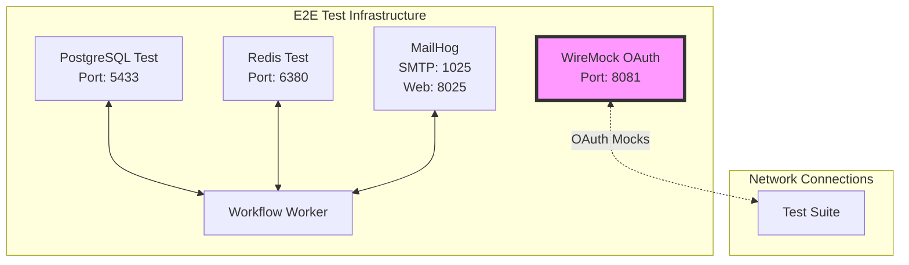
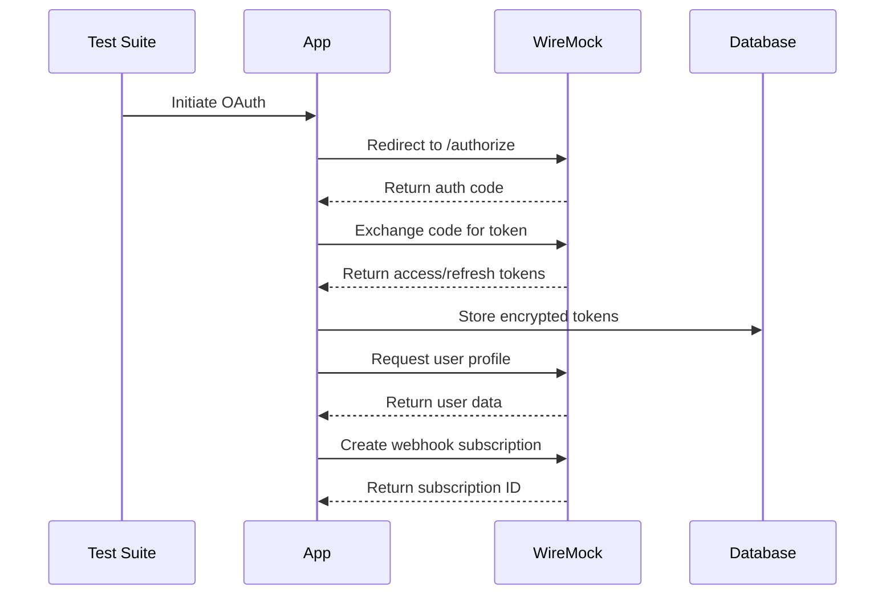
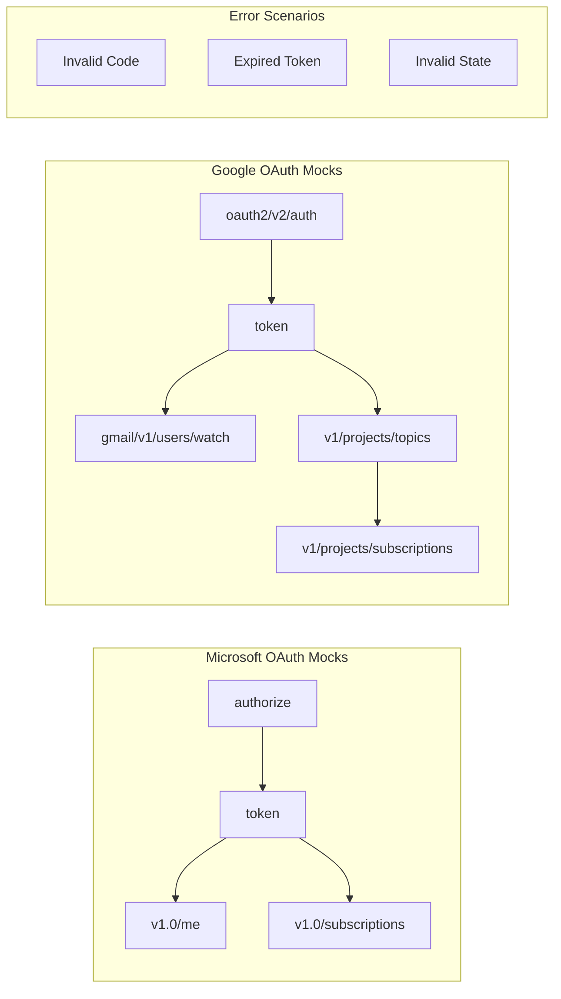
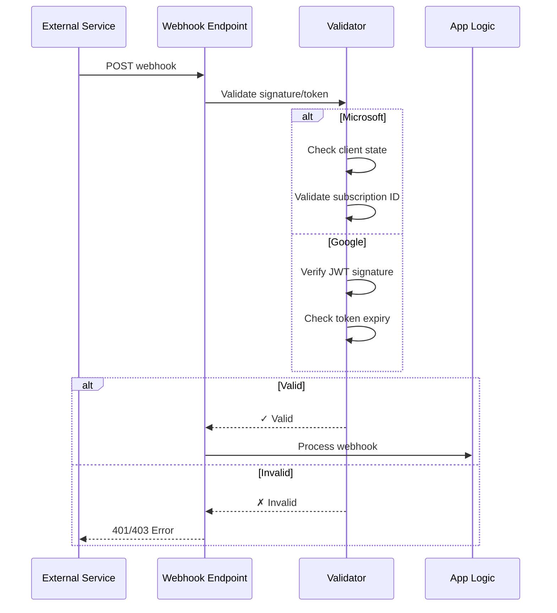
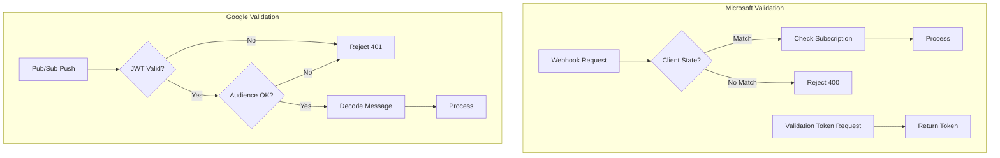
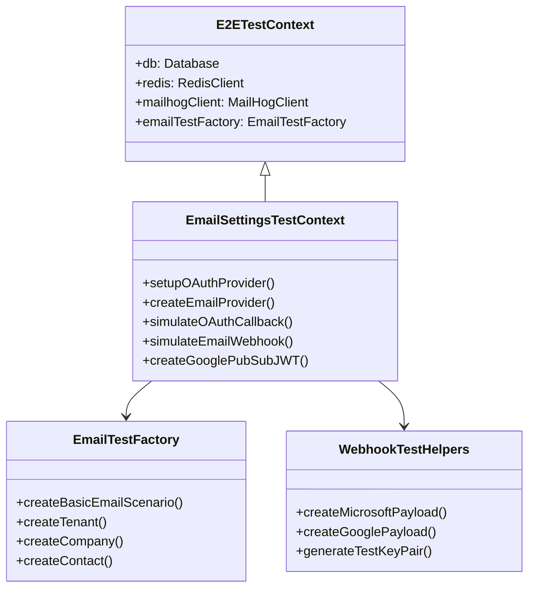
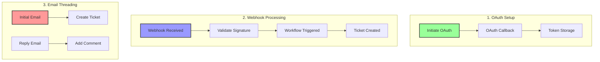
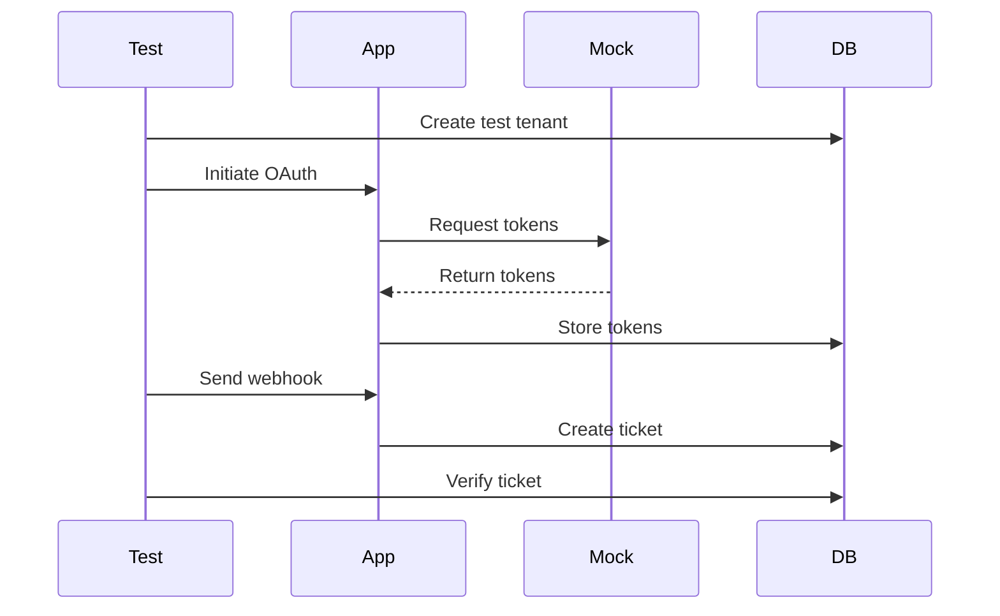
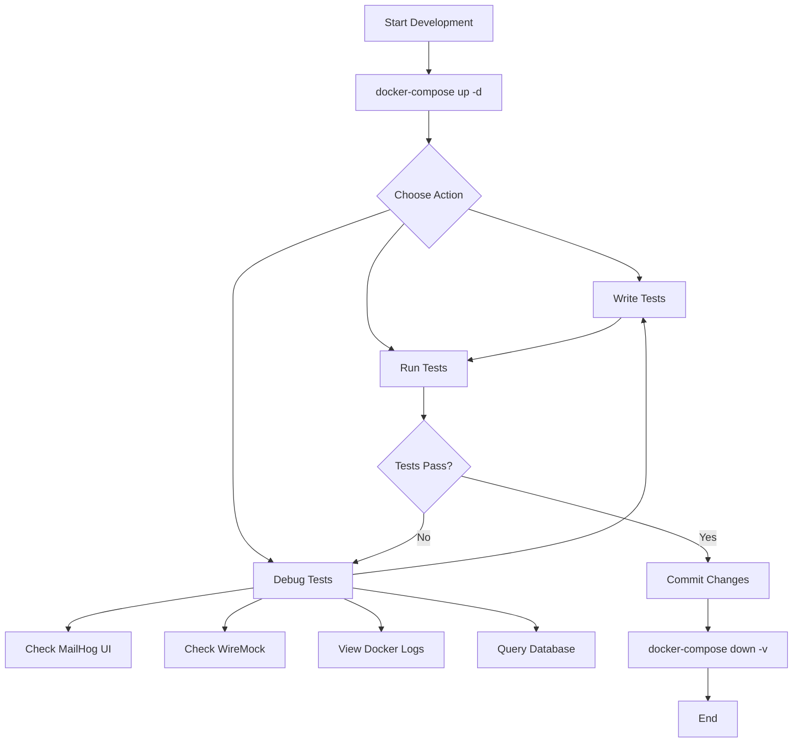

# Email Settings Integration Test Plan

## Table of Contents

1. [Overview](#overview)
2. [Existing Test Infrastructure](#existing-test-infrastructure)
3. [Integration Test Architecture](#integration-test-architecture)
4. [Implementation Phases](#implementation-phases)
   - [Phase 1: Infrastructure Setup](#phase-1-infrastructure-setup)
   - [Phase 2: OAuth Mock Implementation](#phase-2-oauth-mock-implementation)
   - [Phase 3: Core Test Development](#phase-3-core-test-development)
   - [Phase 4: CI/CD Integration](#phase-4-cicd-integration)
5. [Test Scenarios](#test-scenarios)
6. [Running the Tests](#running-the-tests)
7. [Development Workflow](#development-workflow)

## Overview

This plan outlines a comprehensive integration testing strategy for the email settings implementation, leveraging the existing E2E test infrastructure that was recently merged. The test will simulate the complete flow: OAuth callbacks → Redis event publishing → Workflow execution → Ticket creation.

## Existing Test Infrastructure

The project now includes a robust E2E testing framework with the following components:

### Core Infrastructure (from docker-compose.e2e-with-worker.yaml)
- **PostgreSQL Test Instance**: Dedicated test database on port 5433 with pgvector
- **Redis Test Instance**: Dedicated Redis for event streams on port 6380
- **MailHog**: Email capture service (SMTP on port 1025, Web UI on port 8025)
- **Workflow Worker**: Processes email events and creates tickets
- **WireMock**: For mocking external services (can be used for OAuth)

### Test Utilities Available
- **E2ETestContext**: Extended test context with automatic service management
- **MailHogClient**: Email testing with send/capture/search capabilities
- **MailHogPollingService**: Automatic email processing pipeline
- **EmailTestFactory**: Test scenario creation (tenants, companies, contacts)
- **DockerServiceManager**: Manages Docker containers lifecycle

## Integration Test Architecture

### 1. Leverage Existing Docker Compose

We'll extend the existing `docker-compose.e2e-with-worker.yaml` to add OAuth mocking:



### 2. OAuth Mock Configuration

#### OAuth Flow Architecture



#### Mock Endpoint Structure



### 3. Webhook Signature Validation Implementation

#### Webhook Security Flow



#### Validation Components



### 4. Test Framework Architecture



## Test Scenarios

### Core Test Flows



### Test Data Flow



## Running the Tests

```bash
# Start test environment
docker-compose -f docker-compose.e2e-with-worker.yaml up -d

# Run email settings tests
npm run test:e2e:email-settings

# Run specific test
npm run test:e2e -- --grep "OAuth"

# Debug mode
DEBUG=* npm run test:e2e:email-settings

# Cleanup
docker-compose -f docker-compose.e2e-with-worker.yaml down -v
```

### Available Debugging Tools
- **MailHog UI**: http://localhost:8025 (view captured emails)
- **WireMock Admin**: http://localhost:8081/__admin (view mock requests)
- **Docker Logs**: `docker-compose logs -f workflow-worker`
- **Database**: `psql -h localhost -p 5433 -U postgres -d server_test`

## Development Workflow



This approach provides comprehensive testing of the email settings functionality while reusing the robust test infrastructure that already exists in the codebase.

### Phase 1: Infrastructure Setup

**Goal**: Establish the foundational testing infrastructure for email settings integration tests.

**Tasks**:
- [ ] **Extend Docker Compose Configuration**
  - [ ] Add OAuth mock service (WireMock) to `docker-compose.e2e-with-worker.yaml`
  - [ ] Configure network connectivity between services
  - [ ] Add health checks for new services
  - [ ] Set up volume mounts for WireMock mappings
  - [ ] Add environment variables for OAuth endpoints

- [ ] **Database Schema Preparation**
  - [ ] Verify email_provider_configs table schema
  - [ ] Add test-specific migrations if needed
  - [ ] Create indexes for efficient test queries
  - [ ] Add cleanup procedures for test data

- [ ] **Service Configuration**
  - [ ] Configure test-specific Redis channels
  - [ ] Set up workflow worker for email processing
  - [ ] Configure MailHog integration points
  - [ ] Set up test-specific environment variables

### Phase 2: OAuth Mock Implementation

**Goal**: Create comprehensive OAuth mocking capabilities for Microsoft and Google providers.

**Tasks**:
- [ ] **Microsoft OAuth Mocks**
  - [ ] Create authorization endpoint mock
  - [ ] Create token exchange endpoint mock
  - [ ] Add refresh token endpoint mock
  - [ ] Mock user profile endpoint
  - [ ] Add subscription creation endpoint mock
  - [ ] Implement webhook validation token endpoint

- [ ] **Google OAuth Mocks**
  - [ ] Create authorization endpoint mock
  - [ ] Create token exchange endpoint mock
  - [ ] Add refresh token endpoint mock
  - [ ] Mock user profile endpoint
  - [ ] Add Pub/Sub topic creation mock
  - [ ] Add Pub/Sub subscription creation mock
  - [ ] Mock Gmail watch endpoint

- [ ] **OAuth Flow Utilities**
  - [ ] Create state parameter generator
  - [ ] Implement PKCE challenge/verifier utilities
  - [ ] Add JWT token generation for mocks
  - [ ] Create configurable response delays
  - [ ] Add error scenario configurations

### Phase 3: Core Test Development

**Goal**: Implement the essential test scenarios for email settings functionality.

**Tasks**:
- [ ] **Test Utilities**
  - [ ] Create EmailSettingsTestContext extending E2ETestContext
  - [ ] Add OAuth provider setup methods
  - [ ] Create webhook payload builders
  - [ ] Add webhook signature validation helpers

- [ ] **OAuth Flow Tests**
  - [ ] Test Microsoft OAuth complete flow (initiate → callback → token storage)
  - [ ] Test Google OAuth complete flow with Pub/Sub setup
  - [ ] Test OAuth error scenarios (invalid code, expired token)

- [ ] **Webhook to Ticket Tests**
  - [ ] Test Microsoft webhook → workflow → ticket creation
  - [ ] Test Google Pub/Sub → workflow → ticket creation
  - [ ] Test webhook validation (signatures, client state)
  - [ ] Test invalid webhook rejection

- [ ] **Email Threading Tests**
  - [ ] Test initial email creates ticket
  - [ ] Test reply adds comment to existing ticket
  - [ ] Test thread ID preservation

### Phase 4: CI/CD Integration

**Goal**: Add email settings tests to the existing CI pipeline.

**Tasks**:
- [ ] **Add to GitHub Actions**
  - [ ] Add test:e2e:email-settings to package.json scripts
  - [ ] Include in existing E2E test workflow
  - [ ] Set appropriate timeouts for OAuth/webhook tests

- [ ] **Basic Test Reporting**
  - [ ] Ensure test failures are clearly reported
  - [ ] Add artifact upload for test logs on failure