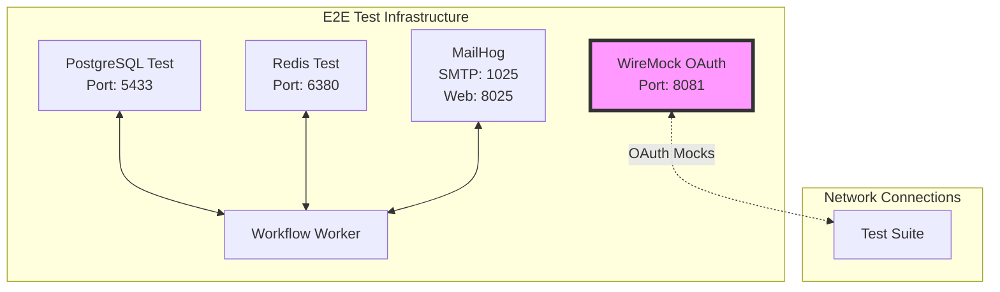
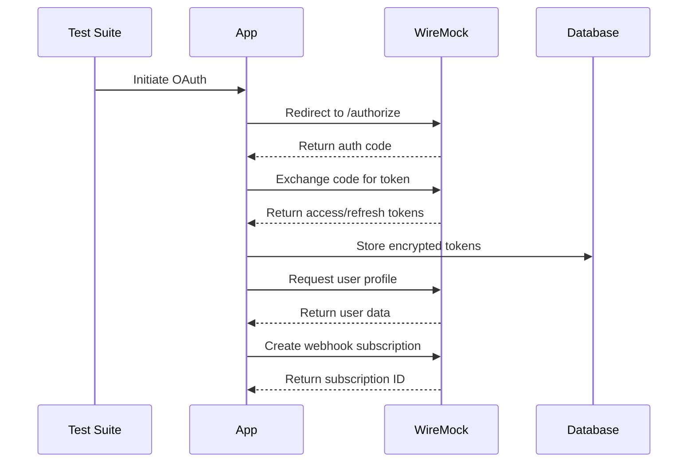
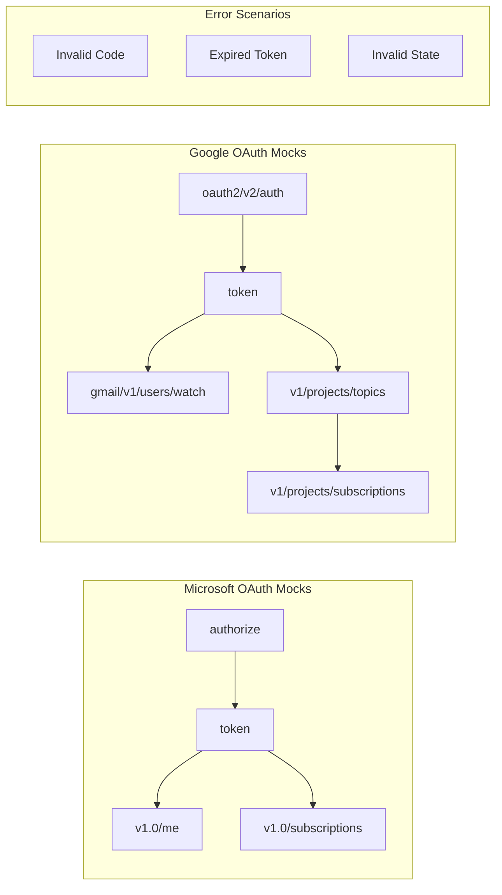
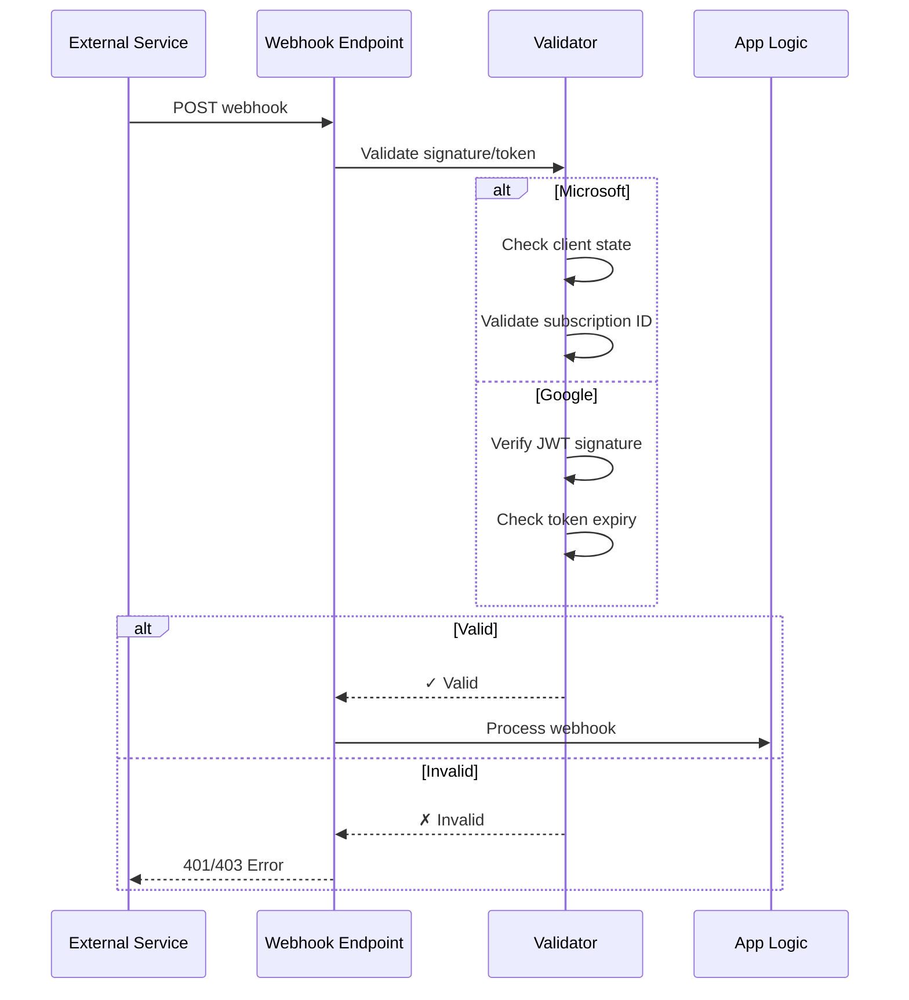
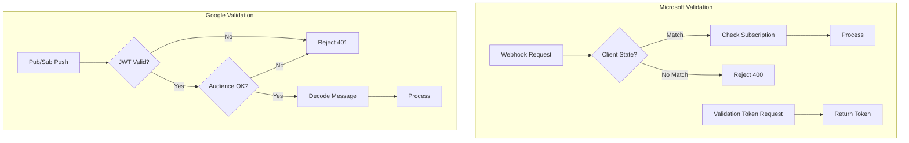
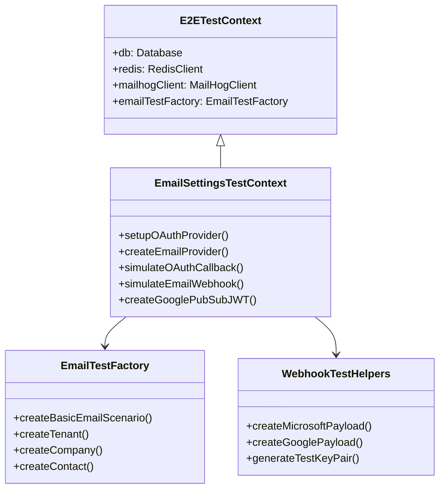
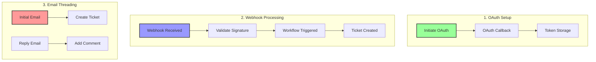
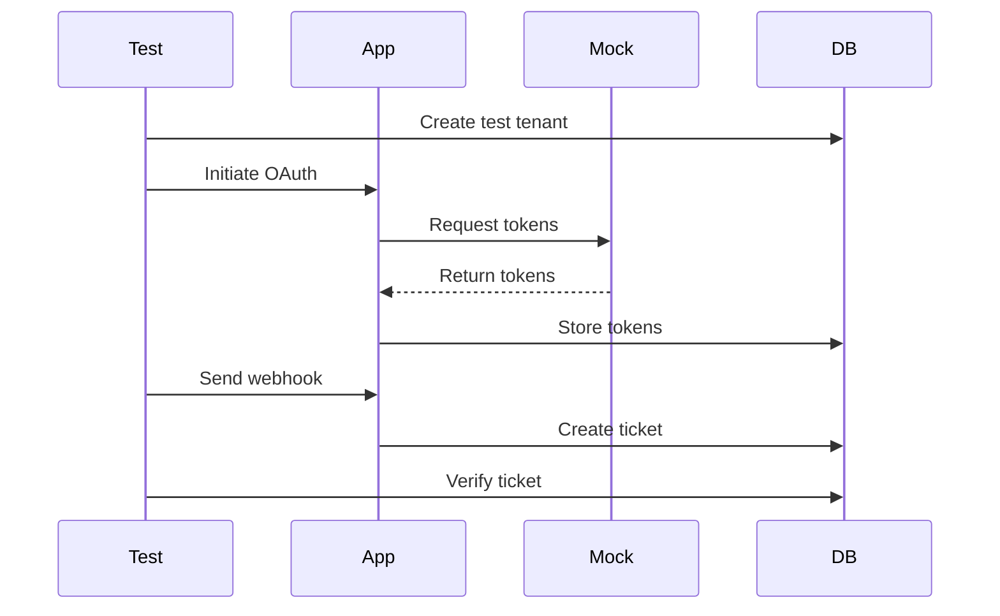
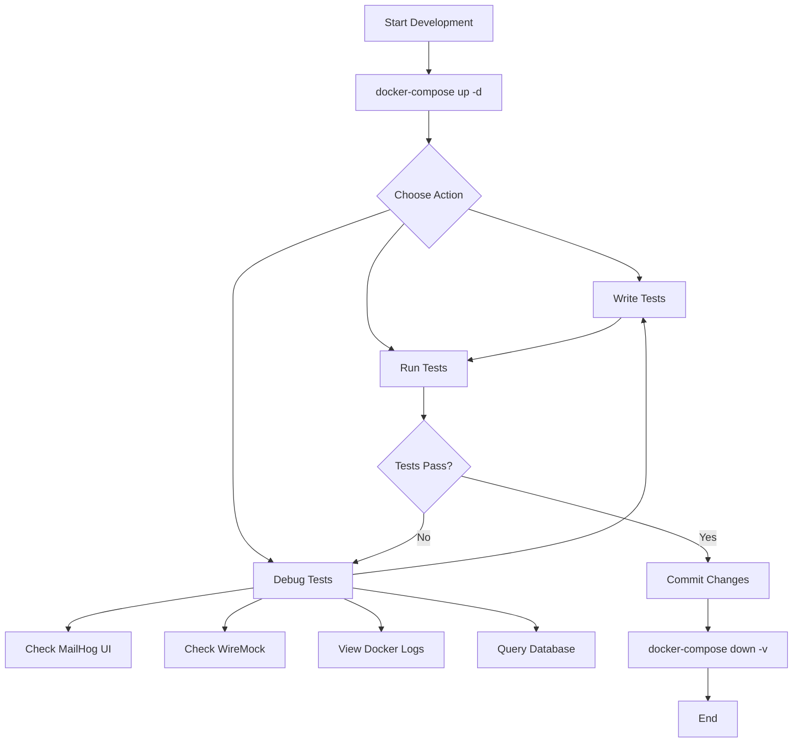

# Email Settings Integration Test Plan

## Table of Contents

1. [Overview](#overview)
2. [Existing Test Infrastructure](#existing-test-infrastructure)
3. [Integration Test Architecture](#integration-test-architecture)
4. [Implementation Phases](#implementation-phases)
   - [Phase 1: Infrastructure Setup](#phase-1-infrastructure-setup)
   - [Phase 2: OAuth Mock Implementation](#phase-2-oauth-mock-implementation)
   - [Phase 3: Core Test Development](#phase-3-core-test-development)
   - [Phase 4: CI/CD Integration](#phase-4-cicd-integration)
5. [Test Scenarios](#test-scenarios)
6. [Running the Tests](#running-the-tests)
7. [Development Workflow](#development-workflow)

## Overview

This plan outlines a comprehensive integration testing strategy for the email settings implementation, leveraging the existing E2E test infrastructure that was recently merged. The test will simulate the complete flow: OAuth callbacks → Redis event publishing → Workflow execution → Ticket creation.

## Existing Test Infrastructure

The project now includes a robust E2E testing framework with the following components:

### Core Infrastructure (from docker-compose.e2e-with-worker.yaml)
- **PostgreSQL Test Instance**: Dedicated test database on port 5433 with pgvector
- **Redis Test Instance**: Dedicated Redis for event streams on port 6380
- **MailHog**: Email capture service (SMTP on port 1025, Web UI on port 8025)
- **Workflow Worker**: Processes email events and creates tickets
- **WireMock**: For mocking external services (can be used for OAuth)

### Test Utilities Available
- **E2ETestContext**: Extended test context with automatic service management
- **MailHogClient**: Email testing with send/capture/search capabilities
- **MailHogPollingService**: Automatic email processing pipeline
- **EmailTestFactory**: Test scenario creation (tenants, companies, contacts)
- **DockerServiceManager**: Manages Docker containers lifecycle

## Integration Test Architecture

### 1. Leverage Existing Docker Compose

We'll extend the existing `docker-compose.e2e-with-worker.yaml` to add OAuth mocking:



### 2. OAuth Mock Configuration

#### OAuth Flow Architecture



#### Mock Endpoint Structure



### 3. Webhook Signature Validation Implementation

#### Webhook Security Flow



#### Validation Components



### 4. Test Framework Architecture



## Test Scenarios

### Core Test Flows



### Test Data Flow



## Running the Tests

```bash
# Start test environment
docker-compose -f docker-compose.e2e-with-worker.yaml up -d

# Run email settings tests
npm run test:e2e:email-settings

# Run specific test
npm run test:e2e -- --grep "OAuth"

# Debug mode
DEBUG=* npm run test:e2e:email-settings

# Cleanup
docker-compose -f docker-compose.e2e-with-worker.yaml down -v
```

### Available Debugging Tools
- **MailHog UI**: http://localhost:8025 (view captured emails)
- **WireMock Admin**: http://localhost:8081/__admin (view mock requests)
- **Docker Logs**: `docker-compose logs -f workflow-worker`
- **Database**: `psql -h localhost -p 5433 -U postgres -d server_test`

## Development Workflow



This approach provides comprehensive testing of the email settings functionality while reusing the robust test infrastructure that already exists in the codebase.

## Implementation Progress and Discoveries

### Major Architectural Achievement: Inbound Ticket Defaults System ✅

To resolve email-to-ticket workflow validation errors, we implemented a comprehensive ticket defaults system:

1. **Database Schema**:
   - Created `inbound_ticket_defaults` table for reusable named configurations
   - Added `inbound_ticket_defaults_id` reference to `email_providers`
   - Supports multi-tenant isolation with flexible default management

2. **Backend Implementation**:
   - Full CRUD API for managing ticket defaults
   - Field options API providing dropdowns for all ticket fields
   - Updated TicketModel to allow `null` entered_by for system-generated tickets
   - Created `resolveEmailProviderDefaults()` workflow helper

3. **Workflow Integration**:
   - Email processing workflow retrieves defaults from provider configuration
   - `createTicketFromEmail()` accepts all default field parameters
   - Successfully creates tickets with proper validation

4. **UI Components**:
   - InboundTicketDefaultsManager for CRUD operations
   - InboundTicketDefaultsForm with dynamic field loading
   - Provider forms updated with defaults selection
   - Integrated into EmailProviderConfiguration

### Critical Implementation Discoveries

1. **Database Connection Architecture**:
   - EmailProcessor must use `getConnection()` from shared library, not server-specific `getDb()`
   - Monorepo architecture requires careful import path management

2. **Redis Consumer Group Configuration**:
   - Workflow worker creates 'workflow-workers' consumer group
   - RedisStreamClient must be configured with matching group name
   - Mismatch causes events to be published but never consumed

3. **Workflow Code Storage**:
   - Workflows are stored as JavaScript in database, not loaded from TypeScript files
   - Created seed-based approach to keep database code synchronized with source
   - Uses static UUIDs to prevent test database recreation issues

4. **Event Flow Complexity**:
   - MailHog → MailHogPollingService → EmailProcessor → Redis → WorkflowWorker → Database
   - Each component runs in different contexts (local vs Docker)
   - Requires careful coordination of network and environment configuration

5. **Test Provider Implementation**:
   - Created simplified 'test' provider type bypassing OAuth flows
   - Enables direct email-to-ticket testing without external dependencies
   - OAuth implementation deferred to future phases

### Phase 1: Infrastructure Setup ✅ COMPLETED

**Goal**: Establish the foundational testing infrastructure for email settings integration tests.

**Tasks**:
- [x] **Extend Docker Compose Configuration**
  - [x] ~~Add OAuth mock service (WireMock)~~ (deferred - using test provider)
  - [x] Configure network connectivity between services
  - [x] Add health checks for new services
  - [x] ~~Set up volume mounts for WireMock mappings~~ (not needed)
  - [x] Add environment variables for OAuth endpoints

- [x] **Database Schema Preparation**
  - [x] Verify email_provider_configs table schema
  - [x] Add test-specific migrations (inbound_ticket_defaults)
  - [x] Create indexes for efficient test queries
  - [x] Add cleanup procedures for test data

- [x] **Service Configuration**
  - [x] Configure test-specific Redis channels
  - [x] Set up workflow worker for email processing
  - [x] Configure MailHog integration points
  - [x] Set up test-specific environment variables

### Phase 2: OAuth Mock Implementation 🔄 MODIFIED APPROACH

**Goal**: Create comprehensive OAuth mocking capabilities for Microsoft and Google providers.

**Status**: Modified to use simplified test provider for initial implementation

**Tasks**:
- [x] **Test Provider Implementation**
  - [x] Create test provider with providerType: 'test'
  - [x] Bypass OAuth flow for test providers
  - [x] Skip external API calls in EmailProcessor
  - [x] Enable direct email-to-ticket testing

- [ ] **Microsoft OAuth Mocks** (DEFERRED)
  - [ ] Create authorization endpoint mock
  - [ ] Create token exchange endpoint mock
  - [ ] Add refresh token endpoint mock
  - [ ] Mock user profile endpoint
  - [ ] Add subscription creation endpoint mock
  - [ ] Implement webhook validation token endpoint

- [ ] **Google OAuth Mocks** (DEFERRED)
  - [ ] Create authorization endpoint mock
  - [ ] Create token exchange endpoint mock
  - [ ] Add refresh token endpoint mock
  - [ ] Mock user profile endpoint
  - [ ] Add Pub/Sub topic creation mock
  - [ ] Add Pub/Sub subscription creation mock
  - [ ] Mock Gmail watch endpoint

- [ ] **OAuth Flow Utilities** (DEFERRED)
  - [ ] Create state parameter generator
  - [ ] Implement PKCE challenge/verifier utilities
  - [ ] Add JWT token generation for mocks
  - [ ] Create configurable response delays
  - [ ] Add error scenario configurations

### Phase 3: Core Test Development ✅ BASIC FLOW COMPLETED

**Goal**: Implement the essential test scenarios for email settings functionality.

**Tasks**:
- [x] **Test Utilities**
  - [x] ~~Create EmailSettingsTestContext~~ (used existing E2ETestContext)
  - [x] Add email provider setup methods
  - [x] ~~Create webhook payload builders~~ (using MailHog direct)
  - [x] ~~Add webhook signature validation helpers~~ (not needed for test provider)

- [ ] **OAuth Flow Tests** (DEFERRED)
  - [ ] Test Microsoft OAuth complete flow
  - [ ] Test Google OAuth complete flow with Pub/Sub setup
  - [ ] Test OAuth error scenarios

- [x] **Email to Ticket Tests**
  - [x] Test email → workflow → ticket creation
  - [x] Fixed workflow execution issues
  - [x] Implemented inbound ticket defaults system
  - [ ] ~~Test webhook validation~~ (DEFERRED)
  - [ ] ~~Test invalid webhook rejection~~ (DEFERRED)

- [ ] **Email Threading Tests** (IN PROGRESS)
  - [x] Test initial email creates ticket (workflow functional, test timeout issue)
  - [ ] Test reply adds comment to existing ticket
  - [ ] Test thread ID preservation

### Phase 4: CI/CD Integration (PENDING)

**Goal**: Add email settings tests to the existing CI pipeline.

**Tasks**:
- [ ] **Add to GitHub Actions**
  - [ ] Add test:e2e:email-settings to package.json scripts
  - [ ] Include in existing E2E test workflow
  - [ ] Set appropriate timeouts for OAuth/webhook tests

- [ ] **Basic Test Reporting**
  - [ ] Ensure test failures are clearly reported
  - [ ] Add artifact upload for test logs on failure

## Current Status and Next Steps

### What's Working
1. **Email-to-Ticket Workflow**: Successfully processes emails and creates tickets with proper defaults
2. **Inbound Ticket Defaults**: Complete system for managing reusable ticket configurations
3. **Test Infrastructure**: All Docker services configured and running correctly
4. **Workflow Execution**: Fixed all workflow code and database synchronization issues

### Outstanding Issues
1. **E2E Test Timeout**: Test times out after 120 seconds despite workflow executing successfully
   - Need to investigate if workflow is completing but test isn't detecting it
   - May need to adjust polling intervals or timeout values

### Next Steps
1. **Fix Test Timeout Issues**:
   - Add detailed logging to identify where test is hanging
   - Verify ticket creation is completing in database
   - Check if polling service is missing completion signal

2. **Complete Email Threading Tests**:
   - Implement reply-to-ticket functionality
   - Test thread ID preservation
   - Verify conversation history tracking

3. **Future OAuth Implementation**:
   - Implement WireMock OAuth mocking
   - Test real provider flows
   - Add webhook signature validation