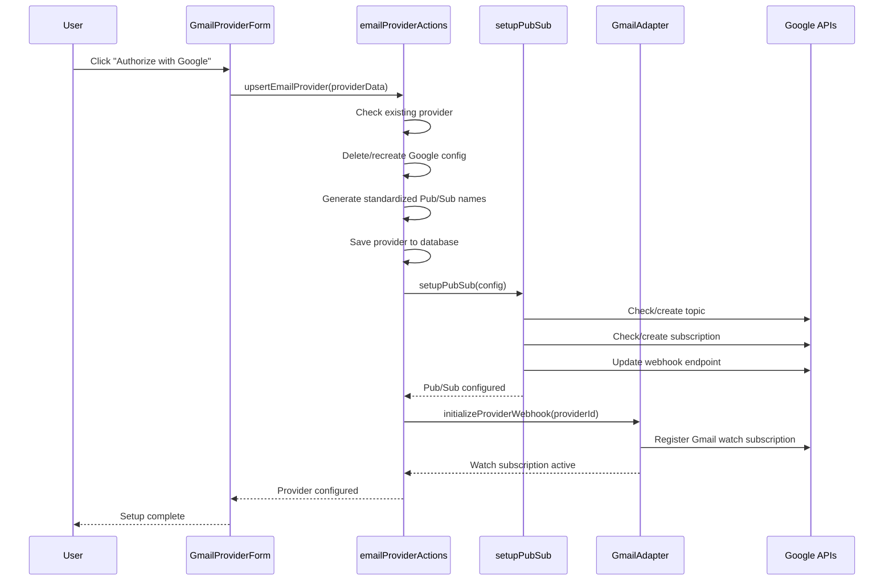

# Gmail Pub/Sub Configuration Automation Plan

## Overview

Remove the manual Pub/Sub configuration section from the Gmail provider setup form and automate it in the background using standardized naming conventions.

## Problem Statement

Currently, users must manually configure Google Pub/Sub settings when setting up Gmail email providers. This creates complexity and potential for errors in the setup process.

## Solution

Automate the Pub/Sub configuration using standardized naming conventions based on tenant ID, removing the manual configuration UI entirely.

## Implementation Plan

### Phase 1: Simplify Gmail Provider Form

- [x] Remove "Pub/Sub Configuration" card from `GmailProviderForm.tsx`
- [x] Remove `pubsubTopicName` and `pubsubSubscriptionName` fields from form schema
- [x] Remove manual "Setup Pub/Sub" button and related UI state
- [x] Update form validation to remove Pub/Sub field requirements

### Phase 2: Implement Automatic Pub/Sub Setup

- [x] Modify `upsertEmailProvider` function to automatically call `setupPubSub()` after saving provider config
- [x] Implement standardized naming conventions:
  - Topic: `gmail-notifications-{tenant-id}`
  - Subscription: `gmail-webhook-{tenant-id}`
  - Webhook URL: `${process.env.NEXT_PUBLIC_APP_URL}/api/email/webhooks/google`
- [x] Handle setup automatically during OAuth flow
- [x] Add proper error handling for Pub/Sub setup failures

### Phase 3: Update Database Schema

- [x] Set default values for `pubsub_topic_name` and `pubsub_subscription_name` in database
- [x] Use tenant-specific naming for proper isolation
- [x] Update existing records to use standardized naming (migration removed - not needed)

### Phase 4: Improve User Experience

- [x] Add loading states during automatic setup
- [x] Provide clear success/error feedback
- [x] Surface meaningful error messages if setup fails
- [x] Simplify setup flow: OAuth → automatic configuration → ready to use

## Technical Details

### OAuth Authorization Flow



### Naming Conventions

```typescript
const topicName = `gmail-notifications-${tenantId}`;
const subscriptionName = `gmail-webhook-${tenantId}`;
const webhookUrl = `${process.env.NEXT_PUBLIC_APP_URL}/api/email/webhooks/google`;
```

### Files to Modify

1. `server/src/components/GmailProviderForm.tsx` - Remove Pub/Sub UI
2. `server/src/lib/actions/email-actions/emailProviderActions.ts` - Add automatic setup
3. Form schema validation - Remove Pub/Sub fields
4. Database defaults - Set standard naming patterns

## Benefits

- **Simplified UX**: Users only see OAuth setup, not infrastructure details
- **Reduced Errors**: No manual configuration means fewer mistakes
- **Consistent Naming**: Standardized topic/subscription names across tenants
- **Better Security**: Less exposure of technical implementation details
- **Faster Setup**: Fewer clicks and steps for users

## Backward Compatibility

- Keep existing `setupPubSub` function but call it automatically
- Preserve webhook URL structure and processing logic
- Ensure existing configured providers continue working
- Migration path for existing manual configurations

## Success Criteria

- [x] Gmail provider setup requires only OAuth authentication
- [x] Pub/Sub infrastructure is created automatically with standardized naming
- [x] Existing email processing continues to work without interruption
- [x] Setup process is faster and more reliable
- [x] Error handling provides clear feedback to users

## Phase 5: Gmail Watch Subscription Automation

### Critical Gap Identified

**Issue**: Gmail watch subscriptions (required for real-time email notifications) are not automatically renewed during OAuth authorization, causing potential service disruption.

**Requirements**:
- [x] Automatic Gmail watch subscription setup during OAuth authorization  
- [x] Automatic renewal of existing Gmail watch subscriptions during re-authorization
- [x] Integration with `EmailProviderService.initializeProviderWebhook()`
- [x] Proper error handling for watch subscription failures
- [x] Logging for Gmail watch subscription lifecycle events

### Implementation Plan

1. [x] **Modify OAuth Flow**: Update `upsertEmailProvider`, `createEmailProvider`, and `updateEmailProvider` functions to call `initializeProviderWebhook()` after successful Pub/Sub setup
2. [x] **Watch Subscription Management**: Ensure Gmail watch subscriptions are established automatically without manual intervention
3. [x] **Re-authorization Handling**: Existing providers get both OAuth tokens and Gmail watch subscriptions renewed
4. [x] **Error Resilience**: Watch subscription failures don't break provider creation but are logged for manual resolution

## Implementation Status

✅ **Phase 1-4 COMPLETED** - Gmail Pub/Sub automation implemented:

1. **UI Simplification**: Removed manual Pub/Sub configuration from Gmail provider form
2. **Automatic Setup**: Implemented standardized naming and automatic Pub/Sub creation
3. **Database Integration**: Updated all provider actions to use standardized naming
4. **Error Handling**: Added proper error handling that doesn't break provider creation
5. **User Experience**: Simplified flow to OAuth → automatic configuration → ready to use
6. **Comprehensive Logging**: Added detailed logging for troubleshooting and monitoring

✅ **Phase 5 COMPLETED** - Gmail watch subscription automation:

**Implemented**: Gmail watch subscriptions are now automatically established and renewed during OAuth authorization, ensuring continuous real-time email processing without manual intervention.

The migration file was removed as no existing providers had pubsub callbacks configured.